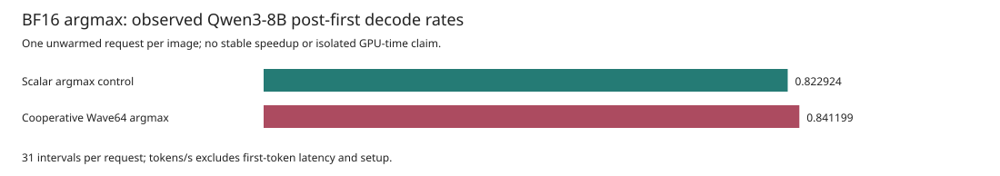
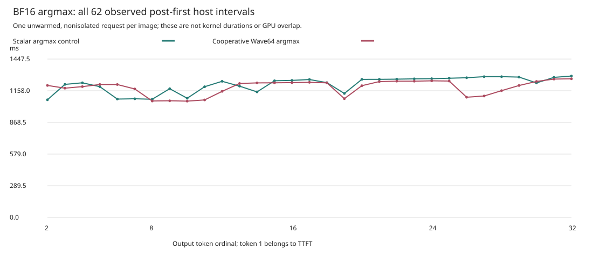

# Cooperative BF16 Argmax: An Exact-Choice Optimization

This is a separate **single-request, TP1, target-only Qwen3-8B** comparison on
Asrock's MI350X (`gfx950`). Both native images produced all 32 expected token IDs
and decoded bytes against the unchanged independent reference. Weights,
intermediate activations, and output logits remain BF16. No quantization or
speculation is used. **700 tokens/s is not achieved.**

There is **one unwarmed, nonisolated request per image**, with 31 post-first-token
intervals. The observed difference is not a stable speedup, isolated argmax
measurement, or causal optimization contribution. These are host observations
of a multi-dispatch model execution, not GPU timestamps or a megakernel.

## Matched Observations

| Configuration | TTFT (s) | Mean TPOT (s) | Post-first tokens/s | Setup (s) |
| --- | ---: | ---: | ---: | ---: |
| Scalar argmax control | 5.664633 | 1.215179 | 0.822924 | 167.156145 |
| Cooperative Wave64 argmax | 5.843879 | 1.188779 | 0.841199 | 166.694882 |

The observed rate ratio is **1.022208x**; observed mean TPOT is **2.1725% lower**.
The candidate's TTFT is higher in this pair. Neither difference can be attributed
to the kernel alone from these two requests. There are no repeated-run error
bars, warmup corrections, CPU isolation, or recording-overhead corrections.





The rate is `31e9 / sum(the 31 decode intervals in nanoseconds)`, not 32 divided
by that duration. Token 1 belongs to TTFT; setup is separately reported.
The [unaltered control public report](assets/asrock-bf16-argmax-v1/control-report-public.json),
[unaltered cooperative public report](assets/asrock-bf16-argmax-v1/cooperative-report-public.json),
[integer-nanosecond CSV](assets/asrock-bf16-argmax-v1/intervals.csv),
[generated table](assets/asrock-bf16-argmax-v1/table.md), and
[observed contrast](assets/asrock-bf16-argmax-v1/summary.json) retain the evidence.

Both requests use the same frozen controller (`a28848ea...`), runtime worker
(`b4cb3078...`), model revision, prompt, immutable reference, and options. They
retain scalar projections and attention, device-side TP1 residuals, context 64,
four physical pages, one row and one-token prefill chunks. Prefix caching,
head pruning, FP32-head sidecars, sequences, ordered batches, and profiling are
disabled. Admission caching and operational currentness remain enabled.

The complete native image identities differ deliberately: the control uses
HSACO `583a889a...`, the opt-in candidate `7641c055...`. Full image, manifest,
handoff, controller, worker, capture, and reference hashes are in both public
reports. Every request completes 36 forwards and 22,176 dispatch packets. The
unchanged reference SHA-256 is
`1ed868663df52a146dd7921f9fbb2cf1e1d0c0ceed8a7bfda030d65f8ec5b094`.
Passing this prompt is bounded numerical evidence, not model-wide quality or
bitwise equivalence of all intermediate tensors.

## Make The Scan Cooperative

The [scalar implementation](../device/qwen3-tp-batch-kernels-v2/src/logits.rs)
launches one Wave64 per row but only lane zero scans its 151,936 logits.
The opt-in [cooperative implementation](../device/qwen3-tp-perf-kernels-v3/src/logits.rs)
uses every lane. Lane `l` reads token IDs `l, l + 64, l + 128, ...`.
The vocabulary is exactly `64 * 2374`, so each lane reads 2,374 BF16 values;
adjacent lanes read adjacent two-byte elements.

For a finite row, each lane initializes its maximum from its first logit, rather
than from zero. This is required for all-negative rows. It retains the earliest
token in its own ascending subsequence on equality. Three collective maximum
reductions then perform distinct jobs:

1. Reduce an invalid-value flag. Any NaN or infinity rejects the entire row
   before a choice is stored, including nonfinite values that would not win.
2. Find the maximum finite logit across all lanes.
3. For lanes matching that maximum, reduce `151936 - local_token_id`; other lanes
   contribute zero. The largest key selects the smallest token ID.

All nonzero keys are positive integers at most 151,936, exactly representable in FP32.
The final subtraction is exact as well. Equal signed zeros enter the same tie
set. Only lane zero writes the result after the collectives and checks.
This reorders comparisons, **not a GEMV sum**, and does not round the input logits
to a different precision. It preserves the scalar scan's finite rejection and
lowest-token-ID tie rule without adopting candidate output as a new reference.

### Keep The Interface Stable

The `cooperative-argmax` Cargo feature is opt-in for the v3 device crate. Without
it, v3 still imports the original v2 body; the general v2 crate is unchanged.
Both native images retain the same 13 exported kernel names. Argmax keeps:

- Symbol `ferric_qwen3_tp_batch_argmax_bf16_v2` and 36-byte argument ABI.
- Wave64, required/max workgroup `[64, 1, 1]`, and max grid `[16, 1, 1]`.
- One owned output choice per row; admitted rows remain 1 through 16.
- Existing input/output extent, launch, and finite-value checks.

No extra buffer, kernel dispatch, or host completion boundary is introduced.
The broader image identity changes, so ordinary artifact admission and a matched
full-model comparison remain mandatory even with an unchanged symbol and ABI.

## Static Cost And Conditional Bounds

| Source or native property | Scalar control | Cooperative candidate |
| --- | ---: | ---: |
| Logit elements read per row | 151,936 | 151,936 |
| Logical BF16 input bytes per row | 303,872 | 303,872 |
| Logits scanned by each active scanning lane | 151,936 | 2,374 |
| Scanning lanes per row | 1 | 64 |
| Collective reduction stages | 0 | 18: three six-stage reductions |
| Native argmax code bytes | 1,776 | 2,276 |
| Native SGPR / VGPR counts | 58 / 12 | 30 / 14 |
| LDS / private memory / spills | 0 / 0 / 0 | 0 / 0 / 0 |

The emitted candidate ISA contains 18 `ds_bpermute_b32` instructions for these
collectives and coalesced BF16 loads. These are static observations, not dynamic
cycle measurements. A 64-fold decrease in the longest lane's scan length is not
a predicted 64-fold kernel or model speedup: instruction dependencies, memory
latency, one-workgroup occupancy, collective work, and launch overhead remain.

An exact maximum over arbitrary finite inputs must inspect all `N` values and
requires at least `N - 1` value comparisons in the ordinary comparison model.
The candidate redistributes that work instead of eliminating the vocabulary
read. Under the explicit assumption that every logit is fetched once from HBM,
with no cache credit or other cost, the optimistic transfer-time floor is:

```text
logical_input_bytes = N * sizeof(BF16) = 151936 * 2 = 303872
transfer_time >= logical_input_bytes / assumed_bandwidth
```

| Assumed aggregate bandwidth | Conditional argmax-input transfer floor |
| --- | ---: |
| 6.810 TB/s | 44.62 ns |
| 8.000 TB/s | 37.98 ns |

These are the explicitly declared bandwidth scenarios from the
[BF16 streaming discussion](GFX950_TARGET8B_ABLATIONS_V2.md#theoretical-context-not-a-measured-bar),
not measured sustained bandwidth for one wave. The preceding head may leave
logits in cache; in that case an HBM-only floor is not the applicable bound.
Output stores, instructions, synchronization, and launch costs are omitted.
**No standalone argmax GPU duration was collected**, so no percentage of this
bound or kernel-only speedup is reported. Whole-model host TPOT is a different
workload and must not be divided by this argmax-only floor as a utilization claim.

## Validation And Reproduction

The [CPU tests](../device/qwen3-tp-perf-kernels-v3/src/logits/tests.rs) use an
independent integer-order reference, enumerate all 65,536 BF16 bit patterns for
decode/classification, and cover finite extremes, subnormals, signed zeros,
all-negative rows, ties across lanes, boundary winners, randomized rows, and
nonfinite rejection without publishing a choice. Feature-off testing passed 11
tests; feature-on testing passed 22; strict Clippy passed. Source-linked fixtures
and contract checks cover the emitted body, unchanged ABI, and launch geometry.

Normal frozen-compiler native emission, exact native replay, and ordinary
controller artifact admission passed. Finally, both GPU requests passed all 32
reference tokens and bytes, completed worker closure, and retained pre/post
input and host-state checks. The public close record alone is not an independent
proof of system-wide GPU idleness or final page reclamation; the report retains
those limits explicitly.

The [small reporting tool](../tools/target_bf16_argmax_report_v1.py) accepts only
the SHA-pinned public pair. It checks exact workload and identity fields,
recomputes timing summaries from every interval, and produces a new directory:

```sh
python3 -B tools/target_bf16_argmax_report_v1.py \
  --control docs/assets/asrock-bf16-argmax-v1/control-report-public.json \
  --cooperative docs/assets/asrock-bf16-argmax-v1/cooperative-report-public.json \
  --output /tmp/ferric-bf16-argmax-v1-rebuilt
python3 -B -m unittest discover -s tools -p 'test_target_bf16_argmax_report_v1.py'
```

[Asset hashes](assets/asrock-bf16-argmax-v1/SHA256SUMS) bind the raw public reports,
generated table, charts, and CSV. This separate pair does not modify the existing
four-family ablation dataset or its 310 interval points. Its ratio must not be
multiplied by results from other controller, worker, projection, or head cohorts.
