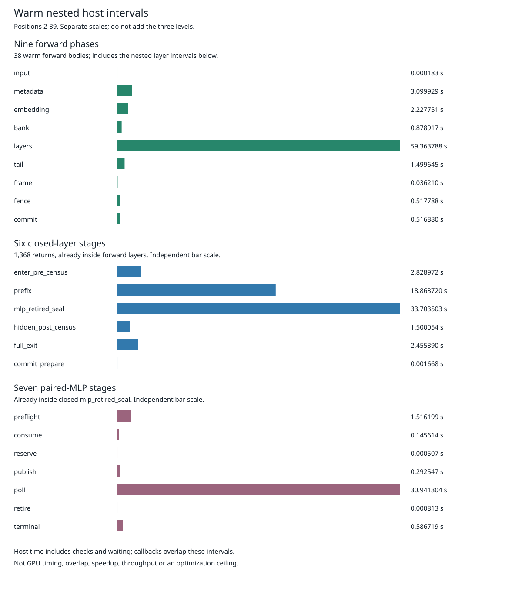
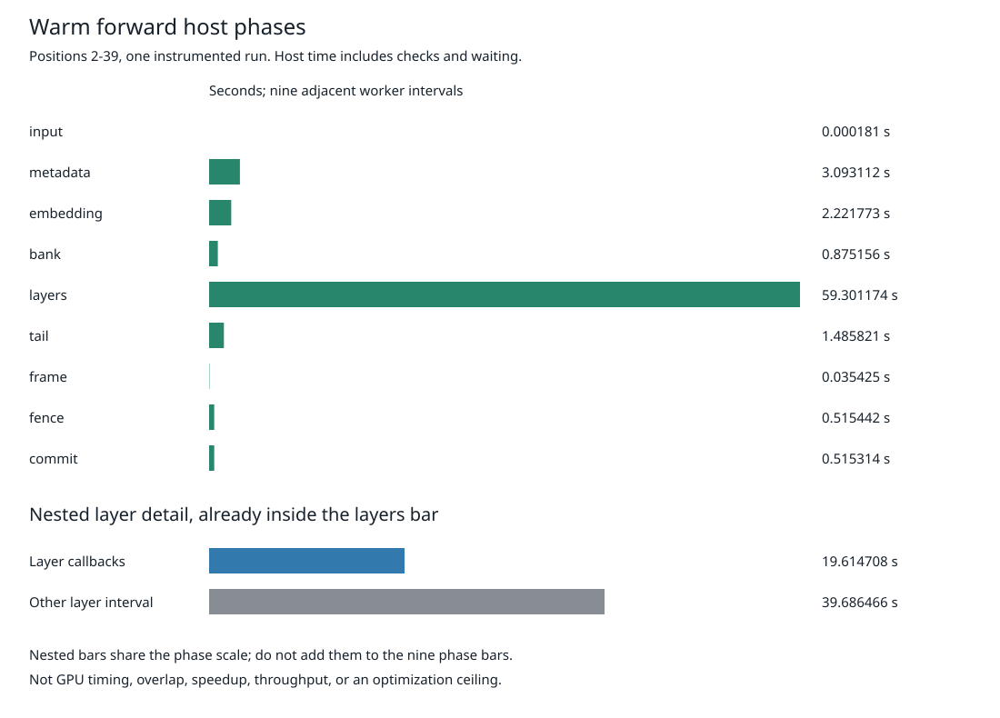

# Qwen3-8B Currentness Ablation Demo

This is a retained-evidence demo of Qwen3-8B BF16 tensor parallelism across two
gfx950 GPUs on `mi350`. It shows a bounded host-overhead reduction, not a chat
service, accepted full-model decode or a 700 tokens/s result. The measured
workload is 40 authentic prompt forwards through all 36 layers, with **zero
generated tokens**.

## Active-Pause Candidate

A new [Scoped active-pause candidate](../qualification/guarded-mlp-active-pause-v1/README.md)
is retained as an isolated qualification archive, not installed on the runtime
production branch. It changes three private runtime source paths: the existing
Scoped pause uses at most 4,096 spin hints toward the same 50-microsecond budget,
then sleeps a positive remainder. The Full currentness branch retains its old
sleep. Currentness checks, ownership, kernel arithmetic and deadlines are unchanged.

Both runtime CPU modes pass, with 1,221/1,192 primary tests and eight unchanged
ignores each; diagnostic/default workers pass 911/838 tests with four unchanged
ignores each. Diagnostic/default parents pass 641/584 selected invocations
across 61/58 scopes. All six CPU qualifications have completed. Twelve new
pause tests run in both runtime modes, not 24 distinct cases.

The candidate/control native-workflow CPU suites now pass 336/330 tests in
eight natural, reaped phases each, with unchanged sources and absent owned
process groups. The [candidate archive](../qualification/guarded-mlp-active-pause-v1/native-admission-cpu-v2.tar.gz)
and [control archive](../qualification/guarded-mlp-active-pause-v1/control-native-admission-cpu-v1.tar.gz)
each retain 423 members. These totals overlap the 227 predecessor workflow
tests and 14 usage tests; they are not 666 distinct tests. The earlier
335-test candidate v1 was staged but unrun and receives no credit.
These are actual-artifact-backed and synthetic CPU checks, not native model
execution or measured live resource accounting.

No candidate GPU result or gain has been observed. The next gate is fresh,
serial control/candidate/candidate/control measurement with matching artifacts
and separately prepared, identity-bound native cases,
the same 40 prompt forwards and historical payload checks, unchanged bounds,
and explicit CPU/resource cost. Both paired poll and complete warm-forward
body must improve before promotion. The earlier 30.941303993-second poll
bucket below includes required checks and device waiting; it is not all
removable. Full2303, exact 256-output acceptance and 700 tokens/s remain open.

## Latest Closed-Layer Attribution

The [closed-layer phase diagnostic](../qualification/guarded-mlp-layer-phases-v1/README.md)
now passes its first [MI350 native attempt](../qualification/guarded-mlp-layer-phases-v1/native-gpu-v1/README.md)
in 448.486305 seconds, with 11 naturally retired owned phases and six
successful pre/postflight idle checks. All 40 semantic completion records
and four numeric payload captures match the historical Ferric baseline;
the run's own transcript validates. This remains 40 prompt forwards and
zero generated tokens, not independent full-model numerical acceptance.

The 38 warm worker bodies total 68.141092151 seconds. The closed layer
bodies account for 59.353307047 seconds across 1,368 ordered returns,
including 33.703502531 seconds in MLP/sealing and 18.863720373 seconds in
prefix work. Inside MLP/sealing, the paired body totals 33.483701772 seconds;
its poll interval takes 30.941303993 seconds (92.407059%). These tables
and plots show nested levels on separate scales, not additive costs.
Polling includes host checks and device waiting, not measured GPU compute
or a removable fraction. No matched speedup follows from this run.

The implementation also passes six MI350 feature-on/off CPU configurations: runtime primary suites
1,209/1,180, worker suites 911/838, and parent selected scopes 641/584.
The documentation separates repeated test scopes, retained failures and
the reduced qualification workspace.
The [strict V2 checker](../qualification/guarded-mlp-layer-phases-v1/checker-cpu-v1/README.md)
passes 178 tests, and the [native workflow retry](../qualification/guarded-mlp-layer-phases-v1/native-admission-cpu-v2/README.md)
passes 304 tests in seven cleanly retired processes. These suites overlap
inherited cases, not 482 distinct tests. The failed first workflow attempt
is preserved; the retry corrects an exact workspace-feature expectation,
not a runtime or numerical gate.

The retained 170-member native archive, original three-record stderr and
exact integer report are linked from the native result. The report passes
12 focused CPU tests and its actual data-only invocation. Neither the CPU
qualification nor host attribution establishes overlap, numerical acceptance
or inference speedup.

## Earlier Forward Attribution

The [nine-phase GPU diagnostic](../qualification/guarded-mlp-forward-phases-v1/native-gpu-v1/README.md)
passed its first MI350 attempt in 445.407950 seconds. All 40 semantic completion
records and four captured numeric payloads match the historical Ferric baseline;
each run's own transcript chain validates. The original
169-member archive also passed export and retain revalidation. This is still
40 prompt positions and zero generated tokens, not full-model numerical
acceptance.

Across positions 2-39, the worker forward body totals 68.043397297 seconds.
Layers account for 59.301173639 seconds (87.151988%); their measured callbacks
are nested inside that total. The remaining 39.686465506 layer seconds mix
host work and device waiting, not measured GPU compute. The exact table and
source-grounded next measurement are in the linked report. Parent/worker
interval differences have different boundaries and are not exclusive timers.
This single instrumented run establishes no matched speedup or GPU overlap.

The earlier callback-only measurement checkpoint is
[optional currentness-duration instrumentation](../qualification/guarded-mlp-currentness-duration-v1/README.md).
Its runtime and worker sources are integrated after separate MI350 CPU
qualifications with the feature off and on, and its strict checker passes
126 synthetic tests. The separate parent builds also pass 584 selected tests
with the feature off and 595 with it enabled; their tested source is integrated.
The live CPU admission gate also passes against the real artifacts, and the
synthetic native-workflow suite passes all 171 tests with independently
reviewed originals. Actual data-only request preparation also passed on MI350.
The [instrumented GPU run](../qualification/guarded-mlp-currentness-duration-v1/native-gpu-v1/README.md)
now passes all forty forwards and four historical payload comparisons, with
eleven cleanly retired phases. Its measured callback categories total
21.242500713 seconds within 68.571861417 warm-forward seconds. This is one
instrumented host attribution, not a matched speed comparison. The new report
passes all thirteen CPU tests and its actual original-archive invocation on
MI350. Its chart is shown below, separately from the earlier matched ablations.

The [nine-phase diagnostic CPU checkpoint](../qualification/guarded-mlp-forward-phases-v1/README.md)
is a separate implementation step: worker builds pass 885/838 tests with the
feature enabled/disabled, and parent selected scopes pass 622/584 tests. It
attributes the whole forward body without changing kernel arithmetic or
currentness policy. Its [new checker passes 146 tests](../qualification/guarded-mlp-forward-phases-v1/checker-cpu-v1/README.md),
and the [three-record native-admission workflow passes 227 tests](../qualification/guarded-mlp-forward-phases-v1/native-admission-cpu-v1/README.md)
in four cleanly retired CPU-only processes. These suites retain the earlier
126 checker and 171 workflow cases; their overlapping inherited tests must
not be counted as 373 distinct tests. The new workflow tests use authenticated
CPU artifacts and synthetic retention cases, not a model/GPU run. Data-only
request preparation has separately passed. The new native result has the
separate original evidence linked above; the chart below remains historical.

## Earlier Callback Attribution

The [report and reproduction command](../qualification/guarded-mlp-currentness-duration-v1/report-v1/README.md)
show where the measured host time goes. Layer callbacks account for
20.181996517 seconds across the 38 warm forwards. The complete disjoint
attribution, including bank guarded-body time and tail callbacks, accounts
for 31.009075% of warm parent-forward time; the remaining 68.990925% is
unprofiled work and waiting, not measured GPU time.

Use the [exact category table](../qualification/guarded-mlp-currentness-duration-v1/report-v1/table.md)
and [per-forward data](../qualification/guarded-mlp-currentness-duration-v1/report-v1/forwards.csv)
to inspect the calculation. Bank callbacks are inside the bank interval and
are never counted twice. The first two forwards are unmeasured by these
callbacks. This identifies the next host-cost investigation; it does not show
a removable fraction, GPU overlap, or an additional speedup.

## Show Now

Open the published [Census ablation report](../qualification/guarded-mlp-scoped-capacity-census-v1/matched-timing-report-v1/README.md).
Bank V2 is the control; Census V3 additionally moves two zero-add allocation
preflights inside each existing warm-layer currentness window. Both cases use
the same parent and worker binaries. Arithmetic and capacity limits are
unchanged. Full entry/exit checks remain, but temporal equivalence to repeated
full discovery is explicitly not claimed.

| Parent wall interval | Bank V2 (s) | Census V3 (s) | Observed change |
| --- | ---: | ---: | ---: |
| First use, positions 0-1 | 25.999121 | 26.194714 | +0.752305% |
| Warm, positions 2-39 | 109.162388 | 72.475772 | -33.607378% |
| Complete parent, including setup and shutdown | 480.325641 | 445.273315 | -7.297617% |

These are overlapping intervals from one ordered pair, not additive gains,
repeated samples or confidence intervals. Parent wall time includes host checks
and waiting; it is not GPU kernel time, overlap evidence or token throughput.

## Demo Sequence

1. State the workload and open the [original pair record](../qualification/guarded-mlp-scoped-capacity-census-v1/matched-timing-gpu-v1/README.md).
   Each case completed one attempt and 11 naturally retired supervised phases,
   with healthy Close and retained process/device postchecks.
2. Show the [per-position frame waits](../qualification/guarded-mlp-scoped-capacity-census-v1/matched-timing-report-v1/waits.svg)
   and [parent/forward groups](../qualification/guarded-mlp-scoped-capacity-census-v1/matched-timing-report-v1/groups.svg).
   Include the first-use regression and complete-parent result, not only the
   warm interval. Use the [category table](../qualification/guarded-mlp-scoped-capacity-census-v1/matched-timing-report-v1/table.md)
   and [integer group CSV](../qualification/guarded-mlp-scoped-capacity-census-v1/matched-timing-report-v1/forward-groups.csv)
   when inspecting the numbers.
3. Show the parity boundary: all 40 semantic records and four complete
   606,976-byte observation payloads at positions 0/5/16/39 match each other
   and the historical baseline. Capture files also contain control/timing
   fields; whole-file byte equality is not claimed. Same-side parity is not
   independent framework acceptance.
4. Optionally run the exact [data-only reproduction commands](../qualification/guarded-mlp-scoped-capacity-census-v1/matched-timing-report-v1/README.md#reproduce-the-report)
   on Linux with Python 3. They authenticate the published original archive,
   retain a fresh original-only capsule and regenerate the report without
   running the model or GPU. Do not pass the commentary-augmented published
   capsule directly to the strict reporter. [Provenance](../qualification/guarded-mlp-scoped-capacity-census-v1/matched-timing-report-v1/provenance.json)
   binds the report source, verifier and original archive.
5. Finish with the open gates below and the [current progress record](GFX950_FINITE_PREFIX_PROGRESS_V1.md).
   This demo requires no new native launch or benchmark run.

## Tail V4 Demo

The [new Tail ablation report](../qualification/guarded-mlp-scoped-tail-v1/matched-timing-report-v2/README.md)
is a second, separately measured same-binary pair. Census V3 is its control;
Tail V4 additionally scopes the warm final normalization/head/argmax/readback
window. Both native cases passed with complete 40-record/four-payload parity.

| Parent wall interval | Census V3 (s) | Tail V4 (s) | Observed change |
| --- | ---: | ---: | ---: |
| First use, positions 0-1 | 25.789911 | 26.078570 | +1.119270% |
| Warm, positions 2-39 | 72.284347 | 68.373602 | -5.410224% |
| Complete parent, including setup and shutdown | 443.092756 | 442.055825 | -0.234021% |

Show the [per-position plot](../qualification/guarded-mlp-scoped-tail-v1/matched-timing-report-v2/waits.svg),
[parent/forward groups](../qualification/guarded-mlp-scoped-tail-v1/matched-timing-report-v2/groups.svg)
and [complete category table](../qualification/guarded-mlp-scoped-tail-v1/matched-timing-report-v2/table.md).
The modest total change matters: setup and shutdown dominate, and first use
regressed. This is one ordered host-wall pair, not GPU overlap or sustained
decode. Do not multiply its reduction by the earlier Census experiment's gain.

| Gate | Retained Status |
| --- | --- |
| Runtime/worker CPU qualification | Passed: 1,180 runtime tests plus 8 ignores; 820 worker tests plus 4 ignores; 27 phases |
| Strict data checker | Passed: 114 synthetic tests |
| Parent CPU qualification | Passed on fresh retry: 68 phases, 568 selected tests; original failed attempt retained |
| Final bound report tool | Passed: 13 synthetic tests; original evidence independently checked |
| Fresh same-binary Census V3 / Tail V4 native pair | Passed: one attempt per case, 11 naturally retired phases each |
| Tail report | Generated on MI350; original tables, plots, archive and reproduction commands retained; independent data-only review passed |

The parent failure is a shared test's backend-specific module reference. The
[test-only repair passed a fresh complete runtime/worker qualification](../qualification/guarded-mlp-scoped-tail-v1/cpu-attempt-v2/README.md)
and is integrated. The [fresh parent retry also passed](../qualification/guarded-mlp-scoped-tail-v1/parent-cpu-v2/README.md),
and its seven tested source files are integrated. The native pair is retained
separately from CPU qualification. This measured Tail experiment remains a
distinct Readiness40 route, not Full2303 activation. Both the original failure and measured regressions
remain visible. The report's data-only reproduction needs no new GPU launch.

The [new full-request scoped-tail worker](../qualification/guarded-mlp-full2303-scoped-tail-v1/README.md)
has since passed a separate 27-phase MI350 CPU qualification: 1,180 runtime
and 838 worker tests, with existing skips unchanged. Its tested source is
integrated. Its separate [parent qualification](../qualification/guarded-mlp-full2303-scoped-tail-v1/parent-cpu-v1/README.md)
now passes 584 selected tests across 58 scopes and all 68 phases; six tested
parent files are integrated. The [full-route admission checker](../qualification/guarded-mlp-full2303-scoped-tail-v1/admission-cpu-v1/README.md)
passes 84 synthetic cases. Native Full2303 execution and numerical acceptance
remain pending; these CPU results do not turn the short ablation into a decode demo.

The [new loader-only experiment](../qualification/guarded-mlp-owned-admission-v1/README.md)
provides another engineering example: 360 fresh admissions take a median
16.81 ms versus 0.041 ms for retained access. Show its scope and raw table,
not an inference-speedup claim. The larger native host costs are still being
measured; this result does not demonstrate faster decode.

## Still Open

The [independent position-5 diagnostic](../qualification/guarded-mlp-readiness40-position5-v1/README.md#captured-result)
still differs: the framework ties tokens 2 and 9112 at 19.625 and selects 2;
Ferric records 9112 at 19.75 and token 2 at 19.625. This is a prompt-position
diagnostic, not an own-generated-token result. The currentness ablation neither
fixes it nor changes numerical acceptance thresholds.

Native full-workload feasibility, actual long-page/KV transitions and own-output
history remain to be demonstrated within the existing one-hour abort bound.
The target is single-request, BF16, target-only decoding with 2,048 prompt tokens
and 256 generated tokens, including the unchanged exact independent 256-ID/raw
decoded-byte gate. Full CPU and reference qualifications are prerequisites,
not native acceptance. The 700 tokens/s target remains unmet.

Repeated equal-work performance, GPU timing/overlap and an equivalent NVIDIA
comparison are not established here. TP2 does not satisfy the issue's original
single-GPU matrix. **Issue #42 M0-M7 all remain OPEN.** See the
[performance protocol](GFX950_DECODE_PERFORMANCE_V1.md) for workload and
measurement boundaries.
