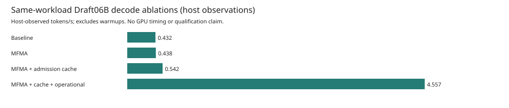
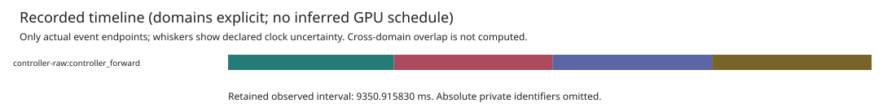
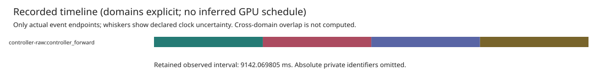
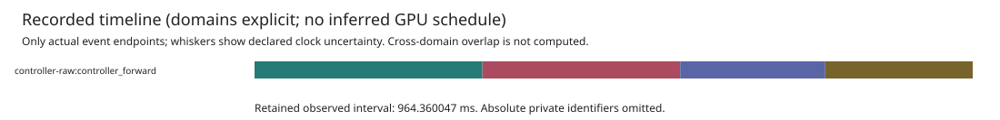
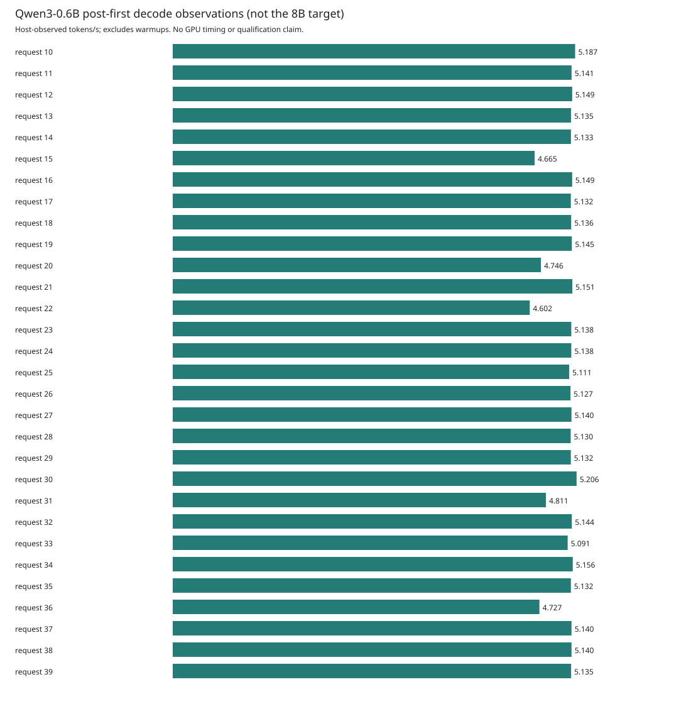

# Asrock GFX950 Draft Decode Observations

These are actual, reference-checked **Qwen3-0.6B Draft06B** engineering observations
on one AMD Instinct MI350X (`gfx950`). They are **not Qwen3-8B results**, a 700
tokens/s achievement, M1 performance qualification, or protected runtime admission.
All plots use recorded **host** timestamps. GPU execution overlap is unmeasured.
Concurrent CPU compiler and regression work was present: these captures are not
CPU-isolated benchmarks, only short diagnostic configuration observations.

The target remains **single-request, batch-one Qwen3-8B decode at 700 tokens/s**.
That target and its separate analytical bandwidth assumptions are documented in
[the performance protocol](GFX950_DECODE_PERFORMANCE_V1.md). They are not a
comparison line on these Draft06B plots.

## Workload And Checks

The four configuration captures each use zero warmup runs and one measured
request: the literal
prompt `The capital of France is` (five tokens), full prefill, then four greedy
output tokens. KV starts empty, uses one 16-token page, and ends at eight processed
tokens. Prefix caching and EOS stopping are disabled. Tensor parallelism is one.
The pinned checkpoint stores BF16 weights; the V10 output head produces FP32
logits. No quantization change is made for these observations.

Every actual token, decoded byte, scheduled input/position/selected row and KV
cursor matched the independently frozen CPU BF16-body/FP32-head reference. That
reference retained two identical full-vocabulary FP32-logit executions before any
candidate GPU output was observed. This is a pinned numerical oracle, not proof
that CPU and GPU implement identical floating-point operations for all inputs.

Each run completed four forwards and 1920 dispatches, returned all private pages,
and reported successful worker exit. The unchanged CPU-only `open_draft32` check
also accepted the closed 14-kernel V10 image and rejected target-image substitution.
Input, binary, artifact and reference hashes were checked; observations retain no
new load, launch or publication authority. Root-owned pre/post idle checks are
diagnostic isolation checks, not system-wide exclusive reservation guarantees.

## Observed Host Timing

| Configuration | Warmups / Requests | TTFT (s) | Mean Post-First TPOT (s) | Post-First Decode (tokens/s) | Output / Request Window (tokens/s) |
| --- | ---: | ---: | ---: | ---: | ---: |
| Baseline | 0 / 1 | 2.406761 | 2.314721 | 0.432017 | 0.427765 |
| MFMA | 0 / 1 | 2.290431 | 2.283883 | 0.437851 | 0.437537 |
| MFMA + admission cache | 0 / 1 | 1.864028 | 1.846562 | 0.541547 | 0.540269 |
| MFMA + cache + operational | 0 / 1 | 0.305985 | 0.219462 | 4.556594 | 4.147779 |

Post-first decode is **3 tokens / (last commit - first commit)**. The output/window
rate is **4 tokens / (last commit - request start)**, including prefill. These
different denominators must not be interchanged. TPOT is a mean over only three
gaps, not a stable tail or steady-state serving result.

Captures use the same model, prompt, reference, precision, native image,
controller, runtime worker and environment identity. Baseline and MFMA keep both
runtime flags off; the third enables `runtime_cache_admission` with MFMA while
keeping `runtime_operational` off. The fourth adds the existing
`runtime_operational` currentness mode, without changing the binaries, artifact,
reference or numerical acceptance. Runtime admission caching is **not KV prefix
caching**, which remains disabled. The observed rate ratios are descriptive, not
statistically established improvements: there is only one unwarmed request per
variant, with concurrent CPU work and no instrumentation-overhead correction.

| Projection | Setup Outside Request (s) | Teardown (s) | Whole Controller (s) |
| --- | ---: | ---: | ---: |
| Baseline | 148.754178 | 0.821274 | 158.946958 |
| MFMA | 155.963002 | 1.193573 | 166.318899 |
| MFMA + admission cache | 157.642958 | 1.200555 | 166.267304 |
| MFMA + cache + operational | 149.456290 | 1.194665 | 151.635277 |

Request rates are **not end-to-end throughput**; the large setup costs are not
included in the decode-rate bars.

The fourth request's three post-first gaps were 265.548540, 194.835606 and
198.002367 milliseconds. Its observed rate is about 10.547 times the baseline's
single observation, **not a qualified or causal speedup claim**. These host
measurements cannot identify how much time was GPU computation versus runtime
checking, IPC, scheduling or contention.

The timeline contains four actual `forward_start` to `forward_complete` host
intervals. It does not infer kernel placement from dispatch counts or draw an
imaginary GPU lane. Host intervals include controller, IPC, queue and wait costs;
the token metrics additionally end at checked KV commit and include between-step
observation emission. Recording overhead is unmeasured, not removed or assumed zero.

## Repeated-Request Lifecycle

A separate capture reused the same MFMA, admission-cache and operational-currentness
configuration, frozen binaries, native image and numerical reference. It completed
**40 fresh-KV requests: 10 warmups followed by 30 measured requests**, each with the
same five-token prompt and four generated tokens. The worker, weights and page
pool were reused; each request started with empty KV and retired its sequence.
This is repeated numerical and lifecycle evidence, not a new configuration in
the four-case comparison above.

All **160 forwards and 76,800 dispatches** completed. All 160 generated choices,
decoded bytes and scheduled input/position/selected-row/KV-cursor checks matched
the frozen reference, including warmups. After every request the single page was
free, with zero cached, retained or quarantined pages; the final record confirmed
all 40 runs completed and the worker exited successfully. Saved pre/post checks
showed zero graphics and memory-controller activity, unchanged 283 MB resident
VRAM, and only the checked zero-allocation monitor. These are recorded lifecycle
checks, not a system-wide exclusivity claim.

| Repeated Operational Capture | Observed Value |
| --- | ---: |
| Excluded warmups / measured requests | 10 / 30 |
| Measured output / post-first tokens | 120 / 90 |
| Median host TTFT (s) | 0.223435 |
| Median R33 floor TPOT (s) | 0.194699 |
| Pooled post-first decode (tokens/s) | 5.063301 |
| Output / measured request window (tokens/s) | 4.837703 |
| Setup / teardown / whole controller (s) | 148.995107 / 1.189740 / 183.315843 |

The pooled rate is 90 post-first tokens divided by 17.774966970 seconds of summed
request decode intervals. The output/window rate is 120 tokens divided by the
24.805158307-second measured window. Neither includes the large setup cost or
represents GPU execution time. Warmup records remain in the retained capture and
host timeline, but are excluded from these metrics.

The [sanitized repeated report](assets/asrock-draft-decode-v1/mfma-operational-repeat-report.json)
and [recorded host timeline](assets/asrock-draft-decode-v1/mfma-operational-repeat-host-timeline.svg)
retain the actual samples and provenance. The sampling label is
**`benchmark-sized-unqualified`**. CPU compiler/regression work was concurrent,
recording overhead was unmeasured, and the four-token requests do not establish
isolated benchmark performance, stable tails or steady-state serving. Do not
combine these 10/30 samples with the earlier 0/1 comparison or infer a validated
speedup. This remains Draft06B multi-dispatch evidence: no GPU-overlap, Qwen3-8B,
700 tokens/s, protected-admission or single-launch megakernel claim is made.

## Retained Evidence

[Baseline sanitized report](assets/asrock-draft-decode-v1/baseline-report.json),
[MFMA sanitized report](assets/asrock-draft-decode-v1/mfma-report.json),
[MFMA with admission caching report](assets/asrock-draft-decode-v1/mfma-cache-report.json),
[MFMA with cache and operational currentness report](assets/asrock-draft-decode-v1/mfma-operational-report.json),
and the [four-variant comparison](assets/asrock-draft-decode-v1/comparison-four-report.json)
contain exact nanosecond samples, per-request metrics, sampling class, lifecycle
durations, tool hashes and provenance digests. The graphs and report are byte
copies of the validated actual capture outputs, not regenerated synthetic examples.
Individual decode-rate figures are retained for
[baseline](assets/asrock-draft-decode-v1/baseline-decode.svg) and
[MFMA](assets/asrock-draft-decode-v1/mfma-decode.svg).
The [admission-cache decode-rate figure](assets/asrock-draft-decode-v1/mfma-cache-decode.svg)
and [operational-currentness decode-rate figure](assets/asrock-draft-decode-v1/mfma-operational-decode.svg)
are also retained. The earlier [two-variant report](assets/asrock-draft-decode-v1/comparison-two-report.json)
and [two-variant figure](assets/asrock-draft-decode-v1/comparison-two.svg) remain
available rather than being replaced.

| Identity | Value |
| --- | --- |
| Model revision | `c1899de289a04d12100db370d81485cdf75e47ca` |
| Draft weight payload SHA-256 | `1ef7831cb757e33432b09d47542a48b27509ae2ae99f3967c24913b300d41c62` |
| Independent reference SHA-256 | `6774a7ea7a50f0f2d3ff282897281d81c435aa25a7a543e2593a9624800bab25` |
| Native HSACO SHA-256 | `90f39f5f4a7f67522872251647af13920756acd7a15264615ccecb155fd109e9` |
| Observation manifest SHA-256 | `6d40c397bc98180135db067dca905547c7a0a6fa29443a9b0fa1a9f2e4eeebbb` |
| Controller SHA-256 | `0ced9e502c172b2bfbaeefd6b3e1c2b6fe43689d2979e21b0d9a96134f446392` |
| Runtime worker SHA-256 | `b4cb30788d4a32d9cae240823c26a80e9103f5698f91d95b16d2bda7e78270f9` |

The compiler-handoff identity is
`3303c167a43c0c9ad78a0fe4bd2a6d0c4eda772a28ccb1d5e9e26d939e81d071`
(471051 bytes), joined through the pinned engineering manifest. The native CLI
deletes its private handoff scratch; these observations do **not** claim the raw
handoff bytes were retained or revalidated. Hash consistency is not collector or
hardware attestation. Raw private captures, selectors, process identifiers and
absolute machine paths are intentionally not published.

## Limits

- The four one-request configuration observations are diagnostics, not a performance
  benchmark, statistical speedup estimate or stable latency distribution.
- Four-token greedy parity is not a general model quality or numerical guarantee.
- No admitted GPU-clock trace was collected. Host spans do not establish device
  duration, cross-CU clock alignment, compute/communication overlap or residency.
- This is the full Draft06B model through an engineering multi-dispatch path, not
  a single-launch Qwen megakernel, a Qwen3-8B result, or a 700 tokens/s claim.
- No adaptive retries, best-of-run selection, timing subtraction or correctness
  tolerance adjustment is used to make these observations pass.

The [reporting tool](../tools/qwen-decode-report/README.md) revalidates retained
records before rendering and separates request decode from aggregate throughput.
