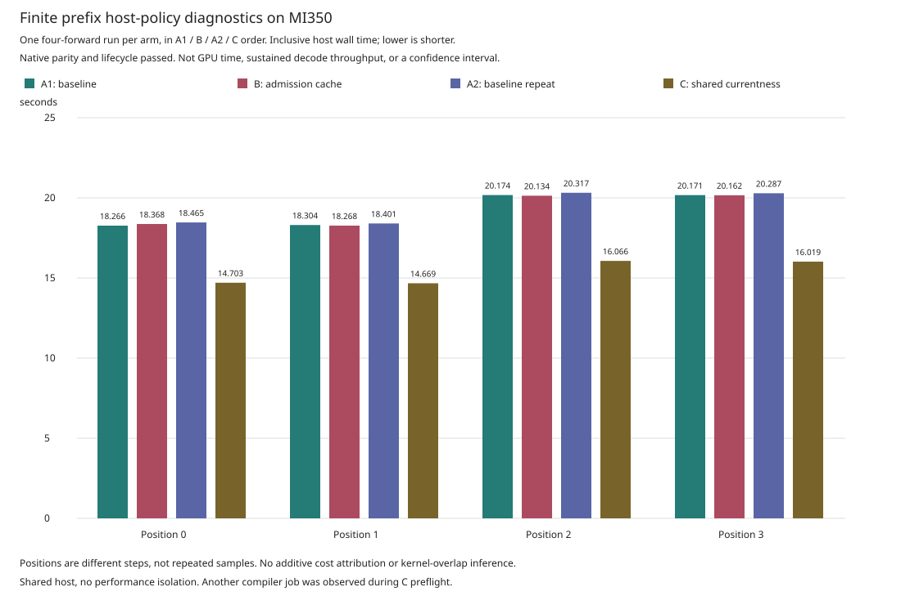

# Finite Prefix Host Policies

This opt-in engineering diagnostic isolates two host-overhead optimizations
for the four-forward gfx950 prefix route. It does not change production
admission or the V1 diagnostic. The V2 baseline and admission-cache arm have
completed on `mi350`, as have a repeated baseline and the shared-currentness
arm. The shared arm had lower observed host time in this diagnostic sequence;
these single runs do not establish a qualified decode speedup.

## Policies

| Request policy | Immutable admission cache | Shared full-currentness fence |
| --- | --- | --- |
| `baseline` | Off | Off |
| `immutable-admission-cache` | On | Off |
| `shared-full-currentness` | Off | On |

All three explicitly configure a fresh peer group before enabling observation
or allocating/uploading data. Operational-currentness shortcuts, raw GPU
timestamps and legacy profiling remain disabled. There is no combined policy,
automatic selection, retry or silent fallback. Unknown policies and late or
repeated runtime configuration are rejected.

The admission cache avoids repeating immutable kernel-object validation and
binding during dispatch preparation. Initial image admission still runs.
Current pointer ownership and extent, aliasing, ABI, dispatch geometry,
workgroup/grid limits, idle/completion frontier and queue checks remain.

Shared full-currentness performs one fresh topology discovery at each group
fence, bracketed by each rank's mutable checks. Every retained rank snapshot
and generation is rechecked; a failure poisons the group. It is not a topology
cache across calls. Individual I/O, wait and lifecycle checks remain. Round
publication already shares a fresh observation in the baseline, so that
existing behavior is not a contribution of this optimization.

These mechanisms live in the published
[fe2o3 runtime](https://github.com/harsh-nod/fe2o3/commit/6964f6129c4c42d343117f61cdbcfe6166392535).
Ferric selects and observes the policy; it does not replace the runtime checks.

## Request And Execution

Wrap a complete existing finite-prefix V1 decode configuration in a JSON
object with these fields:

- `schema`: `FerricFinitePrefixDecodeHostPolicyRequestV2`
- `policy`: one of the three names in the table
- `decode`: the complete, unchanged V1 configuration object

The new parent entry point is separate from the V1 diagnostic:

```sh
ferric-qwen3-finite-prefix-decode-host-policy-engineering \
  --request /absolute/policy-request.json \
  --allow-unauthenticated-machine-code --observe-host-policy
```

The request is limited to 64 KiB. The sidecar path is derived from the decode
evidence directory as `<evidence-directory>-host-policy-v2.json`; it must be
absent before launch. The parent binds the requested policy to the actual
worker binary, bootstrap, transcript and all seven recorded snapshots. It
validates the sidecar only after four completions, Close, EOF, successful
child exit and owned-process reap, before publishing the summary. A missing,
stale, mismatched or oversized sidecar fails the diagnostic.

This remains an explicitly unauthenticated-machine-code engineering route,
not authority to launch arbitrary artifacts through the production engine.

## CPU Validation

On `mi350-2`, fresh Ferric `9eca2576` and fe2o3 `6964f6129` Git archives plus
the exact 13-file V2 source overlay passed 633 tests with four ignored. The
[validation record](assets/finite-prefix-v228/host-policy-cpu.json) and
[source overlay](assets/finite-prefix-v228/host-policy-source.json) identify
the tested bytes and selected binary hashes.

| Selection | Passed | Ignored |
| --- | ---: | ---: |
| Worker library | 385 | 4 |
| Shared wire integration tests | 13 | 0 |
| Disjoint parent library selections | 224 | 0 |
| Eleven parent CLI tests | 11 | 0 |
| Total | 633 | 4 |

All 12 binaries built, and the parent's default-library check passed. The
runner checked actual test inventories against named outcomes, rather than
adding overlapping filters. The new V2 tests cover policy selection, strict
request parsing, policy/flag mismatches, stale identities, malformed sidecars,
and publication ordering. Shared data tests execute in both parent and worker.

The run used an initially empty target, two CPU cores and two Cargo/test
threads. Worker compilation used `nightly-2026-04-03`; parent compilation used
Rust `1.97.1` with `RUSTC_BOOTSTRAP=fe2o3_device,fe2o3_macros`. Dependencies and
toolchains were cached. Both test and binary builds used optimized test
profiles with debug assertions and overflow checks retained. All 6,928
post-overlay source files remained unchanged. Cargo metadata checked 39 worker
packages and 209 parent packages against their separate dependency graphs.

This is a selected CPU cohort, not a workspace-wide regression, formatting,
Clippy, compiler/HSACO reproduction or GPU qualification. Direct tests of
real-group recorder initialization and post-Close sidecar-write failures
remain gaps. The previous V1 GPU result does not qualify these new binaries;
their separate V2 baseline result follows.

## GPU Baseline

The freshly built CPU633 parent and worker completed one four-forward,
teacher-forced baseline diagnostic on `mi350`. All 152 retained tensor rows
matched the prior native route bit-for-bit. Three pre-run and three post-run
device-state audits passed; all owned processes exited and were reaped without
forced cleanup. All 57 final output files were independently rehashed after
local retention. The [baseline record](assets/finite-prefix-v228/host-policy-baseline.json)
binds these results to the actual binaries, deployment, controller and sidecar.

| Position | Forward Wall (ms) | Full Currentness R0 (ms) | Full Currentness R1 (ms) | Admission R0 (ms) | Admission R1 (ms) |
| --- | ---: | ---: | ---: | ---: | ---: |
| 0 | 18,266.096 | 8,529.099 | 8,492.171 | 14.202 | 10.533 |
| 1 | 18,304.417 | 8,544.323 | 8,511.074 | 14.190 | 10.485 |
| 2 | 20,174.308 | 9,481.453 | 9,443.423 | 14.096 | 10.484 |
| 3 | 20,171.139 | 9,476.559 | 9,445.684 | 14.115 | 10.574 |

Setup's snapshot interval was 174.817 seconds; Close took 26.475 seconds.
The parent diagnostic took 421.828 seconds, while the surrounding controller
took 439.514 seconds. These are different timing boundaries. The table records
inclusive, nested host scopes, not additive costs or GPU time. Both optional
optimizations were disabled. This single baseline is not an ablation, a speedup claim,
independent full-model acceptance or the sustained 2,048/256 workload.
The V2 autoregressive diagnostic remains unrun.

## Admission Cache Observation

The next single-run diagnostic enabled only `immutable-admission-cache`,
using the same CPU633 binaries, device images, model, prompt and numerical
checks. All 152 native tensor rows again matched bit-for-bit. All six device
audits passed, and all owned processes exited and were reaped without forced
cleanup. All 57 final outputs were independently rehashed locally. The
[cache record](assets/finite-prefix-v228/host-policy-cache.json) retains its
own receipt, policy snapshots and host counters.

The intended counter change occurred: per-forward repeated kernel admissions
fell from 148 / 145 on ranks 0 / 1 to zero on both ranks, with zero time recorded
in that repeated-admission scope. Setup still performed the required 9 / 6
initial image admissions. Dispatch counts remained 148 / 145 per forward;
full-currentness counts, shared publication counts, and I/O counts and byte
extents were unchanged. Operational-currentness shortcuts, shared group
currentness and raw timestamps remained off in all seven snapshots.

| Position | Baseline Forward Wall (ms) | Cache Forward Wall (ms) | Cache Minus Baseline (ms) |
| --- | ---: | ---: | ---: |
| 0 | 18,266.096 | 18,368.441 | +102.345 |
| 1 | 18,304.417 | 18,268.495 | -35.921 |
| 2 | 20,174.308 | 20,133.830 | -40.479 |
| 3 | 20,171.139 | 20,162.169 | -8.971 |

This removes the intended repeated work, but these two diagnostic runs do
not establish an overall latency improvement. The four forward durations sum
to 76.916 seconds for baseline and 76.933 seconds for cache. Their positions
are different steps, not independent repetitions of one workload; no
confidence interval or speedup claim is justified. The largest measured host
scopes remain full-currentness checks. The cache setup interval was 167.157
seconds, Close 26.697 seconds, parent 414.917 seconds and controller 432.616
seconds. Do not attribute the cross-run setup difference to caching when
initial admission and setup operation counts did not change.

## Baseline Repeat

A fresh baseline worker ran after the cache arm with both optional policies
off. All 152 native tensor rows, six device audits and clean Close/reap checks
passed again. All 57 final outputs were independently rehashed locally. The
[repeat record](assets/finite-prefix-v228/host-policy-baseline-repeat.json)
retains its separate receipt and the unchanged binary identities. Deterministic
operation counts match the first baseline, including the restored 148 / 145
admissions per forward. Completion-poll counts can vary with timing.

| Position | First Baseline (ms) | Cache (ms) | Repeated Baseline (ms) |
| --- | ---: | ---: | ---: |
| 0 | 18,266.096 | 18,368.441 | 18,464.903 |
| 1 | 18,304.417 | 18,268.495 | 18,401.490 |
| 2 | 20,174.308 | 20,133.830 | 20,317.262 |
| 3 | 20,171.139 | 20,162.169 | 20,286.874 |
| Sum | 76,915.960 | 76,932.935 | 77,470.528 |

The baseline totals differ by 554.568 ms, compared with the initial cache
minus baseline difference of 16.974 ms. The cache total lies between the
two baseline totals; not every individual position lies between its baseline
samples. This A/B/A sequence establishes the intended admission-counter
reduction, not a reliable end-to-end speedup, confidence interval or linear
drift correction. The repeated baseline's setup interval was 167.248 seconds,
Close 27.115 seconds, parent 415.551 seconds and controller 433.236 seconds.

## Shared Currentness Observation

The separate `shared-full-currentness` arm completed with the same CPU633
binaries, images, model, prompt and numerical gates. All 152 retained native
tensor rows were bitwise equal. All six device audits and seven owned process
leaves passed, with natural exit, confirmed reap and no forced cleanup. All
57 final outputs were independently rehashed locally. Its
[record](assets/finite-prefix-v228/host-policy-shared.json) binds the actual
policy, counters, binaries and receipt.



| Position | First Baseline (ms) | Repeated Baseline (ms) | Shared Currentness (ms) | Shared Minus First (ms) | Shared Minus Repeat (ms) |
| --- | ---: | ---: | ---: | ---: | ---: |
| 0 | 18,266.096 | 18,464.903 | 14,703.166 | -3,562.930 | -3,761.737 |
| 1 | 18,304.417 | 18,401.490 | 14,669.381 | -3,635.036 | -3,732.109 |
| 2 | 20,174.308 | 20,317.262 | 16,065.775 | -4,108.534 | -4,251.487 |
| 3 | 20,171.139 | 20,286.874 | 16,019.419 | -4,151.720 | -4,267.455 |

The four forward durations sum to 61.458 seconds, compared with 76.916 and
77.471 seconds for the two baselines. This is an observed reduction in this
host-heavy diagnostic, not evidence of kernel acceleration, sustained decode
throughput or superiority to another runtime. The host was not performance
isolated: another compiler job was observed during C preflight and was left
untouched. There is only one run per arm and two baseline observations, not
enough to establish a confidence interval or attribute every wall-time change.

The counters show the intended change separately from the timing:

| Positions | Baseline Rank Full Checks R0 / R1 | Shared Rank Full Checks R0 / R1 | Fresh Shared Group Checks | Existing Shared Publication Checks |
| --- | ---: | ---: | ---: | ---: |
| 0, 1 (each) | 5,068 / 5,048 | 2,872 / 2,852 | 2,196 | 288 |
| 2, 3 (each) | 5,644 / 5,624 | 3,160 / 3,140 | 2,484 | 288 |

In this run, each rank's full-check decrease equals the new group-fence count.
That equality is an observation, not an unconditional gate: periodic wait
rechecks and completion polls can depend on timing. Individual currentness
checks remain nonzero. Admissions and dispatches remain 148 / 145 per forward;
initial admissions remain 9 / 6. Read/write counts, byte extents and publication
counts are unchanged. The cache, operational shortcuts and raw timestamps
remain off in all snapshots. Group-currentness time is its own inclusive
scope, not an additive cost that can be subtracted into GPU time.

The shared setup snapshot interval was 141.722 seconds, Close 21.901 seconds,
the parent 368.802 seconds and the controller 386.540 seconds. Keep those boundaries separate
from forward latency. The current shared path still invokes each rank's full
idle check immediately after the fresh group fence. The next candidate
consolidates those duplicate currentness checks while retaining poison,
queue-counter, completion-frontier and exception validation. Its CPU validation
is recorded below; its rebuilt worker still needs a separate GPU comparison.

This remains pre-qualification host-overhead diagnosis, not completion of
issue #42's M6 performance gate. V2 autoregressive validation also remains open.

## Consolidation Candidate

[fe2o3 `725ecc6a5`](https://github.com/harsh-nod/fe2o3/commit/725ecc6a500ff49e7dfaefb38b027f6bcc223ebf)
factors the existing idle check into its ordinary wrapper and a private queue
validator. The shared group path calls that validator only after a successful
fresh full group fence. Standalone and nonshared paths still perform their
original currentness checks; both paths reject a poisoned ordered context.
Queue-counter observation, completed frontier, monotone counters, retained
read frontier and acquired exception checks keep their original order.
The change does not cache topology or add an operational-currentness shortcut.

Fresh source archives plus the exact overlays passed 475 CPU tests with four
ignored on `mi350-2`, and a new worker binary built. The
[CPU record](assets/finite-prefix-v228/group-fence-cpu.json) identifies the
tested sources, named outcomes and binary separately from CPU633 and the
four completed GPU arms.

| Selected Runtime Tests | Passed |
| --- | ---: |
| Context checks | 14 |
| Peer group, including three new routing tests | 15 |
| Fresh device-group currentness | 7 |
| Publication checks | 16 |
| Host observation | 13 |
| Performance policy | 5 |
| Ordered batches | 7 |
| Runtime subtotal | 77 |
| Worker library and shared wire | 398 |
| Total | 475 |

The production routing function is exercised with recording backends for two
and eight ranks, every routed failure, repeated fresh fences, and a failing
later fence. Every injected failure passes through the real group completion
handler and must quarantine subsequent operations. These CPU tests do not
execute native queue MMIO. All 12 owned CPU phases completed successfully;
all 6,928 extracted source files were unchanged after execution. The run used
an empty target, cached dependencies, two CPU/test threads and the same nightly
toolchain and checked optimized profile as the earlier worker build. All 62
raw records and the binary were rehashed after local retention.

The first test launch failed before compilation because Cargo does not accept
explicit feature switches for this dependency outside the worker workspace.
The corrected launch retains the worker's declared engineering feature and
requires the actual 77-test inventory. The failed attempt remains a failure.
A focused formatting check reported a pre-existing import-wrapping difference;
it was left unchanged, and no formatting pass is claimed.

This is not a parent rebuild, full workspace regression, new HSACO, GPU parity
result or speedup measurement. The A/B/A/C graph above still uses the previous
worker. Next, deploy this new binary with its own runtime review and repeat
the numerical, audit and cleanup gates before comparing host counters or time.

## GPU Comparison Gates

Run each arm in a fresh worker with identical devices, images, inputs, token
history and numerical checks. Retain a baseline repeat between candidates
to expose drift, and preserve pre/post device audits and Close/reap evidence.
Only compare an arm after its own tensor checks and shutdown checks pass.

Report admission-cache and shared-currentness effects separately. Admission
counts include required load-time work, and shared-group counters are distinct
from existing publication counters. Individual full-currentness counts may
remain nonzero in the shared arm.

Recorded scopes are inclusive, nested host timings. Do not sum them as
disjoint contributions, subtract them into GPU time, infer kernel overlap or
convert four forwards into the 2,048/256 throughput target. Independent
floating-point premises, the sustained workload, equal-work baselines and
production qualification remain open; see the
[overall checkpoint](GFX950_FINITE_PREFIX_PROGRESS_V1.md).
