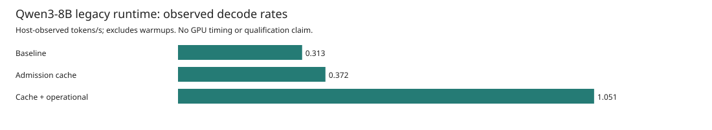
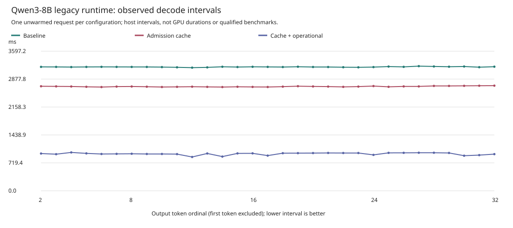
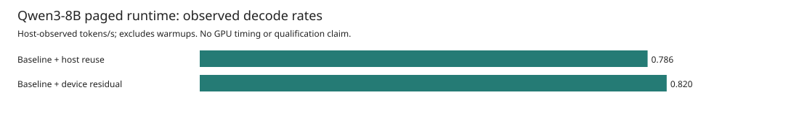
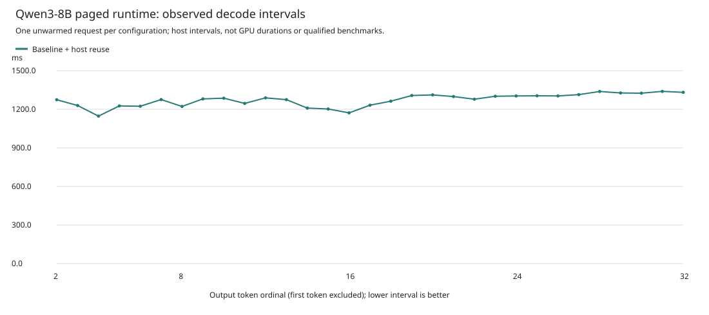
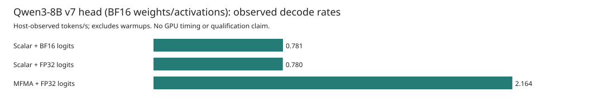
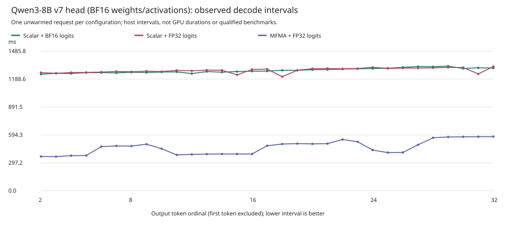
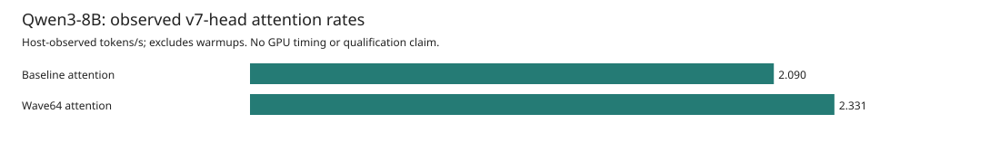
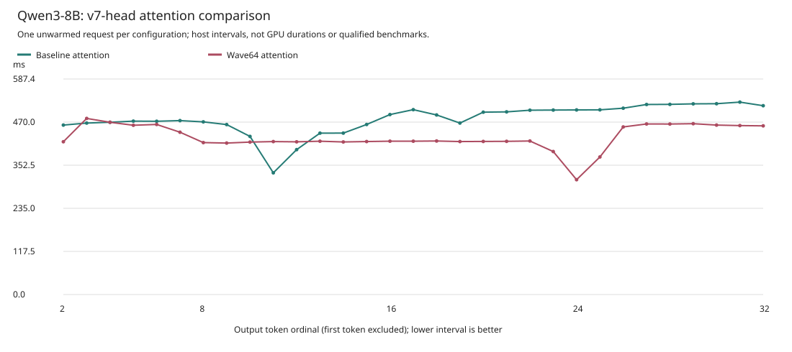
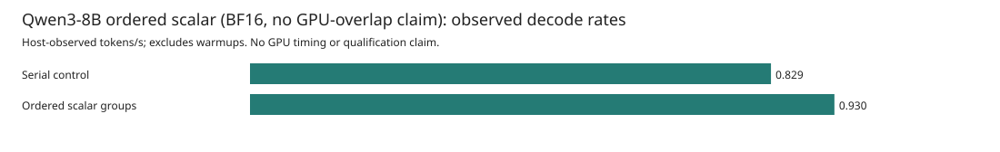
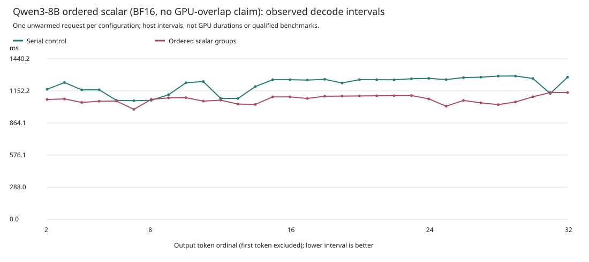

# Qwen3-8B BF16 Decode: Measured Optimization Steps

These are actual **single-request, target-only Qwen3-8B BF16** observations on
Asrock's AMD Instinct MI350X (`gfx950`), not Qwen3-0.6B results. Every plotted
capture checks all 32 generated token IDs and decoded bytes against an independent,
SHA-pinned reference. **700 tokens/s is not achieved.** These are multi-dispatch
engineering executions, not a full-model megakernel or a SOTA comparison.

Each comparison cohort has **one unwarmed request per configuration, with 31
post-first-token intervals**.
CPU isolation and recording-overhead corrections are absent. Ratios below describe
these observations; they are not controlled causal contributions, repeated-run
speedup estimates, stable tail measurements or production qualifications.

The separately matched [cooperative BF16 argmax comparison](GFX950_BF16_ARGMAX_V1.md)
adds an exact-choice kernel explanation, conditional bounds, and its own plots
and raw public reports. It does not modify the original four cohorts or their 310
interval points. A fifth, separately matched wave-attention cohort below adds 62
interval points; neither single-request difference is a stable speedup claim.

## Fixed Workload

| Item | Checked value |
| --- | --- |
| Model | `Qwen/Qwen3-8B` |
| Revision | `b968826d9c46dd6066d109eabc6255188de91218` |
| Weights and intermediate activations / target / concurrency | BF16 / target-only / one request, TP1 |
| Output logits | BF16 controls; the head and wave-attention cohorts explicitly label FP32 logits |
| Prompt | `The capital of France is` |
| Prompt tokens | `[785, 6722, 315, 9625, 374]` |
| Generated tokens / processed KV positions | 32 / 36 |
| Context capacity | 64 |
| Independent reference | Two matching BF16 SDPA greedy passes, generated earlier on MI300X |
| Reference SHA-256 | `1ed868663df52a146dd7921f9fbb2cf1e1d0c0ceed8a7bfda030d65f8ec5b094` |

Five token-at-a-time prompt forwards produce the first output, and 31 further
forwards produce the remaining outputs. Decode throughput is therefore:

```text
post_first_tokens_per_second = 31 / sum(the 31 inter-token intervals)
mean_TPOT = sum(the 31 inter-token intervals) / 31
```

It is not 32 divided by that duration, and it excludes first-token latency and
setup. The reference output is ` Paris. The capital of Italy is Rome. The capital
of Spain is Madrid. The capital of Germany is Berlin. The capital of the
Netherlands is Amsterdam. The`. Exact choices and bytes for this prompt are
evidence of bounded parity, not an error bound on every logit or model-wide quality.

## Legacy Runtime Ablation

These variants use the same target v1 controller, runtime worker, 14-root native
image, model, reference, prompt, precision and workload. They execute 19,584
dispatches each. The only configuration changes in this series are the named
runtime admission/currentness options; prefix reuse, quantization and speculation
are not enabled.

| Configuration | TTFT (s) | Mean TPOT (s) | Post-first tokens/s | Observed rate / first | Setup (s) |
| --- | ---: | ---: | ---: | ---: | ---: |
| Baseline | 15.931709 | 3.191286 | 0.313353 | 1.000x | 197.600449 |
| Admission cache | 13.390205 | 2.686603 | 0.372217 | 1.188x | 197.974242 |
| Cache + operational | 4.461510 | 0.951921 | 1.050508 | 3.352x | 166.020448 |

| Added option, relative to the preceding row | Observed rate ratio | Observed mean TPOT change |
| --- | ---: | ---: |
| Admission cache | 1.188x | -15.81% |
| Operational currentness, retaining the cache | 2.822x | -64.57% |

These adjacent contrasts are descriptive, not isolated causal estimates. Their
percentages must not be added together or presented as statistically validated
optimization contributions.





The interval plot starts at output token 2; token 1 belongs to TTFT. Its points
are actual host observations, not sampled or inferred GPU events. Source values
are retained in the [interval CSV](assets/asrock-target8b-ablations-v2/legacy-intervals.csv),
[baseline report](assets/asrock-target8b-ablations-v2/legacy-baseline-report.json),
[admission-cache report](assets/asrock-target8b-ablations-v2/legacy-cache-report.json),
and [operational-currentness report](assets/asrock-target8b-ablations-v2/legacy-operational-report.json).
The [observed contrasts](assets/asrock-target8b-ablations-v2/observed-contrasts.json)
calculate adjacent rate ratios and TPOT changes without treating them as additive
optimization contributions. Large initialization costs remain visible in the
table; the rate bars are not process-start-to-finish throughput.

### Cache Immutable Admission Work

`--runtime-cache-admission` retains kernel inspection/binding information already
validated when the worker loads its immutable owned image. Without this option,
the runtime repeats object validation and symbol binding during dispatch.
Caching avoids that repeated host work for an unchanged loaded kernel.

It **does not cache the KV prefix or skip each dispatch's dynamic checks**.
Buffer ownership, aliasing, argument values, launch geometry and queue state are
checked again. The source comment and dispatch path are in the pinned
[gfx950 engineering runtime](https://github.com/harsh-nod/fe2o3/blob/fe406b0c3275c33b92f81734a4e6e3852b891073/crates/fe2o3-kfd/src/engineering_gfx950.rs).
That distinction matters when removing host overhead: reusable immutable
validation and changing dispatch operands have different lifetimes.

### Use The Retained-Queue Currentness Contract

`--runtime-operational` selects the existing engineering operational fence for
non-lifecycle operations. Full topology/aperture checks remain required at
lifecycle boundaries. The shorter fence still checks process incarnation,
reset state, KFD/render descriptors, UAPI version, XNACK mode, and DRM identity or
VRAM-loss state. A failure poisons the retained token; it cannot silently recover.
This is **not a switch that disables all safety checks**. See the pinned
[device currentness implementation](https://github.com/harsh-nod/fe2o3/blob/fe406b0c3275c33b92f81734a4e6e3852b891073/crates/fe2o3-kfd/src/device_gfx950.rs).

No isolated attribution to any individual fence operation is possible from the
host token intervals. The experiment changes a named runtime mode and preserves
its existing numerical and lifecycle contracts.

## Paged Runtime: Separate Experiments

The paged batch controller is a different execution path. Its single-request
experiments must not be inserted into the legacy-runtime chart as though only one
option changed. Its fixed workload is one row, prefill chunk one, four 16-token
physical pages, context 64, disabled prefix caching and disabled output-head
pruning. Admission caching and operational currentness are enabled together.

Both completed scalar-projection captures check all 32 target choices and decoded
bytes. They retain the same controller, worker, native image and scheduling
options. The first uses host-staged reusable reduction buffers; the second changes
only the TP1 residual path to device-side handling. Neither establishes a speedup
over the different legacy controller.

| Configuration | TTFT (s) | Mean TPOT (s) | Post-first tokens/s | Observed rate / first | Setup (s) |
| --- | ---: | ---: | ---: | ---: | ---: |
| Baseline + host reuse | 5.953338 | 1.272268 | 0.785998 | 1.000x | 168.567387 |
| Baseline + device residual | 5.720333 | 1.220244 | 0.819508 | 1.043x | 168.326220 |





The [host-reuse report](assets/asrock-target8b-ablations-v2/batch-baseline-host-report.json),
[device-residual report](assets/asrock-target8b-ablations-v2/batch-baseline-device-report.json)
and [interval CSV](assets/asrock-target8b-ablations-v2/batch-intervals.csv) retain
the actual data. The observed device/host rate ratio is 1.043x and mean TPOT is
4.09% lower, but one unwarmed observation per mode is not a qualified speedup.
The techniques below describe source paths; rejected or unmeasured configurations
and pending native candidates are not plotted as successful results.

### Rejected Numerical Candidate

The subsequent `wave-host` capture changed only the projection mode while
retaining the same v3 image, controller, worker, host-reuse collective and other
options. It completed and closed its worker, but **failed the immutable 32-token
reference**:

| Check | Observed result |
| --- | --- |
| Matching initial output tokens | 12 |
| First differing output | Index 12, the 13th token |
| Expected token | `17689` (` Spain`) |
| Actual token | `9856` (` Germany`) |
| Numerical acceptance | Rejected |

No rate, interval plot or speedup from this rejected capture is published.
Successful worker shutdown and post-run idle/input checks do not override a
numerical mismatch. The original capture is retained with SHA-256
`fea7a82c7a83bbc06593d1e909e12b5c395bdeb15a2c882947dc1af18f7d78d1`;
the validator rejection log has SHA-256
`5136ce0f6f1a16d9d59a7d2daa33213491c538d3666cabae808863163e5e332e`.

Dependent wave/device-residual and wave/IPC-sequence captures were halted pending
diagnosis. The reference, token window and acceptance rule were not weakened.
Wave reductions change summation order, which is a reason to validate them, not
an established diagnosis of this particular mismatch.

### Cooperate Across Wave64 For GEMV

The [projection kernels](../device/qwen3-tp-perf-kernels-v3/src/projection.rs)
assign one Wave64 to a row/output-column dot product. Lane `l` accumulates
elements `l, l + 64, l + 128, ...` in FP32, and the subgroup combines the 64
partials. Adjacent lanes load adjacent BF16 weights from the unchanged row-major
layout. Only the designated output lane stores after the collective and finite
checks.

This exposes parallelism along K for batch-one projections and coalesces adjacent
weight accesses. It is a WaveGEMV path, not a claim that these runs use an MFMA
matrix tile. Floating-point reduction order differs from scalar accumulation,
so independent token/byte validation is mandatory even when shapes and dtype match.

### Keep The TP1 Residual On The Device

The [TP1 residual kernel](../device/qwen3-tp-perf-kernels-v3/src/collective.rs)
retains an output/down projection's FP32 partial, adds the BF16 residual converted
to FP32, and rounds the result to BF16 once. It preserves the existing arithmetic
order, including its initial FP32 zero addition and finite-value checks.

Device-side residual handling removes the corresponding host-staged transfer and
reduction boundary. It adds two GPU dispatches per layer: 616 instead of 544 per
forward, or 22,176 instead of 19,584 over the request. More dispatches can still
mean less host work, but only actual end-to-end measurements establish the net
effect. No cross-device collective is claimed by the TP1 kernel.

### Bound Extra Serial Completion Polls

A separate software experiment retains scalar projections and device-side TP1
residuals but changes the runtime worker binary. It must not be inserted into the
same-worker ablation above. The old worker is SHA-256
`b4cb30788d4a32d9cae240823c26a80e9103f5698f91d95b16d2bda7e78270f9`;
the bounded-poll worker is
`737f151f798b16cf8393659950cddf1b62faa204e8c8dbbc5c2753b969391d20`.
Controller, native image, reference, runtime options and 22,176 dispatches remain
the same, and both separate resource-accounted captures pass all 32 output tokens.

After the first pending completion observation, including its mandatory initial
currentness fence, the new worker opens one monotonic backoff window. It admits
at most 16 additional fresh polls while the window is less than 10 microseconds
old, with a spin-loop hint between attempts. Once either limit is reached it uses
the unchanged 50-microsecond sleeps for the rest of that dispatch, without
reopening the window. Completion and error paths return before a pause or new
backoff-clock read. The poll implementation, publication, timeout start, success
idle fence, peer/ordered paths and teardown remain unchanged. This bounds extra
poll admissions, not the duration of a poll that blocks or is descheduled.
The `engineering_gfx950.rs` implementation snapshot has SHA-256
`cece0666efd8219c77d7038ec13b0f5d77e13952571028e8154a36c9fe3e75aa`.
The published [backoff implementation and validation note](https://github.com/harsh-nod/fe2o3/blob/01cd73e4813a5484ac025034f1315aa76f8e2a54/docs/gfx950-serial-backoff-v1.md)
records the unchanged runtime contracts and focused tests.

| Separate software cohort | TTFT (s) | Mean TPOT (s) | Post-first tokens/s | Setup (s) | Whole-process CPU (s) |
| --- | ---: | ---: | ---: | ---: | ---: |
| Original worker, resource control | 5.380819 | 1.231651 | 0.811919 | 167.792913 | 181.98 |
| Bounded extra-poll worker | 5.903367 | 1.192912 | 0.838285 | 169.620889 | 183.92 |

These are again one unwarmed request per worker, with concurrent CPU work and no
CPU isolation. The observed rate difference is not a causal or statistically
qualified gain. CPU seconds are GNU time's user plus system seconds for the
controller and waited-for children, **including setup and teardown**, not
decode-only CPU time. The larger total for the second row cannot establish the
backoff's isolated CPU cost, and these captures did not measure completion-poll
counts. The [original-worker report](assets/asrock-target8b-ablations-v2/worker-control-report.json),
[new-worker report](assets/asrock-target8b-ablations-v2/worker-spin-report.json),
[control resources](assets/asrock-target8b-ablations-v2/worker-control-resources.txt)
and [new-worker resources](assets/asrock-target8b-ablations-v2/worker-spin-resources.txt)
retain the checked observations separately. Runtime-counter profiling, when used,
is a different instrumented diagnostic and cannot replace these non-profiled rows.

### Measure Host Counters Separately

Two additional requests explicitly enabled runtime profiling, with the same old
and new worker hashes shown above. Both pass the unchanged 32-token reference and
perform 22,176 scalar/device-residual dispatches. These are a separate diagnostic
cohort, not the uninstrumented resource pair or a GPU execution timeline.

| Workload counter delta | Original worker | Bounded extra-poll worker |
| --- | ---: | ---: |
| Completed dispatch packets | 22,176 | 22,176 |
| Worker commands | 22,393 | 22,393 |
| Completion observations | 337,974 | 574,169 |
| Completion observations / dispatch | 15.2405 | 25.8915 |
| Operational currentness checks | 89,137 | 89,137 |
| New kernel admissions | 0 | 0 |
| Command host-wall seconds | 40.476575122 | 40.356761093 |
| Dispatch preparation host-wall seconds | 1.729881243 | 1.952099832 |
| Dispatch publication host-wall seconds | 1.718533726 | 1.935345915 |
| Dispatch wait host-wall seconds | 35.265477265 | 34.493446267 |
| Currentness host-wall seconds, overlapping | 6.752211722 | 7.604924692 |

The counters are differences between the before-workload and after-workload
snapshots. Their window includes the earlier snapshot command and the later
snapshot's idle/currentness fence, but excludes worker close. Command timing
excludes framing reads and response emission. These are **host-wall timers, not
GPU timestamps, GPU kernel durations, thread CPU seconds or measured overlap**.
Currentness/admission timing overlaps other phases; summing every timer row or
stacking them as independent optimization contributions would double-count work.

The bounded-poll observation has more completion polls, larger preparation,
publication and currentness totals, and a smaller wait total. One instrumented
request per worker, without CPU isolation or profiling-overhead correction, does
not establish an isolated backoff effect or a net performance win. The change in
poll count is an observation, not a hardware-overlap measurement.

The [original-worker counter report](assets/asrock-target8b-ablations-v2/runtime-profile-control-report.json)
and [new-worker counter report](assets/asrock-target8b-ablations-v2/runtime-profile-spin-report.json)
are the separate runtime-profile checker's explicit public whitelist. They retain
all 19 before/after/delta counters, frozen input/checker identities and numerical
checks, without private process or device selectors. Their schema is deliberately
not accepted by the ordinary rate-plot input contract.

### Group Serial IPC Submissions

The existing `--dispatch-sequences` path groups bounded dependent dispatches in a
single worker command. This amortizes serial controller/worker communication;
the underlying kernels still execute with their required ordering and completion
checks. Packet counts do not decrease merely because command frames are grouped.

This is **not the ordered-AQL-batch path, GPU execution overlap, or a persistent
full-model megakernel**. Any reduction in IPC command count is a source-level
schedule property, not a measured hardware overlap duration. This experiment does
not enable queue rollover or relax the separately guarded ordered-batch mode.

### Retain Rejected Loop-Tuning Attempts

An archived projection candidate attempted to stop the FP32 partial's reduction loop
after its admitted K dimension rather than continuing empty iterations up to the
largest supported width. It is **not included in the measured charts** until a
native artifact and actual GPU reference check both succeed.

Three source variants failed native lowering and produced no runnable candidate
artifact. A divided dynamic loop bound failed the checked arithmetic proof for
`step * 64`. Adding an explicit maximum guard resolved that issue, but the dynamic
ranking header failed `FE2O3-PROGRESS-002`. Restoring a static header with a uniform
early break then failed the unique-header-exit requirement. All failures and
source snapshots are retained; no compiler gate, arithmetic policy or numerical
acceptance rule was relaxed. A source proposal or passing CPU test is not GPU
performance evidence.

A fourth formulation uses six explicit static loops for the admitted K values
512, 1536, 2048, 4096, 6144 and 12288. Their trip counts are respectively 8, 24,
32, 64, 96 and 192. Native compilation and ordinary artifact admission passed,
but this alone is not a candidate GPU result. In TP1, the attention-output partial
needs 64 useful iterations while the down projection still needs 192; the
per-lane FP32 operation order and final subgroup reduction remain unchanged.
After the wave model capture failed its reference, this source experiment was
retired and its two production-file deltas restored to the baseline. Its source
snapshots and native/admission evidence remain archived; it is not a landed
model-qualified optimization.

## MFMA And Output-Head Precision

This is a third, separately matched cohort. All three captures use the same
controller, original worker, 15-root v3 MFMA-capable image, three-root v7 head
sidecar, reference and paged workload. They retain scalar attention, host-staged
reusable TP1 reductions and 19,584 dispatch packets. Prefix reuse, pruning,
dispatch sequences, ordered batches and queue rollover are disabled. Each
capture passes **all 32 original token IDs and decoded bytes**; the failed WaveGEMV
candidate above remains rejected and is not rehabilitated by these results.

Weights and intermediate activations remain BF16 in every row. The first row is
an explicit BF16-logit control; the other two retain the final output logits in
FP32 before greedy selection. This precision difference is not hidden under the
BF16 model label, and no quantized weights, speculative tokens or extra requests
are used.

| Configuration | TTFT (s) | Mean TPOT (s) | Post-first tokens/s | Observed rate / first | Setup (s) |
| --- | ---: | ---: | ---: | ---: | ---: |
| Scalar + BF16 logits | 5.970907 | 1.280531 | 0.780926 | 1.000x | 169.661754 |
| Scalar + FP32 logits | 6.257646 | 1.281963 | 0.780053 | 0.999x | 167.166619 |
| MFMA + FP32 logits | 1.787298 | 0.462051 | 2.164262 | 2.771x | 211.986581 |

| Change relative to preceding row | Observed rate ratio | Observed mean TPOT change |
| --- | ---: | ---: |
| Preserve FP32 output logits | 0.999x | +0.11% |
| Use MFMA projections, retaining FP32 logits | 2.775x | -63.96% |





The [BF16 control report](assets/asrock-target8b-ablations-v2/head-baseline-bf16-v7-control-report.json),
[scalar FP32-logit report](assets/asrock-target8b-ablations-v2/head-baseline-fp32-v7-report.json),
[MFMA FP32-logit report](assets/asrock-target8b-ablations-v2/head-mfma-fp32-v7-report.json)
and [31 intervals per request](assets/asrock-target8b-ablations-v2/head-intervals.csv)
retain the checked measurements. The observed MFMA/scalar-FP32 rate ratio is
2.7745x, not a causal or statistically qualified contribution. These are one
unwarmed request per configuration, not a SOTA comparison or a stable 2.16-token/s
claim. Runtime-counter profiling and host-span sidecars are disabled in this
cohort; the existing host token timing, JSON emission and their uncorrected
overheads remain. Separately instrumented diagnostics must not replace these rows.

### Tile BF16 Products With FP32 Accumulation

The [v3 projection source](../device/qwen3-tp-perf-kernels-v3/src/projection.rs)
assigns one Wave64 to a 16-by-16 output tile. Its matrix-fragment API loads
16-wide K fragments and issues BF16 matrix multiply-accumulate with FP32
accumulators. Inactive activation rows are zero-filled; a single-token request
therefore does not fill all 16 tile rows. Only live output elements are stored,
with explicit finite and extent checks. Attention-output and down projections
retain FP32 partials for the existing residual path; other intermediate outputs
round back to BF16. The matrix reduction order is different from the scalar
projection, so passing native compilation alone is not sufficient acceptance.

MFMA uses an additional resident row-major `[k, n]` transpose of the unchanged
BF16 weights. The actual setup receipt records **15,136,194,560 additional
resident bytes** in this run. This is a layout copy, not compression or reduced
precision. Its preparation and allocation remain included in the 211.99-second
setup observation above; they are not charged to the post-first-token rate.
Memory cost and setup cost must accompany any reuse-based decode comparison.

### Preserve Logits Through Greedy Selection

The [v7 head projection](../device/qwen3-tp-fp32-head-kernels-v7/src/projection.rs)
and [argmax](../device/qwen3-tp-fp32-head-kernels-v7/src/logits.rs) avoid rounding
the final logit vector to BF16 in the explicitly selected FP32 modes. The
predeclared head workspace is 9,723,904 bytes, `16 * 151936 * 4`, versus zero
additional FP32-head workspace in the BF16 control. This does not convert the
model's weight tensors or intermediate activations to FP32.

Retaining FP32 logits can prevent a final BF16 conversion from collapsing close
values into a tie, but these captures do not establish that as the cause of the
earlier WaveGEMV mismatch. All three rows match the same independent reference on
this prompt; that does not establish bitwise equality of every logit, broader
generation equivalence or model-wide quality. The dedicated
[head validator](../tools/target_head_decode_v1.py) checks the declared precision,
workspace and both native-image identities before reusing the unchanged numerical
and request-schedule checks.

### Profile The Remaining Host Spans

A separate MFMA/FP32-head request enables `--host-timing` and still passes all
32 independent reference choices, page/dispatch checks, worker closure and
post-run idle/currentness checks. It retains the same v3/v7 images and controller
as the uninstrumented head cohort. These spans include host checks, IPC,
scheduling and completion waits; **they are not GPU kernel durations**.

| Named host scope | Calls over 36 forwards | Total seconds | Mean milliseconds per call |
| --- | ---: | ---: | ---: |
| Attention, including its projections and normalization | 1,296 | 7.343729 | 5.666 |
| Feed-forward, including its normalization and projections | 1,296 | 4.100177 | 3.163 |
| Output head, including the three following subscopes | 36 | 0.873570 | 24.266 |
| Output-head normalization | 36 | 0.036955 | 1.027 |
| Output-head projection | 36 | 0.041941 | 1.165 |
| Output-head argmax | 36 | 0.794583 | 22.072 |

The whole workload scope is 14.955226 seconds, with setup separately measured at
215.803789 seconds. Do not add the output-head parent to its child rows, or infer
GPU overlap from these aggregated spans. The observations include prompt
forwards as well as decode forwards and do not establish recording-free costs.
They prioritize attention/feed-forward investigation and cooperative argmax;
they do not measure the benefit of those future changes.

The [strict diagnostic checker](../tools/target_head_host_timing_v1.py) verifies
the exact named scopes for every completed physical batch and independently
reuses the unchanged token/byte and sidecar validators. The
[public host-span report](assets/asrock-target8b-ablations-v2/head-mfma-host-spans-report.json)
omits raw process identities, paths and absolute clock origins. It is not included
in the uninstrumented rate charts.

An attempted unchanged capacity-32 v5 image remains unavailable: native
compilation rejected its baseline attention root at the existing race-freedom
proof peak-storage limit. CPU tests do not override that rejection. No image,
GPU result or speedup is claimed for that attempt, and the proof limit was not
weakened to continue it.

## Wave64 Attention With The V7 Head

This is a separate matched pair, not another row in the earlier head chart.
Both runs retain **BF16 weights and intermediate activations, FP32-v7 logits,
MFMA projection, device-side TP1 residuals, and an unpruned output head**.
The controller, old runtime worker, admitted main15/head3 images, prompt and
reference are identical within the pair. Only baseline versus Wave64 attention
is selected. Both pass all 32 independent output tokens and decoded bytes and
execute 616 packets per forward, 22,176 per request.

| Attention | TTFT (s) | Mean TPOT (s) | Post-first tokens/s | Observed rate / baseline | Setup (s) |
| --- | ---: | ---: | ---: | ---: | ---: |
| Baseline | 2.132519 | 0.478535 | 2.089713 | 1.000x | 215.188188 |
| Wave64 | 1.574438 | 0.428933 | 2.331366 | 1.116x | 217.103051 |

The observed rate ratio is 1.11564x and mean TPOT is 10.37% lower. These are
**one unwarmed request per variant**, with shared CPU work and no verified CPU
isolation. They do not establish a stable improvement, an isolated GPU attention
speedup, a SOTA result or achievement of 700 tokens/s.
Initialization remains outside the decode-rate denominator and visible above.





The [baseline public report](assets/asrock-target8b-v7-wave16-v1/baseline-report.json),
[wave public report](assets/asrock-target8b-v7-wave16-v1/wave-report.json),
[62-point CSV](assets/asrock-target8b-v7-wave16-v1/intervals.csv) and
[descriptive contrast](assets/asrock-target8b-v7-wave16-v1/observed-contrast.json)
retain the actual receipts. Private raw captures remain retained separately.
The [plot generator](../tools/target_v7_wave16_plots_v1.py) reruns the unchanged,
SHA-pinned [v7 numerical checker](../tools/target_v7_wave16_decode_v1.py) on both
complete captures, verifies the regenerated reports and matching image identities,
then plots the host receipt intervals. No GPU events or overlap are inferred.

### Share Each QK Dot Product Across A Wave

The existing [wave attention kernel](../device/qwen3-tp-perf-kernels-v3/src/attention.rs)
maps one Wave64 to one query head and row. Each lane computes two products from
the 128-element Q/K head; six shuffle-reduction stages share the full score.
Each lane then keeps two value-channel accumulators. A running maximum,
denominator and rescaled numerator implement online softmax without materializing
the attention-score matrix. Adjacent lanes access adjacent BF16 Q/K/V elements.
This is Wave64 QK cooperation, not an MFMA attention tile or measured communication
overlap. The finite-value and paged-cache bounds checks remain present.

The new host admission permits this exact capacity16/MFMA/device-TP1/FP32-v7
combination using already compiled kernels. Its CPU tests compare every command,
operand, grid and host IO event, allowing only 36 attention-root substitutions
per forward. The shuffle changes reduction order, so the complete GPU token check
was still required. This accepted **attention** path does not reverse the earlier
rejection of wave **projection**, qualify arbitrary prompts, or loosen the
separate wide ordered-submission guard.

## Scalar Ordered Submission

This fourth cohort uses a newly frozen controller for **both** its serial control
and ordered case. It retains the original runtime worker and 13-root v3 image,
scalar projections, scalar attention, device-side TP1 residuals, BF16 weights,
intermediate activations and output logits. Both requests pass all 32 independent
reference tokens and bytes, with identical model, prompt, paging and cache/currentness
options. No head sidecar, pruning, prefix caching, sequences or rollover is enabled.

| Configuration | TTFT (s) | Mean TPOT (s) | Post-first tokens/s | Observed rate / first | Setup (s) |
| --- | ---: | ---: | ---: | ---: | ---: |
| Serial control | 5.827936 | 1.206858 | 0.828598 | 1.000x | 167.792711 |
| Ordered scalar groups | 5.166229 | 1.075842 | 0.929505 | 1.122x | 167.645664 |





The observed ordered/serial rate ratio is **1.1218x**, and mean TPOT is 10.86%
lower. This is one unwarmed request per case without CPU isolation, not a causal
contribution or qualified speedup. The
[serial-control report](assets/asrock-target8b-ablations-v2/ordered-serial-control-report.json),
[ordered report](assets/asrock-target8b-ablations-v2/ordered-ordered-scalar-v3-report.json)
and [interval CSV](assets/asrock-target8b-ablations-v2/ordered-intervals.csv) preserve
the observations separately from the older paged-controller and MFMA cohorts.
Runtime counters and host-span sidecars are disabled. Existing host token timing
and between-batch JSON emission remain in the measured intervals.

### Group Packets At Existing Dependency Barriers

The opt-in `--runtime-ordered-scalar-v3` policy is sealed by
[`configure_scalar_v3_ordered_batches`](../adapters/m1-engineering-execution-v1/src/tp_execution/batched.rs).
It groups dependent dispatch packets at the existing attention and feed-forward
boundaries. Each layer has an 11-packet attention group and a six-packet
feed-forward group, including device residual handling. A residual completes
with its producers before the hidden/scratch state advances. Four remaining
calls per forward, including the embedding and unpruned BF16 head path, remain
synchronous.

```text
packets per forward = 36 layers * (11 + 6) + 4 = 616
ordered completion frontiers per forward = 36 layers * 2 + 4 = 76
request forwards = 5 prompt forwards + 31 decode forwards = 36
```

| Work-accounting item | Serial control | Ordered scalar groups |
| --- | ---: | ---: |
| Completed GPU dispatch packets | 22,176 | 22,176 |
| Source-derived ordered groups | 0 | 2,592 |
| Source-derived serial frontiers | 22,176 | 144 |
| Source-derived completion frontiers | 22,176 | 2,736 |

Packet counts are checked execution receipts. Group/frontier counts are derived
from the admitted source schedule, **not measured GPU events, completion polls,
kernel-duration savings or overlap**. Grouped publication/completion reduces
host submission boundaries while retaining every packet and its arithmetic;
it does not fuse the model into one kernel or imply concurrent execution of
dependent operators. The runtime still validates dispatch operands and retains
the group's required completion/error handling. Failed groups cannot silently
advance hidden state or the request cursor.

The new scalar policy is separate from both `--dispatch-sequences` and the
previous wider ordered profile. It does not broaden their admission rules, and
it does not admit the v7 FP32-head/MFMA combination used in the preceding cohort.
Multiplying this observed ratio by the MFMA ratio would be an unmeasured
combination. The [ordered-scalar validator](../tools/target_ordered_scalar_v3.py)
checks the exact controller, worker, image and explicit mode before reusing the
unchanged reference/page/timing checks. Optional counter-on diagnostics use a
different schema and cannot enter this ordinary rate chart; their minimum
completion observations must be checked against frontiers, not confused with
the unchanged packet count.

## Theoretical Context, Not A Measured Bar

The [BF16 performance protocol](GFX950_DECODE_PERFORMANCE_V1.md#bf16-weight-streaming-bound)
derives an optimistic weight-streaming model from the pinned checkpoint:

```text
active_weight_bytes = 16,381,470,720 - 151,936 * 4,096 * 2 + 4,096 * 2
                    = 15,136,819,200 bytes/token
streaming_tokens_per_second = bandwidth_bytes_per_second / active_weight_bytes
```

The subtraction removes the full input embedding matrix from per-token traffic;
the final addition counts the one embedding row actually used. Dense decoder and
output-head weights remain in the count.

| Explicit bandwidth assumption | Ideal streaming tokens/s |
| --- | ---: |
| Installed-host advertised bandwidth: 6.810 TB/s | 449.90 |
| Public MI350X peak: 8.000 TB/s | 528.51 |

Neither row measures sustained bandwidth. Both assume no persistent weight-cache
credit, perfect streaming, and zero KV, activation, scheduling or compute cost.
They are conditional analytical bounds, not cache-independent physical limits.
At 700 tokens/s the same traffic model requires **10.596 TB/s for weights alone**.
Reducing dispatch overhead cannot, by itself, remove those bytes. The target
remains BF16 and target-only; quantization and speculative output are not substitutes.

The observed host rates are far below these analytical reference values. Dividing
a rate by a streaming bound is not a measurement of HBM utilization: the host
interval also includes checking, IPC, scheduling and kernel work. Separate GPU
profiling and measured sustained bandwidth are needed to explain that gap.

### Lossless Sampling Is Not A Runtime Result

A separate [CPU-only lossless feasibility study](assets/asrock-target8b-ablations-v2/bf16-lossless-feasibility.md)
sampled 17.2 MB across all 399 tensors without changing the admitted weights,
GPU kernels or BF16 numerical policy. Its sampled fixed exponent escape model
estimated 10.6858 GB of weight traffic per token. Dividing the two declared
bandwidth scenarios by that estimate gives 637.3 and 748.7 tokens/s **before any
codec, metadata, indexing, activation, KV, synchronization or compute cost**.

Those are not achieved compression ratios or decode rates. No packed format or
fused decoder is implemented by this study. Sample entropy is not a universal
bound on lossless representations, and unsampled exponent tails can increase
escapes. Any future codec must reconstruct every original BF16 word exactly;
substituting lower-precision values would violate this workload. The note records
the sampling policy, resource bounds, estimator limitations and required next
tests. Its analytical scenarios are deliberately absent from the measured charts.

## Reproduction And Limits

The [target-profile validator](../tools/target_decode_profile_v1.py) checks the
original exit status, exact ordered receipts, predeclared controller/worker/native
identities, frozen reference, token and byte parity, KV/dispatch counts, finite
timings and successful worker closure. The separate
[paged-target validator](../tools/target_batch_decode_v1.py) additionally checks
the exact request schedule and emitted page accounting. System idle/topology and
input-digest checks remain separately retained evidence, not deductions from a
close record. The separately declared head cohort additionally pins the v7
sidecar and distinguishes BF16 controls from FP32 output logits.

[The plotting tool](../tools/target_decode_plots_v1.py) consumes only those
validated reports. It keeps runtime families separate, requires matching
controller/artifact/reference identities within a comparison, recomputes rates
from all intervals and publishes an explicit field whitelist. Regenerate into a
new directory, for example:

```sh
python3 -B tools/target_decode_plots_v1.py \
  --legacy baseline="$BASELINE_VALIDATED_REPORT" \
  --legacy cache="$CACHE_VALIDATED_REPORT" \
  --legacy operational="$OPERATIONAL_VALIDATED_REPORT" \
  --batch baseline-host="$BATCH_BASELINE_VALIDATED_REPORT" \
  --batch baseline-device="$BATCH_DEVICE_VALIDATED_REPORT" \
  --head baseline-bf16-v7-control="$HEAD_BF16_CONTROL_VALIDATED_REPORT" \
  --head baseline-fp32-v7="$HEAD_FP32_VALIDATED_REPORT" \
  --head mfma-fp32-v7="$HEAD_MFMA_VALIDATED_REPORT" \
  --ordered serial-control="$ORDERED_SERIAL_CONTROL_VALIDATED_REPORT" \
  --ordered ordered-scalar-v3="$ORDERED_SCALAR_VALIDATED_REPORT" \
  --output "$NEW_PLOT_DIRECTORY"
```

Published [asset hashes](assets/asrock-target8b-ablations-v2/SHA256SUMS) bind the
normalized reports, charts, tables and CSV samples. Private device selectors,
process identifiers, machine paths and raw worker logs are excluded. No GPU
timestamps were collected: these graphs must not be relabeled as a kernel overlap
timeline. Matched repeated runs, numerical coverage beyond this prompt, isolated
baselines against tuned serving engines, calibrated GPU traces and a full-model
megakernel remain separate work.
