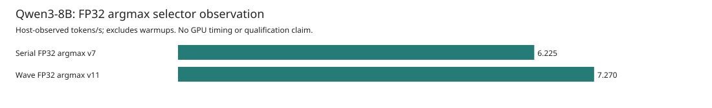
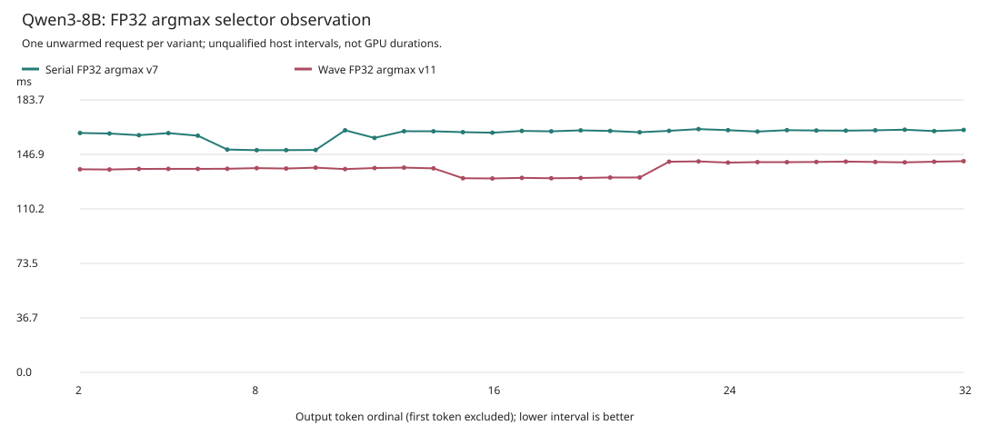
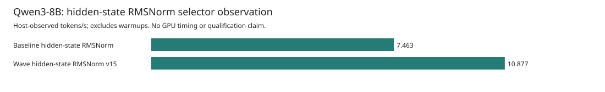
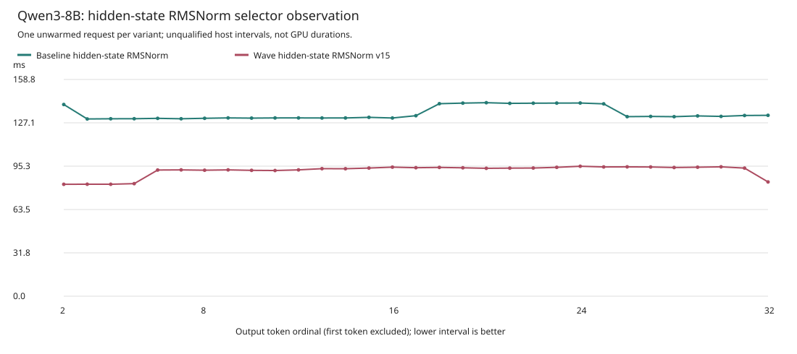
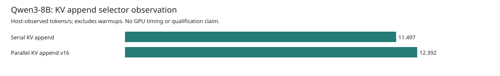
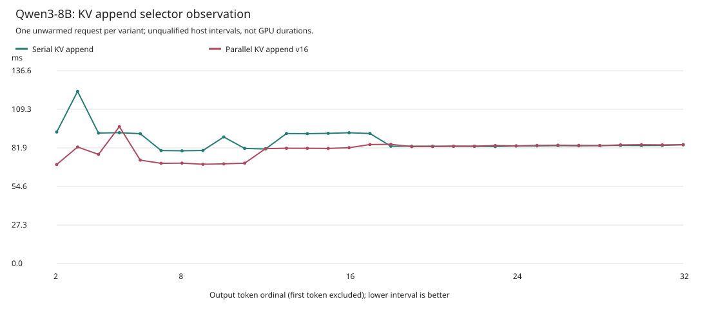

# Full-Forward Feature Observations

These are separate **single-request, TP1, target-only Qwen3-8B** observations on
Asrock's MI350X (`gfx950`). Weights and activations are BF16; the unpruned FP32-v7
head produces FP32 logits. Every reported request matches all 32 token IDs and
decoded bytes of the unchanged independent reference. No quantization or
speculation is used. **700 tokens/s is not achieved.**

Each variant has one unwarmed, nonisolated request. These observations do not
establish a stable or causal speedup, GPU overlap, kernel-only duration, or a
persistent GPU megakernel. Do not multiply ratios across these cohorts or the
separate [full-forward submission observations](GFX950_TARGET8B_FULL_FORWARD_V2.md).

## Image-Level Feature Observation

This pair varies the main native image: matched-source paired-prefetch feature
off versus feature on. Controller, runtime worker, FP32 head, MFMA projections,
wave attention, full-forward flags, workload, and reference are fixed. Both
images were compiled from the same frozen source with the same compiler,
vendor inputs, tools, and options; build commands differ only in the feature
selection and output directory. The earlier `6b088...` image is not this pair's
control because it came from a different compiler build.

| Variant | TTFT (s) | Mean TPOT (s) | Post-first tokens/s | Observed rate / control | Setup (s) |
| --- | ---: | ---: | ---: | ---: | ---: |
| Feature-off main image | 1.019467 | 0.199392 | 5.015256 | 1.000x | 213.609398 |
| Paired-prefetch main image | 0.872272 | 0.178807 | 5.592616 | 1.115x | 209.244860 |

The observed rate ratio is **1.115121x**, with **10.323613% lower** mean TPOT.
This is an image-level feature observation, **not a pure-prefetch causal gain**.
The feature remains opt-in and default off. The source supports TP1 rows 1
through 16, but this GPU observation validates only one active row.

### Mechanism

The paired path in
[`projection.rs`](../device/qwen3-tp-perf-kernels-v3/src/projection.rs#L301)
loads two activation/weight operand pairs into registers before consuming
either pair. It then performs two in-order MFMAs through the **same FP32
accumulator**, visiting the original K16 tiles in the original arithmetic
order. The [FP32 partial projection](../device/qwen3-tp-perf-kernels-v3/src/projection.rs#L458)
uses the same schedule for its TP1 widths. There is no second accumulator or
LDS double-buffer, and this is not a persistent-kernel or proven-overlap scheme.

The matched native ISA evidence shows **16 static masked load sites, one
`s_waitcnt vmcnt(0)`, and two MFMAs per paired TP1 loop cycle**, versus eight
load sites, one wait, and one MFMA in the control cycle. There are no loads or
waits between the paired MFMAs. These are instruction-site/schedule facts,
not measured memory concurrency or proof that this mechanism alone caused
the observed rate difference. The secondary codegen changes below remain part
of the comparison.


Six kernel bodies differ, including **four secondary non-MFMA codegen changes**.
Nine of the 15 roots are byte-identical. The complete retained 15-root catalog
binds each root's code hashes, ABI, metadata, resource counts, and opcode deltas.
All 15 launch/argument layouts match, both images passed the ordinary proof and
admission checks, and the catalog found no spills. These checks are not a full
binary-dataflow equivalence proof. Ignoring e32/e64 encodings, the four secondary
roots retain their floating-point opcode sequences; that does not establish
that their timing effects are zero.

All names below have the prefix `ferric_qwen3_tp_`:

| Changed Root | Classification |
| --- | --- |
| `mfma_gemm_bf16_v3` | Intended MFMA feature codegen |
| `mfma_gemm_partial_f32_v3` | Intended MFMA feature codegen |
| `batch_argmax_bf16_v2` | Secondary codegen |
| `batch_gemm_partial_bf16_f32_v2` | Secondary codegen |
| `batch_paged_gqa_bf16_f32_v2` | Secondary codegen |
| `wave_paged_gqa_bf16_v3` | Secondary codegen |

The [control report](assets/asrock-target8b-feature-ablations-v1/paired-prefetch/control-report.json)
and [candidate report](assets/asrock-target8b-feature-ablations-v1/paired-prefetch/candidate-report.json)
are byte-for-byte copies of the raw-capture-revalidated public reports. The
[contrast](assets/asrock-target8b-feature-ablations-v1/paired-prefetch/observed-contrast.json)
retains every actual image and worker identity, both canonical descriptors,
the six changed roots, four secondary roots, catalog hash, and
`pure_prefetch_causal_gain_claimed: false`. The
[62-interval CSV](assets/asrock-target8b-feature-ablations-v1/paired-prefetch/intervals.csv),
[generated table](assets/asrock-target8b-feature-ablations-v1/paired-prefetch/table.md),
and [asset hashes](assets/asrock-target8b-feature-ablations-v1/paired-prefetch/SHA256SUMS)
are derived only from this complete pair.

## Worker Preparation Observation

The separate worker pair compares per-dispatch preparation checks with a
transaction preparation fence. Both retain initial idle/currentness checks,
periodic refresh, stage/publication checks, exception handling, completion
signals, and final currentness checks. It does not remove correctness checks.
The selected runtime worker is the only differing executable identity.

This cohort retains controller-v7, the earlier main image `6b088...`, FP32 head
`b21c...`, and the same full-forward MFMA/v7/wave flags. Consequently it is not
the same main-image cohort as the paired-prefetch feature observation above.
Both variants require fresh captures; an earlier cohort's run is not relabeled
as a control. Both new raw captures passed the unchanged comparator and all
seven postflight checks before these assets were generated.

| Variant | TTFT (s) | Mean TPOT (s) | Post-first tokens/s | Observed rate / control | Setup (s) |
| --- | ---: | ---: | ---: | ---: | ---: |
| Per-dispatch checks | 1.022150 | 0.196072 | 5.100166 | 1.000x | 213.115331 |
| Transaction checks | 0.884140 | 0.178867 | 5.590755 | 1.096x | 214.532412 |

The observed rate ratio is **1.096191x**, with **8.774994% lower** mean TPOT.
This remains one unwarmed, nonisolated request per worker, not a stable causal
speedup. The preparation-worker ratio cannot be multiplied by the image-level
ratio: their main-image identities and capture cohorts differ. The separate
argmax pair below holds both features fixed; it does not measure how their
individual effects combine.

### Mechanism

The exact 616-command full-forward path holds an exclusive mutable `Context`
through preparation, publication, and completion. After its initial
idle/currentness fence, a transaction-local snapshot binds the device identity,
queue epoch, write frontier, and completed frontier. Every command must match
that snapshot and the next sequential index. A due refresh performs the idle
and currentness check at a 100 ms cadence during preparation; the state cannot
authorize another queue epoch, skipped command, or reused transaction.

This hoists repeated idle/currentness work out of each command's preparation;
it does **not** remove kernel admission, pointer extent/access, alias, or launch
geometry checks. Stage completeness, pre-publication checks, exception handling,
all completion signals, periodic wait checks, and the final fence remain.
Failure poisons the transaction without committing request progress. Legacy
and peer preparation retain their original per-dispatch checks. Currentness
check counts and polling counts are not measured, so the table does not assign
a causal duration to individual checks.


The [control report](assets/asrock-target8b-feature-ablations-v1/preparation-worker/control-report.json)
and [candidate report](assets/asrock-target8b-feature-ablations-v1/preparation-worker/candidate-report.json)
retain the different actual worker hashes and unchanged native-image identities.
The [62-interval CSV](assets/asrock-target8b-feature-ablations-v1/preparation-worker/intervals.csv),
[generated table](assets/asrock-target8b-feature-ablations-v1/preparation-worker/table.md),
[contrast](assets/asrock-target8b-feature-ablations-v1/preparation-worker/observed-contrast.json),
and [asset hashes](assets/asrock-target8b-feature-ablations-v1/preparation-worker/SHA256SUMS)
remain separate from the paired-image cohort. The candidate worker's frozen
source manifest below binds this mechanism; both harness arms check that
source and all its files before and after their run.

## FP32 Argmax Selector Observation

This third cohort compares `serial-v7` with `wave-v11` on the same full-forward
stack. Both arms use the identical controller `b4d180...`, transaction-fence
worker `055037...`, paired-prefetch main image `2e677...`, FP32 head `b21c...`,
and native v11 sidecar `86c3ee...`. Both load that sidecar before allocation,
including the serial control. The only configured difference is the FP32
argmax selector and its final kernel root, not an executable or image identity.
The older cohorts' captures are not relabeled or reused as this control.

| Variant | TTFT (s) | Mean TPOT (s) | Post-first tokens/s | Observed rate / control | Setup (s) |
| --- | ---: | ---: | ---: | ---: | ---: |
| Serial FP32 argmax v7 | 0.778280 | 0.160648 | 6.224789 | 1.000x | 210.207021 |
| Wave FP32 argmax v11 | 0.678554 | 0.137543 | 7.270475 | 1.168x | 218.197635 |

The observed rate ratio is **1.167987x**, with **14.382642% lower** mean TPOT.
These are complete-request host observations from one unwarmed, nonisolated
request per mode. They do not establish a stable causal speedup or measure the
GPU duration of the argmax kernel. Both fresh captures match all 32 reference
tokens and decoded bytes and pass all 13 cohort-specific postflight checks.

### Mechanism

The unchanged [v11 argmax source](../device/qwen3-tp-fp32-argmax-kernels-v11/src/logits.rs#L62)
uses one Wave64 per active row. Its lanes inspect strided positions across all
151,936 FP32 logits, then perform wave reductions for nonfinite rejection,
the maximum value, and the stable lowest-token winner. Equal signed zeros
preserve the same lowest-token tie policy. It writes one token choice and
does not prune the vocabulary or change BF16 weights/activations or FP32 logits.

The frozen selector changes the final root from
`ferric_qwen3_tp_argmax_f32_v7` to
`ferric_qwen3_tp_batch32_wave_argmax_f32_v11`; the other 615 packets remain in
the same forward schedule. Root names and packet counts are source-derived,
not an instrumented GPU trace. The closed one-root sidecar's complete native
ABI and both ordinary admission cases are pinned separately. Its source
domain is rows 1 through 32, the controller uses capacity 16 buffers, and this
GPU observation validates **only one active row**.





The [serial control report](assets/asrock-target8b-feature-ablations-v1/argmax-v11/control-report.json)
and [wave candidate report](assets/asrock-target8b-feature-ablations-v1/argmax-v11/candidate-report.json)
are exact copies of independently raw-capture-revalidated reports. The
[contrast](assets/asrock-target8b-feature-ablations-v1/argmax-v11/observed-contrast.json)
keeps all actual identities equal and names `fp32_argmax` as the differing
configuration field. It retains sidecar identities, distinct actual handoff
and canonical descriptor, admission/provenance hashes, and every source pin.
The [62-interval CSV](assets/asrock-target8b-feature-ablations-v1/argmax-v11/intervals.csv),
[generated table](assets/asrock-target8b-feature-ablations-v1/argmax-v11/table.md),
and [asset hashes](assets/asrock-target8b-feature-ablations-v1/argmax-v11/SHA256SUMS)
belong only to this matched selector cohort. The earlier image and worker
assets remain byte-identical.

## Hidden-State RMSNorm V15

This fourth, independently captured cohort compares `--rmsnorm baseline` with
`--rmsnorm wave-v15`. Both arms retain the same controller `dbb09f...`, worker
`055037...`, paired main image `2e677...`, FP32-v7 head `b21c...`, wave-v11
argmax image `86c3ee...`, and v15 norm image `c33882...`. All four images are
loaded in both variants before allocation. Only the norm selector differs;
no earlier run is reused as this control.

| Variant | TTFT (s) | Mean TPOT (s) | Post-first tokens/s | Observed rate / control | Setup (s) |
| --- | ---: | ---: | ---: | ---: | ---: |
| Baseline hidden-state RMSNorm | 0.801599 | 0.133992 | 7.463122 | 1.000x | 214.214495 |
| Wave hidden-state RMSNorm v15 | 0.410723 | 0.091939 | 10.876773 | 1.457x | 215.426273 |

The observed rate ratio is **1.457402x**, with **31.384774% lower** mean TPOT.
Both fresh requests match all 32 reference tokens and decoded bytes and pass
all 12 cohort-specific acceptance checks. This remains one unwarmed,
nonisolated request per variant, not a stable or causal speedup. It does not
measure the duration or speedup of any individual norm kernel. Ratios from the
other three cohorts must not be multiplied with this one.

### Mechanism And Numerical Scope

The separate [instrumented GPU packet profile](GFX950_TARGET8B_GPU_PROFILE_V1.md)
identified 73 full-hidden normalization packets as the largest relevant
absolute interval group: 36 input norms, 36 post-attention norms, and one final
norm. That profile motivated this selector, but it used a different instrumented
controller/worker cohort. Its times are not combined with this uninstrumented
pair or used to derive a per-norm speedup. The 72 width-128 Q/K norm packets
remain on their original path.

The unchanged [v15 source](../device/qwen3-tp-wave-rmsnorm-kernels-v15/src/rmsnorm.rs)
uses one Wave64 per 4096-wide row. Each lane accumulates 64 strided components;
six wave-reduction levels combine the partial sums. It then normalizes and
writes disjoint output components. The selector changes exactly **73 kernel
symbols per forward** from `qwen3_rmsnorm_v1` to
`ferric_qwen3_tp_batch32_wave_rmsnorm_bf16_v15`. The remaining 543 packets,
including Q/K norms, stay unchanged. Both paths still execute 616 ordered AQL
packets, not one fused device kernel.

The wave reduction **changes FP32 sum association**. It retains both BF16
rounding boundaries: normalization narrows to BF16, that value is widened for
weight multiplication, and the result narrows again. This is not a proof of
bitwise equality for arbitrary inputs or every intermediate tensor. Before the
model pair, the exact current image passed 16 finite standalone cases: eight
original analytical cases and eight nonuniform independent-f64 reference cases,
at rows 1, 16, 17, and 32. Exact output bytes, all 80 buffers, and 160 guards
passed; 1,081,344 output BF16 words were checked. The model experiment itself
validates only one active row and the fixed 32-token reference window.

The closed one-root image has a 352-byte kernarg (96 explicit plus 256 hidden),
Wave64/workgroup64, no private storage or LDS, and no reported spills. Current
checked emission, exact ABI checks, and ordinary admission for both selectors
passed. Source row capacity 32 and controller buffer capacity 16 are not
claims that every supported model batch shape has been GPU-validated.





The [baseline report](assets/asrock-target8b-feature-ablations-v1/rmsnorm-v15/control-report.json)
and [wave report](assets/asrock-target8b-feature-ablations-v1/rmsnorm-v15/candidate-report.json)
are exact regenerated public reports. The
[contrast](assets/asrock-target8b-feature-ablations-v1/rmsnorm-v15/observed-contrast.json)
preserves all four image identities, the measured controller/source pins,
73-symbol scope, admission evidence, changed FP32 association, and retained
BF16 roundings. The [62-interval CSV](assets/asrock-target8b-feature-ablations-v1/rmsnorm-v15/intervals.csv),
[generated table](assets/asrock-target8b-feature-ablations-v1/rmsnorm-v15/table.md),
and [hashes](assets/asrock-target8b-feature-ablations-v1/rmsnorm-v15/SHA256SUMS)
belong only to this fourth pair. All three earlier asset directories remain
byte-identical.

## Parallel KV Append V16

This fifth matched cohort compares `--kv-append baseline` with
`--kv-append parallel-v16`. Both arms use controller `7ef9f9...`, transaction
worker `055037...`, and the same five images: paired main `2e677...`, FP32-v7
head `b21c...`, wave-v11 argmax `86c3ee...`, wave-v15 norm `c33882...`, and
parallel-v16 KV append `55f095...`. All five are loaded in both modes before
allocation. The new baseline is a fresh capture, not the preceding norm
candidate relabeled as a control. The only configured difference is `kv_append`.

| Variant | TTFT (s) | Mean TPOT (s) | Post-first tokens/s | Observed rate / control | Setup (s) |
| --- | ---: | ---: | ---: | ---: | ---: |
| Serial KV append | 0.456338 | 0.086976 | 11.497466 | 1.000x | 213.311712 |
| Parallel KV append v16 | 0.353535 | 0.080695 | 12.392285 | 1.078x | 211.002111 |

The observed rate ratio is **1.077827x**, with **7.220768% lower** mean TPOT.
The full 31-interval medians are **83.586903 ms** and **82.904579 ms**,
respectively: a much smaller difference than the means. The raw plots below
retain every interval, including the variation within each request.
Both requests match every one of the 32 reference token IDs and decoded bytes
and pass all 12 cohort acceptance checks. These host observations cover one
unwarmed, nonisolated request per mode. They do not establish a stable or causal
speedup, measure individual KV kernel durations, or justify multiplying ratios
across the five cohorts.

### Exact-Copy Mechanism

The separate [instrumented packet profile](GFX950_TARGET8B_GPU_PROFILE_V1.md)
identified serial KV append as a substantial absolute interval group, motivating
this change. Its timings came from a different instrumented controller/worker
cohort; they are not combined with this pair or used to derive a KV-kernel
speedup.

The [v16 source](../device/qwen3-tp-parallel-kv-kernels-v16/src/append.rs)
launches 64 Wave64 workgroups, one for each physical token slot in four pages.
Every group performs the existing bounds and slot-validation prepass. Only
the group selected by the physical slot copies data: its 64 lanes each copy
16 strided u16 words for K and V. The other groups do not write cache words.
This is exact bit copying, including nonfinite BF16 encodings; it adds no
floating-point arithmetic or reduction reassociation.

Only **36 KV append symbols and grids per forward** change, from
`ferric_qwen3_tp_batch_paged_kv_append_v2` with one workgroup to
`ferric_qwen3_tp_batch_parallel_kv_append_v16` with 64 workgroups. The other
580 packets, logical explicit arguments, buffer extents and access modes, guard policies, packet order,
and all 73 wave norms remain unchanged. Both modes still execute 616 sequential
AQL packets per forward, not a fused kernel or measured GPU-overlap schedule.
The admitted selector is limited to TP1, one row, context 64, and four pages.
Recording tests compare logical commands after normalizing only the kernel
symbol and launch grid. Physical device-pointer bytes may differ between
processes, and hidden launch-derived block counts intentionally differ.
The frozen report's argument-byte shorthand denotes logical explicit argument
encoding, not byte-identical relocated GPU kernargs across the two requests.

Before this model pair, the actual current image passed 32 standalone cases:
192 complete allocations and 384 guards were compared exactly, covering all
65,536 u16 encodings across the fixtures. Independent replay checked 1,669
wire records and all raw buffer bytes. The closed one-root native image has a
368-byte kernarg (112 explicit plus 256 hidden), workgroup64/Wave64, no LDS or
private storage, and no reported spills. Current checked emission, actual ABI
admission, and ordinary five-image admission for both selectors passed.
These checks do not validate other KV shapes or a general multirow model domain.





The [baseline report](assets/asrock-target8b-feature-ablations-v1/parallel-kv-v16/control-report.json)
and [parallel report](assets/asrock-target8b-feature-ablations-v1/parallel-kv-v16/candidate-report.json)
are exact raw-capture-revalidated reports. The
[contrast](assets/asrock-target8b-feature-ablations-v1/parallel-kv-v16/observed-contrast.json)
retains all five image identities, the measured controller and source pins,
36-packet scope, grids, admission evidence, and the logical argument/buffer contract.
The [62-interval CSV](assets/asrock-target8b-feature-ablations-v1/parallel-kv-v16/intervals.csv),
[generated table](assets/asrock-target8b-feature-ablations-v1/parallel-kv-v16/table.md),
and [hashes](assets/asrock-target8b-feature-ablations-v1/parallel-kv-v16/SHA256SUMS)
belong only to this fifth pair. All four earlier asset directories remain
byte-identical.

## Measurement Scope

The post-first rate is `31e9 / sum(the 31 decode intervals in nanoseconds)`.
Mean TPOT is that sum divided by 31. Token 1 belongs to admission TTFT; setup
is reported separately. Each pair plots all 62 actual intervals at output
token ordinals 2 through 32. Host intervals include runtime, IPC, and
between-batch JSON logging. Recording overhead is not measured or subtracted.

Both variants in each pair use `--runtime-full-forward-mfma-v7-wave`, one row, one-token prefill chunks,
context 64, four physical pages, and device TP1 residuals. Each request
executes 36 forwards and 22,176 dispatch packets. The 36 completion frontiers
are source-derived schedule counts, not measured polls, events, or GPU durations.
The execution remains 616 sequential AQL packets per forward, not a fused GPU
kernel. Runtime admission caching and operational currentness are enabled;
prefix caching, head pruning, dispatch sequences, queue rollover, and runtime
profiling are disabled. The head workspace remains 9,723,904 bytes.
The image and worker pairs use profile
`mfma-v3-fp32-v7-wave-attention-tp1-616`; both argmax arms use
`mfma-v3-fp32-v7-wave-attention-v11-sidecar-tp1-616` with the explicit
`--fp32-argmax` mode and identical `--fp32-argmax-artifact`.
Both norm arms use
`mfma-v3-fp32-v7-wave-attention-v11-v15-sidecars-tp1-616`, retain `wave-v11`
argmax, and load the same norm sidecar with their explicit `--rmsnorm` selector.
Both KV arms use
`mfma-v3-fp32-v7-wave-attention-v11-v15-v16-sidecars-tp1-616`, retain wave argmax
and wave norm, and load the same KV sidecar with their explicit `--kv-append` mode.

The model revision is `b968826d9c46dd6066d109eabc6255188de91218`. The independent
reference was generated earlier on MI300X. This checks one fixed prompt and
32-token window, not model-wide quality or every intermediate tensor.

### The Remaining 700 Tokens/s Gap

The highest observed rate here, 12.392285 tokens/s, is still far below 700 tokens/s. Register
prefetching, fewer host checks, wave argmax, wave normalization, and parallel KV copying do not eliminate the model's BF16 weight
traffic. The existing
[model-specific weight-streaming analysis](GFX950_DECODE_PERFORMANCE_V1.md#bf16-weight-streaming-bound)
and [explicit bandwidth scenarios](GFX950_TARGET8B_ABLATIONS_V2.md#theoretical-context-not-a-measured-bar)
already account for the pinned checkpoint and its active embedding row. Their
idealized bounds assume perfect streaming, no persistent weight-cache credit,
and no activation, KV, synchronization, or compute cost; they are not measured
sustained bandwidth or cache-independent physical limits. No new theoretical
bar is added here. Host timings alone cannot attribute the remaining gap to
HBM, kernel work, or runtime overhead, and neither this single-request observation
nor multiplication of separate cohort ratios demonstrates the 700-token/s goal.

## Frozen Validation

| Item | SHA-256 |
| --- | --- |
| Paired-image comparator | `da77a498a9a429202bd247bd724e457732621716b5ad7f4f2e301cf14f5b41b2` |
| Preparation-worker comparator | `7e654a33f32a3d382638eafceada3c0db44aa46237533836a51302e6eea4483f` |
| Argmax selector comparator | `f862c587edc165c96a62cca057e07354b456068a7550b600b808378b51b238f2` |
| Norm selector comparator | `1df745d231bb6f1a2666bb7a16179a681c945ae8a45312619ca728d225523eda` |
| KV selector comparator | `444b597ed9afc0ece7919707a91b31edc3a436d6487ba605a70712b6dc563b75` |
| Common numerical comparator | `90cd589fe9b98660f6efb3400775cd269af236688706f37eaedee2d12e92b975` |
| Controller-v7 | `5b218caa6aa51c56749f64329054d29faf0cc766e401db2c41f58bc8d1324f48` |
| Argmax cohort controller | `b4d180bc078b1c84bad374e55f5905b3ba407c0847e6c4255f8546adfaa5199a` |
| Argmax controller overlay source | `9fb2f8d4228f827f37046dbfba27711a6f4e85546d8b5c02e5817a2ed663ff35` |
| Argmax native source closure | `1556bf8bdba72646a62da57c80b2676495b0e6b5655896bd22a43c4c878c3384` |
| Argmax native sidecar | `86c3ee4cead26f6432ef590434b3335e1ee2a95c9c900cf6315dca4ef0a542b0` |
| Argmax ordinary admission | `8d574bd5d838c4f83e7f57b8855e9bee2ded5745db0aea8c7624f4ba1ac9af14` |
| Argmax admission provenance | `25c151cb56dbe3412345787d2bae89172141558b04663f3e4008d46a68f92dbc` |
| Measured norm cohort controller | `dbb09fb78689667c9c6bf80659770e9a340f1fbcbca4ff4520c9b94da3368545` |
| Measured norm controller source-v3 manifest | `2489bee6d4237eeb5873487c96c67c37d0c44d91051b707b07dbfed5a87c3d6c` |
| Norm kernel source manifest | `1a8fbbcb2dbb05d74b9108634bd235d537cdba817b9126484ae15bbb1fccd537` |
| Norm image | `c33882db1afcd8eb26ec02bc43ea2144af322d29bf4e0e921e03ea74adc55af6` |
| Norm actual compiler handoff | `348c74397e520f5dca74d655ec50d9207a57ef2b36b378266b2318a0fdacebb5` |
| Norm canonical descriptor | `67ed3415901de9936ff4dd01bfdf06847b7cb23067268af6921456faf4cb47f2` |
| Norm ordinary admission | `38318484211888d2d20da75985c7b8f8789dbf61907425031567ebea173928f9` |
| Measured KV cohort controller | `7ef9f9e87a9fe1a5722dd3d1ab32c633de5ae82abfafd9d97443eb1e5880fa70` |
| Measured KV controller source-v2 manifest | `6bc0ed1f8bf732cb48772f8e04a2f801960c222247366732b7f1f60eadcde1e2` |
| KV kernel source manifest | `d24c70959d194d973d001e341acb78bf905857ad914a780278bf27a7a1911b66` |
| KV image | `55f0953fc5e60279201d7523b5a11823170e1afcb48c90a985236ecb8518cb66` |
| KV actual compiler handoff | `828f650ab7e0c644cfe25d84ac202f3640e36f39c539612ad216cddb06cfd2f3` |
| KV canonical descriptor | `134aa309ba2a9eb7abf76762b3c588e965c2dc2ed7175f4b37fda6512b58c367` |
| KV ordinary ABI admission | `c6b96a4b92d82244dd3d179dcfbae2269cb4eba27959ce37985208307c05aa94` |
| KV five-image CLI admission | `767113d41542b0644e91d558f25d494d6b5baa43209de130a6985a0d158c0a12` |
| KV standalone fixtures | `e8665f799a5488142f9639fde182c835bc7703143d60adbcd2812916616bd89b` |
| KV standalone accepted report | `96e1ae3c884acc4f3125918eeb3bc7a28dcc344795bfc057d3f013f20586c292` |
| KV standalone capture manifest | `daae62aec9776aed1b23b024f1f21c3e0e52063badff386c8af0a14eef63847b` |
| Independent reference | `1ed868663df52a146dd7921f9fbb2cf1e1d0c0ceed8a7bfda030d65f8ec5b094` |
| Paired source manifest | `b27b9cffc159ee82667d039056aa6a414569cc1309e25a5dca442279aba59fb0` |
| Complete 15-root catalog | `d4a1e53ed7d8ca8bd0d29dded44192e6cbeac2b825174d9faa391fd414af99e6` |
| Original worker | `8284a44f702b8e42a35fe9e04cf051dd709ce9995329adaa2ea5a57ab80fb06a` |
| Transaction-fence worker | `05503764710e8add6ee15fbb1f8526ed9bdddfce7dd670acd7c604f9491490a7` |
| Transaction-fence worker source | `b4de3efc58249ab345c89c2d5d423c5c78c32d348b4d5c5c8f67e49213136fb3` |

The [CPU-only reporter](../tools/target_feature_ablation_plots_v1.py) loads each
unchanged comparator from its exact pinned bytes. It revalidates both complete
raw captures, zero controller status, exact stderr, workload, expectation,
reference, identities, dispatch counts, and timing receipts. Regenerated
reports must exactly equal the retained public reports before any output
directory is created. The comparison explicitly checks the permitted identity
or selector difference and does not normalize or drop image or worker identities to make
plots appear matched.

The original six postflight checks and the cohort-specific seventh source
check are required byte-for-byte:

```text
controller=0 idle=0 topology=0 inputs=0 plan=0 source=0 paired_source=0
controller=0 idle=0 topology=0 inputs=0 plan=0 source=0 worker_source=0
```

The first line applies only to paired-prefetch; the second applies only to
preparation workers. Neither a missing seventh check nor the other cohort's
source check is accepted. The argmax cohort instead requires this exact 13-status line:

```text
controller=0 idle=0 topology=0 inputs=0 plan=0 source=0 worker_source=0 base_source=0 controller_inputs=0 paired_source=0 argmax_source=0 argmax_original_source=0 argmax_shared_source=0
```

This binds the controller overlay and base, unchanged controller inputs,
worker source, paired source, complete native source closure, original v11
source, and both shared native build inputs. The full sidecar admission
provenance and every referenced record are also checked as immutable inputs
before and after each run. Missing, reordered, substituted, or nonzero statuses
are rejected. The captures include request retirement and worker
closure; the close record alone does not independently establish system-wide
idleness or a final free-page count. Performance qualification remains false.

The norm pair instead retains an exact 12-key JSON status object with integer
zeros for `inputs_pre`, `sources_pre`, `idle_pre`, `plan_pre`, `controller`,
`numerical`, `inputs_post`, `sources_post`, `plan_post`, `model_stat_post`,
`idle_post`, and `topology_post`. Missing, extra, boolean, or nonzero values
are rejected. Its independent replay also checked the original capture
manifests, predeclared plans/commands, all source-file hashes, unchanged model
metadata, all four images, both admission evidence directories, and every
interval recomputed from the 32 output timestamps. The checker publication is
byte-identical to the comparator used for the accepted run. Later CPU-only
test adjustments do not change or relabel the measured source-v3/controller.

The KV pair requires the same 12 exact JSON statuses, with separate frozen
plans and actual controller/source identities. Both model arms pin and replay
the accepted 32-case standalone capture before and after execution. Independent
model replay checks all five images, source files, admission records, raw
capture manifests, predeclared commands, model metadata, clean worker closure,
and all 31 intervals. Its published checker is byte-identical to the accepted
model comparator; no earlier controller or image identity is substituted.

The published KV crate differs from its measured source-v4 snapshot only by
removal of one redundant final blank line in `Cargo.toml` and `Cargo.lock`.
Kernel code and dependency entries are unchanged. The immutable source and
binary identities above still describe the measured artifacts, not a rebuild
of the publication tree.

## Reproduce The Reporting

With `EVIDENCE` and `REFERENCE` pointing to the retained evidence and reference:

```sh
python3 -B tools/target_feature_ablation_plots_v1.py \
  --family paired-prefetch \
  --control-capture "$EVIDENCE/target8b-mfma-paired-prefetch-v1-control-01" \
  --candidate-capture "$EVIDENCE/target8b-mfma-paired-prefetch-v1-paired-01" \
  --reference "$REFERENCE" \
  --output /tmp/ferric-image-feature-observation-v1-rebuilt
python3 -B tools/target_feature_ablation_plots_v1.py \
  --family preparation-worker \
  --control-capture "$EVIDENCE/target8b-full-forward-preparation-v1-control-01" \
  --candidate-capture "$EVIDENCE/target8b-full-forward-preparation-v1-transaction-01" \
  --reference "$REFERENCE" \
  --output /tmp/ferric-worker-preparation-observation-v1-rebuilt
python3 -B tools/target_feature_ablation_plots_v1.py \
  --family argmax-v11 \
  --control-capture "$EVIDENCE/target8b-full-forward-argmax-v11-v1-control-01" \
  --candidate-capture "$EVIDENCE/target8b-full-forward-argmax-v11-v1-wave-01" \
  --reference "$REFERENCE" \
  --output /tmp/ferric-argmax-selector-observation-v1-rebuilt
python3 -B tools/target_feature_ablation_plots_v1.py \
  --family rmsnorm-v15 \
  --control-capture "$EVIDENCE/target8b-full-forward-rmsnorm-v15-v1-prep/independent-audit-v1/baseline" \
  --candidate-capture "$EVIDENCE/target8b-full-forward-rmsnorm-v15-v1-prep/independent-audit-v1/wave-v15" \
  --reference "$REFERENCE" \
  --output /tmp/ferric-rmsnorm-selector-observation-v1-rebuilt
python3 -B tools/target_feature_ablation_plots_v1.py \
  --family parallel-kv-v16 \
  --control-capture "$EVIDENCE/target8b-full-forward-parallel-kv-v16-v1-prep/independent-audit-v1/baseline" \
  --candidate-capture "$EVIDENCE/target8b-full-forward-parallel-kv-v16-v1-prep/independent-audit-v1/parallel-v16" \
  --reference "$REFERENCE" \
  --output /tmp/ferric-parallel-kv-selector-observation-v1-rebuilt
PYTHONPATH=tools python3 -B -m unittest \
  test_target_mfma_paired_prefetch_v1 \
  test_target_full_forward_preparation_v1 \
  test_target_full_forward_argmax_v11_v1 \
  test_target_full_forward_rmsnorm_v15_v1 \
  test_target_full_forward_parallel_kv_v16_v1 \
  test_target_feature_ablation_plots_v1
```

The combined suite passes 92 CPU tests, including the reporter's 18 synthetic
tests and one mandatory public-asset reproduction test. They cover actual identity preservation,
declared-axis matching, numerical scope, all interval values, exact report
equality, source pinning, every seven- or 13-status postcheck line, all 12 norm and KV JSON
statuses, and rejection before
output creation. Synthetic fixtures are explicitly labeled and rejected by
the production reference digest check; they provide no GPU or rate evidence.
