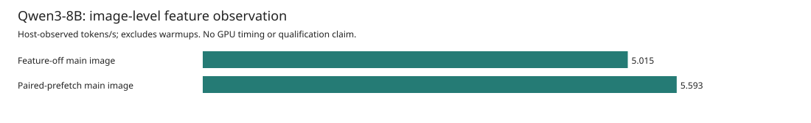
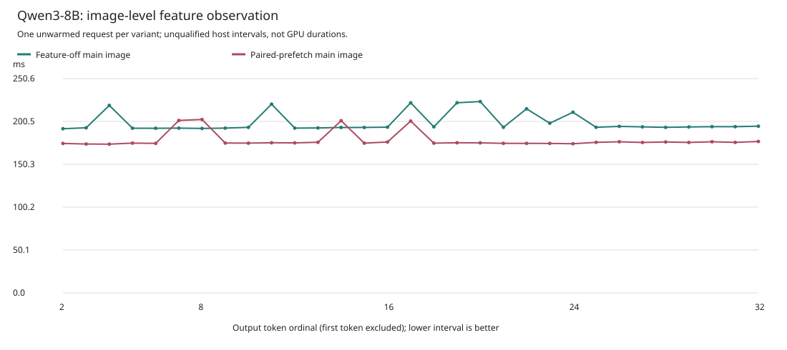
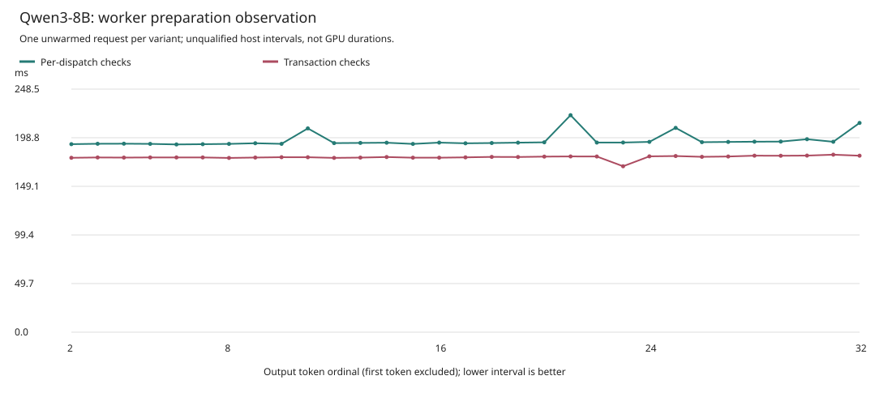

# Full-Forward Feature Observations

These are separate **single-request, TP1, target-only Qwen3-8B** observations on
Asrock's MI350X (`gfx950`). Weights and activations are BF16; the unpruned FP32-v7
head produces FP32 logits. Every reported request matches all 32 token IDs and
decoded bytes of the unchanged independent reference. No quantization or
speculation is used. **700 tokens/s is not achieved.**

Each variant has one unwarmed, nonisolated request. These observations do not
establish a stable or causal speedup, GPU overlap, kernel-only duration, or a
persistent GPU megakernel. Do not multiply ratios across these cohorts or the
separate [full-forward submission observations](GFX950_TARGET8B_FULL_FORWARD_V2.md).

## Image-Level Feature Observation

This pair varies the main native image: matched-source paired-prefetch feature
off versus feature on. Controller, runtime worker, FP32 head, MFMA projections,
wave attention, full-forward flags, workload, and reference are fixed. Both
images were compiled from the same frozen source with the same compiler,
vendor inputs, tools, and options; build commands differ only in the feature
selection and output directory. The earlier `6b088...` image is not this pair's
control because it came from a different compiler build.

| Variant | TTFT (s) | Mean TPOT (s) | Post-first tokens/s | Observed rate / control | Setup (s) |
| --- | ---: | ---: | ---: | ---: | ---: |
| Feature-off main image | 1.019467 | 0.199392 | 5.015256 | 1.000x | 213.609398 |
| Paired-prefetch main image | 0.872272 | 0.178807 | 5.592616 | 1.115x | 209.244860 |

The observed rate ratio is **1.115121x**, with **10.323613% lower** mean TPOT.
This is an image-level feature observation, **not a pure-prefetch causal gain**.
The feature remains opt-in and default off. The source supports TP1 rows 1
through 16, but this GPU observation validates only one active row.

### Mechanism

The paired path in
[`projection.rs`](../device/qwen3-tp-perf-kernels-v3/src/projection.rs#L301)
loads two activation/weight operand pairs into registers before consuming
either pair. It then performs two in-order MFMAs through the **same FP32
accumulator**, visiting the original K16 tiles in the original arithmetic
order. The [FP32 partial projection](../device/qwen3-tp-perf-kernels-v3/src/projection.rs#L458)
uses the same schedule for its TP1 widths. There is no second accumulator or
LDS double-buffer, and this is not a persistent-kernel or proven-overlap scheme.

The matched native ISA evidence shows **16 static masked load sites, one
`s_waitcnt vmcnt(0)`, and two MFMAs per paired TP1 loop cycle**, versus eight
load sites, one wait, and one MFMA in the control cycle. There are no loads or
waits between the paired MFMAs. These are instruction-site/schedule facts,
not measured memory concurrency or proof that this mechanism alone caused
the observed rate difference. The secondary codegen changes below remain part
of the comparison.





Six kernel bodies differ, including **four secondary non-MFMA codegen changes**.
Nine of the 15 roots are byte-identical. The complete retained 15-root catalog
binds each root's code hashes, ABI, metadata, resource counts, and opcode deltas.
All 15 launch/argument layouts match, both images passed the ordinary proof and
admission checks, and the catalog found no spills. These checks are not a full
binary-dataflow equivalence proof. Ignoring e32/e64 encodings, the four secondary
roots retain their floating-point opcode sequences; that does not establish
that their timing effects are zero.

All names below have the prefix `ferric_qwen3_tp_`:

| Changed Root | Classification |
| --- | --- |
| `mfma_gemm_bf16_v3` | Intended MFMA feature codegen |
| `mfma_gemm_partial_f32_v3` | Intended MFMA feature codegen |
| `batch_argmax_bf16_v2` | Secondary codegen |
| `batch_gemm_partial_bf16_f32_v2` | Secondary codegen |
| `batch_paged_gqa_bf16_f32_v2` | Secondary codegen |
| `wave_paged_gqa_bf16_v3` | Secondary codegen |

The [control report](assets/asrock-target8b-feature-ablations-v1/paired-prefetch/control-report.json)
and [candidate report](assets/asrock-target8b-feature-ablations-v1/paired-prefetch/candidate-report.json)
are byte-for-byte copies of the raw-capture-revalidated public reports. The
[contrast](assets/asrock-target8b-feature-ablations-v1/paired-prefetch/observed-contrast.json)
retains every actual image and worker identity, both canonical descriptors,
the six changed roots, four secondary roots, catalog hash, and
`pure_prefetch_causal_gain_claimed: false`. The
[62-interval CSV](assets/asrock-target8b-feature-ablations-v1/paired-prefetch/intervals.csv),
[generated table](assets/asrock-target8b-feature-ablations-v1/paired-prefetch/table.md),
and [asset hashes](assets/asrock-target8b-feature-ablations-v1/paired-prefetch/SHA256SUMS)
are derived only from this complete pair.

## Worker Preparation Observation

The separate worker pair compares per-dispatch preparation checks with a
transaction preparation fence. Both retain initial idle/currentness checks,
periodic refresh, stage/publication checks, exception handling, completion
signals, and final currentness checks. It does not remove correctness checks.
The selected runtime worker is the only differing executable identity.

This cohort retains controller-v7, the earlier main image `6b088...`, FP32 head
`b21c...`, and the same full-forward MFMA/v7/wave flags. Consequently it is not
the same main-image cohort as the paired-prefetch feature observation above.
Both variants require fresh captures; an earlier cohort's run is not relabeled
as a control. Both new raw captures passed the unchanged comparator and all
seven postflight checks before these assets were generated.

| Variant | TTFT (s) | Mean TPOT (s) | Post-first tokens/s | Observed rate / control | Setup (s) |
| --- | ---: | ---: | ---: | ---: | ---: |
| Per-dispatch checks | 1.022150 | 0.196072 | 5.100166 | 1.000x | 213.115331 |
| Transaction checks | 0.884140 | 0.178867 | 5.590755 | 1.096x | 214.532412 |

The observed rate ratio is **1.096191x**, with **8.774994% lower** mean TPOT.
This remains one unwarmed, nonisolated request per worker, not a stable causal
speedup. The preparation-worker ratio cannot be multiplied by the image-level
ratio: their main-image identities and capture cohorts differ, and the combined
configuration has not been measured here.

### Mechanism

The exact 616-command full-forward path holds an exclusive mutable `Context`
through preparation, publication, and completion. After its initial
idle/currentness fence, a transaction-local snapshot binds the device identity,
queue epoch, write frontier, and completed frontier. Every command must match
that snapshot and the next sequential index. A due refresh performs the idle
and currentness check at a 100 ms cadence during preparation; the state cannot
authorize another queue epoch, skipped command, or reused transaction.

This hoists repeated idle/currentness work out of each command's preparation;
it does **not** remove kernel admission, pointer extent/access, alias, or launch
geometry checks. Stage completeness, pre-publication checks, exception handling,
all completion signals, periodic wait checks, and the final fence remain.
Failure poisons the transaction without committing request progress. Legacy
and peer preparation retain their original per-dispatch checks. Currentness
check counts and polling counts are not measured, so the table does not assign
a causal duration to individual checks.




The [control report](assets/asrock-target8b-feature-ablations-v1/preparation-worker/control-report.json)
and [candidate report](assets/asrock-target8b-feature-ablations-v1/preparation-worker/candidate-report.json)
retain the different actual worker hashes and unchanged native-image identities.
The [62-interval CSV](assets/asrock-target8b-feature-ablations-v1/preparation-worker/intervals.csv),
[generated table](assets/asrock-target8b-feature-ablations-v1/preparation-worker/table.md),
[contrast](assets/asrock-target8b-feature-ablations-v1/preparation-worker/observed-contrast.json),
and [asset hashes](assets/asrock-target8b-feature-ablations-v1/preparation-worker/SHA256SUMS)
remain separate from the paired-image cohort. The candidate worker's frozen
source manifest below binds this mechanism; both harness arms check that
source and all its files before and after their run.

## Measurement Scope

The post-first rate is `31e9 / sum(the 31 decode intervals in nanoseconds)`.
Mean TPOT is that sum divided by 31. Token 1 belongs to admission TTFT; setup
is reported separately. Each pair plots all 62 actual intervals at output
token ordinals 2 through 32. Host intervals include runtime, IPC, and
between-batch JSON logging. Recording overhead is not measured or subtracted.

Both variants in each pair use `--runtime-full-forward-mfma-v7-wave`, profile
`mfma-v3-fp32-v7-wave-attention-tp1-616`, one row, one-token prefill chunks,
context 64, four physical pages, and device TP1 residuals. Each request
executes 36 forwards and 22,176 dispatch packets. The 36 completion frontiers
are source-derived schedule counts, not measured polls, events, or GPU durations.
The execution remains 616 sequential AQL packets per forward, not a fused GPU
kernel. Runtime admission caching and operational currentness are enabled;
prefix caching, head pruning, dispatch sequences, queue rollover, and runtime
profiling are disabled. The head workspace remains 9,723,904 bytes.

The model revision is `b968826d9c46dd6066d109eabc6255188de91218`. The independent
reference was generated earlier on MI300X. This checks one fixed prompt and
32-token window, not model-wide quality or every intermediate tensor.

### The Remaining 700 Tokens/s Gap

The observed 5.592616 tokens/s is still far below 700 tokens/s. Register
prefetching and fewer host checks do not eliminate the model's BF16 weight
traffic. The existing
[model-specific weight-streaming analysis](GFX950_DECODE_PERFORMANCE_V1.md#bf16-weight-streaming-bound)
and [explicit bandwidth scenarios](GFX950_TARGET8B_ABLATIONS_V2.md#theoretical-context-not-a-measured-bar)
already account for the pinned checkpoint and its active embedding row. Their
idealized bounds assume perfect streaming, no persistent weight-cache credit,
and no activation, KV, synchronization, or compute cost; they are not measured
sustained bandwidth or cache-independent physical limits. No new theoretical
bar is added here. Host timings alone cannot attribute the remaining gap to
HBM, kernel work, or runtime overhead, and neither this isolated observation
nor multiplication of separate cohort ratios demonstrates the 700-token/s goal.

## Frozen Validation

| Item | SHA-256 |
| --- | --- |
| Paired-image comparator | `da77a498a9a429202bd247bd724e457732621716b5ad7f4f2e301cf14f5b41b2` |
| Preparation-worker comparator | `7e654a33f32a3d382638eafceada3c0db44aa46237533836a51302e6eea4483f` |
| Common numerical comparator | `90cd589fe9b98660f6efb3400775cd269af236688706f37eaedee2d12e92b975` |
| Controller-v7 | `5b218caa6aa51c56749f64329054d29faf0cc766e401db2c41f58bc8d1324f48` |
| Independent reference | `1ed868663df52a146dd7921f9fbb2cf1e1d0c0ceed8a7bfda030d65f8ec5b094` |
| Paired source manifest | `b27b9cffc159ee82667d039056aa6a414569cc1309e25a5dca442279aba59fb0` |
| Complete 15-root catalog | `d4a1e53ed7d8ca8bd0d29dded44192e6cbeac2b825174d9faa391fd414af99e6` |
| Original worker | `8284a44f702b8e42a35fe9e04cf051dd709ce9995329adaa2ea5a57ab80fb06a` |
| Transaction-fence worker | `05503764710e8add6ee15fbb1f8526ed9bdddfce7dd670acd7c604f9491490a7` |
| Transaction-fence worker source | `b4de3efc58249ab345c89c2d5d423c5c78c32d348b4d5c5c8f67e49213136fb3` |

The [CPU-only reporter](../tools/target_feature_ablation_plots_v1.py) loads each
unchanged comparator from its exact pinned bytes. It revalidates both complete
raw captures, zero controller status, exact stderr, workload, expectation,
reference, identities, dispatch counts, and timing receipts. Regenerated
reports must exactly equal the retained public reports before any output
directory is created. The comparison explicitly checks the permitted identity
difference and does not normalize or drop image or worker identities to make
plots appear matched.

The original six postflight checks and the cohort-specific seventh source
check are required byte-for-byte:

```text
controller=0 idle=0 topology=0 inputs=0 plan=0 source=0 paired_source=0
controller=0 idle=0 topology=0 inputs=0 plan=0 source=0 worker_source=0
```

The first line applies only to paired-prefetch; the second applies only to
preparation workers. Neither a missing seventh check nor the other cohort's
source check is accepted. The captures include request retirement and worker
closure; the close record alone does not independently establish system-wide
idleness or a final free-page count. Performance qualification remains false.

## Reproduce The Reporting

With `EVIDENCE` and `REFERENCE` pointing to the retained evidence and reference:

```sh
python3 -B tools/target_feature_ablation_plots_v1.py \
  --family paired-prefetch \
  --control-capture "$EVIDENCE/target8b-mfma-paired-prefetch-v1-control-01" \
  --candidate-capture "$EVIDENCE/target8b-mfma-paired-prefetch-v1-paired-01" \
  --reference "$REFERENCE" \
  --output /tmp/ferric-image-feature-observation-v1-rebuilt
python3 -B tools/target_feature_ablation_plots_v1.py \
  --family preparation-worker \
  --control-capture "$EVIDENCE/target8b-full-forward-preparation-v1-control-01" \
  --candidate-capture "$EVIDENCE/target8b-full-forward-preparation-v1-transaction-01" \
  --reference "$REFERENCE" \
  --output /tmp/ferric-worker-preparation-observation-v1-rebuilt
PYTHONPATH=tools python3 -B -m unittest \
  test_target_mfma_paired_prefetch_v1 \
  test_target_full_forward_preparation_v1 \
  test_target_feature_ablation_plots_v1
```

The combined suite passes 48 CPU tests, including the reporter's 14 synthetic
tests. They cover actual identity preservation,
declared-axis matching, numerical scope, all interval values, exact report
equality, source pinning, all seven postcheck statuses, and rejection before
output creation. Synthetic fixtures are explicitly labeled and rejected by
the production reference digest check; they provide no GPU or rate evidence.
