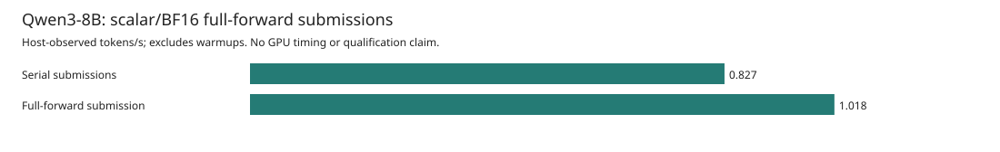
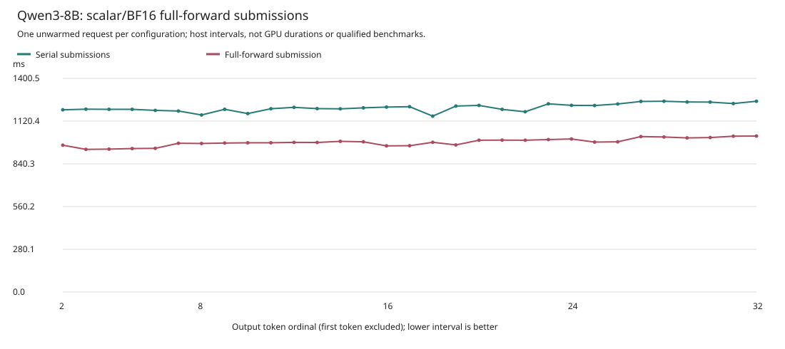
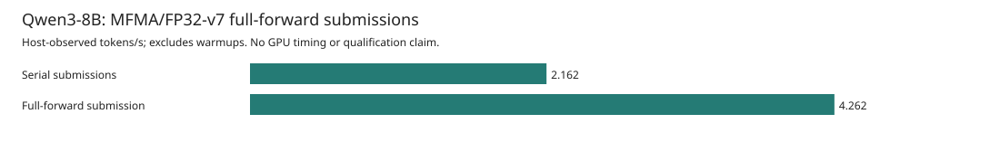
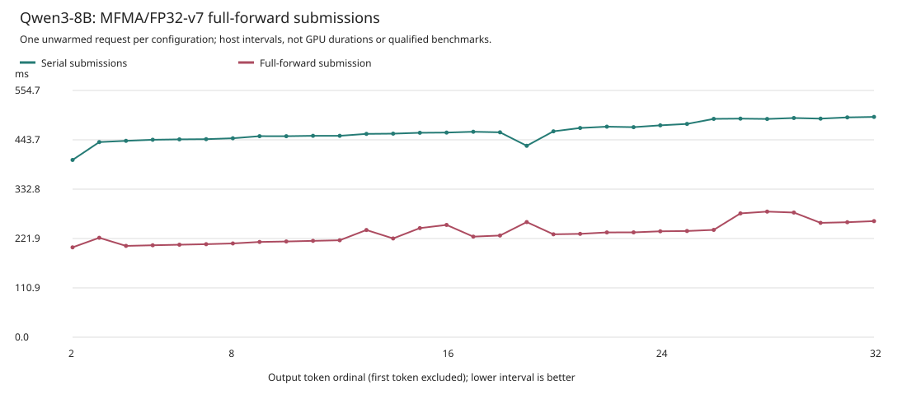

# Full-Forward Submission Observations

These are **single-request, TP1, target-only Qwen3-8B** observations on Asrock's
MI350X (`gfx950`). The scalar pair uses BF16 weights, activations, and output
logits. The separate MFMA pair retains BF16 weights and activations with an
FP32-v7 output head and logits. Neither pair uses quantization or speculation.
Every request matches all 32 token IDs and decoded bytes from the unchanged
independent reference.
**700 tokens/s is not achieved.**

The implementation groups the existing forward's 616 ordered AQL packets into
one worker dispatch command. It remains a multi-dispatch execution. No persistent
GPU megakernel, GPU overlap, kernel-only duration, or stable speedup is established.
There is one unwarmed, nonisolated request per variant and no repeated-run error
bars. The earlier rejected setup attempt is retained separately below.

## Scalar/BF16 Pair

| Submission | TTFT (s) | Mean TPOT (s) | Post-first tokens/s | Observed rate / control | Setup (s) |
| --- | ---: | ---: | ---: | ---: | ---: |
| Serial submissions | 5.863556 | 1.209756 | 0.826613 | 1.000x | 170.853734 |
| Full-forward submission | 4.716267 | 0.982254 | 1.018066 | 1.232x | 166.768686 |

Within this pair, the observed rate ratio is **1.231612x** and mean TPOT is
**18.805597% lower**. This is a comparison of two whole-request host observations,
not a causal or stable gain attributable to submission changes alone.





The rate is `31e9 / sum(the 31 decode intervals in nanoseconds)`. Token 1 belongs
to admission TTFT; setup is reported separately. All 62 actual intervals are
plotted, with output token ordinals 2 through 32 for each request. Host intervals
include runtime, IPC, and between-batch JSON logging. Recording overhead was not
measured or subtracted.

The [control report](assets/asrock-target8b-full-forward-v2/scalar/control-report.json)
and [full-forward report](assets/asrock-target8b-full-forward-v2/scalar/full-forward-report.json)
are byte-for-byte copies of the independently regenerated public reports. Their
integer nanosecond intervals are the source for the
[interval CSV in milliseconds](assets/asrock-target8b-full-forward-v2/scalar/intervals.csv),
[generated table](assets/asrock-target8b-full-forward-v2/scalar/table.md), and
[observed contrast](assets/asrock-target8b-full-forward-v2/scalar/observed-contrast.json).
[Asset hashes](assets/asrock-target8b-full-forward-v2/scalar/SHA256SUMS) bind this
complete scalar pair.

## MFMA/FP32-v7 Pair

This is a separate matched pair using MFMA projections, baseline attention,
device TP1 residuals, and the unpruned FP32-v7 head. Its weights and intermediate
activations remain BF16; its output logits are FP32. Both variants retain the
same MFMA native image and v7 head image. They use 15,136,194,560 additional
resident transposed-weight bytes and a 9,723,904-byte FP32 head workspace.

| Submission | TTFT (s) | Mean TPOT (s) | Post-first tokens/s | Observed rate / control | Setup (s) |
| --- | ---: | ---: | ---: | ---: | ---: |
| Serial submissions | 2.011915 | 0.462470 | 2.162303 | 1.000x | 215.906315 |
| Full-forward submission | 1.008245 | 0.234639 | 4.261868 | 1.971x | 215.412207 |

Within this MFMA pair, the observed rate ratio is **1.970986x** and mean TPOT is
**49.263975% lower**. As with the scalar pair, each variant has one unwarmed,
nonisolated request. This difference is not a causal or stable speedup. The
scalar and MFMA rates have different arithmetic and image identities; their
ratios must not be multiplied or their intervals pooled into one cohort.





The [MFMA control report](assets/asrock-target8b-full-forward-v2/mfma-v7/control-report.json)
and [MFMA full-forward report](assets/asrock-target8b-full-forward-v2/mfma-v7/full-forward-report.json)
retain all integer nanosecond intervals, FP32 head identities, and precision
fields. The separate [62-interval CSV](assets/asrock-target8b-full-forward-v2/mfma-v7/intervals.csv),
[generated table](assets/asrock-target8b-full-forward-v2/mfma-v7/table.md),
[observed contrast](assets/asrock-target8b-full-forward-v2/mfma-v7/observed-contrast.json),
and [asset hashes](assets/asrock-target8b-full-forward-v2/mfma-v7/SHA256SUMS)
use the same post-first timing boundary as the scalar pair.

## Submission And Completion Scope

The [forward recorder](../adapters/m1-engineering-execution-v1/src/tp_execution/full_forward.rs)
retains the same command order and buffer bindings. The
[worker transport](../adapters/m1-engineering-execution-v1/src/bin/tp_worker.rs)
sends one `DispatchFullForward` command containing all 616 dispatch entries and
waits for its aggregate completion receipt. The serial route sends 616 dispatch
commands and waits at each dispatch. These counts describe dispatch-related IPC;
they do not count setup, transfers, reads, or teardown.

| Source-derived schedule | Serial | Full-forward |
| --- | ---: | ---: |
| Ordered AQL packets per forward | 616 | 616 |
| Dispatch commands / completion frontiers per forward | 616 | 1 |
| Forwards per request | 36 | 36 |
| Dispatch packets per request | 22,176 | 22,176 |
| Dispatch commands / completion frontiers per request | 22,176 | 36 |

Completion frontiers are source-derived schedule counts, not measured polling
iterations, GPU events, or GPU duration. The capture's dispatch total remains
22,176 in both cases. This grouping does not fuse device kernels or change the
arithmetic within either matched pair.

All requests use one row, one-token prefill chunks, context 64, four physical
pages, baseline attention, and device TP1 residuals. The scalar pair uses scalar
projections; the MFMA pair uses MFMA projections and the FP32-v7 head. Admission
caching and operational currentness are enabled. Prefix caching, output-head
pruning, ordered attention/FFN groups, dispatch sequences, queue rollover, and
runtime/GPU profiling are disabled. The full-forward mode is the controlled
configuration difference.

## Frozen Identities And Validation

Each pair shares the corrected `rank-wrapper-fixed-v6` controller, worker, model
revision, workload, and reference. Native-image identities match within each
pair and differ between the scalar and MFMA cohorts. Complete capture/input,
native-image, and FP32 head hashes are retained in the applicable reports. The
relevant source and binary pins are:

| Item | SHA-256 |
| --- | --- |
| Scalar-v2 comparator | `045c76bffc17d1ea3f958d599d5e56fa1bafafe90146bcc108c404078a55d639` |
| MFMA-v7-v2 comparator | `2da842ca2403e8ffb3bb9f8e9f73e586a4a0317bdb239fefb94adb5d9ee8b93b` |
| Common numerical comparator | `90cd589fe9b98660f6efb3400775cd269af236688706f37eaedee2d12e92b975` |
| Controller | `3b69635b90d26659a21aab50600640910c3ba637e0713e69c68809ddd7089838` |
| Controller source manifest | `822e9f05ee96b1eb265c98f9002509b665a78f253555c37b3349249b70f8ceb2` |
| Worker | `8284a44f702b8e42a35fe9e04cf051dd709ce9995329adaa2ea5a57ab80fb06a` |
| Independent reference | `1ed868663df52a146dd7921f9fbb2cf1e1d0c0ceed8a7bfda030d65f8ec5b094` |

The model revision is `b968826d9c46dd6066d109eabc6255188de91218`. The independent
reference was generated earlier on MI300X; this checks the fixed prompt and
32-token window, not model-wide quality or every intermediate tensor.

The unchanged pinned comparators independently revalidated all four raw
40-record captures, zero controller exit status, exact stderr, predeclared workload and
expectation, reference tokens/bytes, identities, dispatch counts, and timing
boundaries. The regenerated reports exactly match the retained public reports.
All four harness postflight records are exactly:

```text
controller=0 idle=0 topology=0 inputs=0 plan=0 source=0
```

Each capture includes request retirement and worker closure. The public close
record alone does not independently prove system-wide GPU idleness or final
page-pool reclamation; no final free-page count is observed. Benchmark and
performance qualification remain false.

## Retained Setup Failure

The older scalar full-forward attempt exited with status 1 before setup or
decode, emitting zero capture bytes and zero records. It has **no accepted decode
rate, TPOT, GPU duration, or numerical result**. An empty capture is not a
successful zero-dispatch receipt or proof of worker closure.

The [unchanged failure metadata](assets/asrock-target8b-full-forward-v2/scalar-setup-failure-public.json)
retains the older controller identity (`d624b07b...`), exact error, raw evidence
hashes, and source-review diagnosis. That review identified omitted full-forward
capability, submit, and wait forwarding in the CLI `RankWorker` adapter; trait
defaults rejected the request before driver setup. Its five non-controller
postflight checks passed. All seven raw-evidence hashes in the public failure
metadata were independently checked before copying it into this report.

The metadata remains a record of that earlier attempt. The successful scalar
pair above is independently validated under the corrected v6 controller. The
[top-level asset hashes](assets/asrock-target8b-full-forward-v2/SHA256SUMS) bind the
retained failure metadata and both separate cohort asset manifests.

## Reproduce The Reporting

The [reporter](../tools/target_full_forward_plots_v2.py) never launches a GPU. It
loads the exact SHA-pinned comparator, revalidates raw captures, compares both
public reports, requires all six successful postflight statuses, and recomputes
the rates before creating an output directory. An incomplete or cross-family
pair is rejected. MFMA/FP32-v7 is a separate arithmetic cohort; its values must
not be merged with this scalar/BF16 pair or used to multiply its observed ratio.
Earlier plot directories remain unchanged.

With `EVIDENCE` and `REFERENCE` pointing to the retained evidence and reference:

```sh
python3 -B tools/target_full_forward_plots_v2.py \
  --family scalar \
  --control-capture "$EVIDENCE/target8b-full-forward-v2-control-01" \
  --full-capture "$EVIDENCE/target8b-full-forward-v2-full-01" \
  --reference "$REFERENCE" \
  --output /tmp/ferric-full-forward-scalar-v2-rebuilt
python3 -B tools/target_full_forward_plots_v2.py \
  --family mfma-v7 \
  --control-capture "$EVIDENCE/target8b-full-forward-mfma-v7-v2-control-01" \
  --full-capture "$EVIDENCE/target8b-full-forward-mfma-v7-v2-full-01" \
  --reference "$REFERENCE" \
  --output /tmp/ferric-full-forward-mfma-v7-v2-rebuilt
PYTHONPATH=tools python3 -B -m unittest \
  test_target_full_forward_scalar_v2 \
  test_target_full_forward_mfma_v7_v2 \
  test_target_full_forward_plots_v2
```

The combined targeted suite passed **31 synthetic CPU tests**, including all
**8 reporter tests**. They check pair identity and scope, precise interval
cardinality, source pinning, exact report bytes, and rejection of invalid,
incomplete, or mixed pairs. Synthetic tests provide no GPU or performance
evidence; those observations come only from the separately validated captures.
