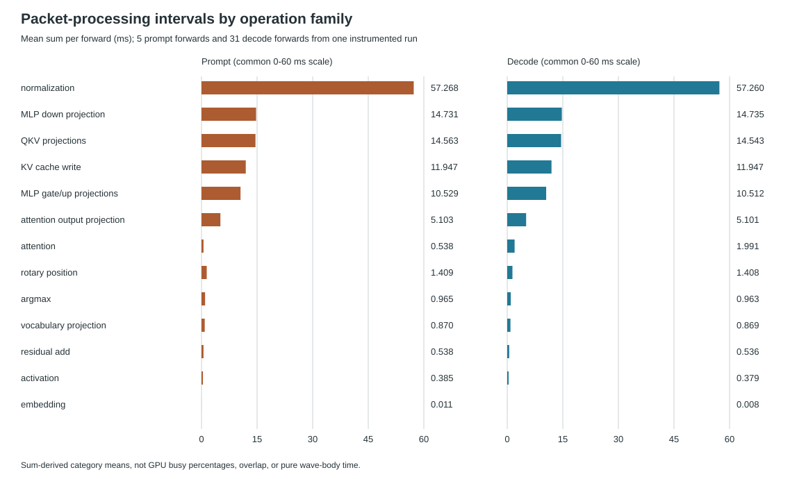
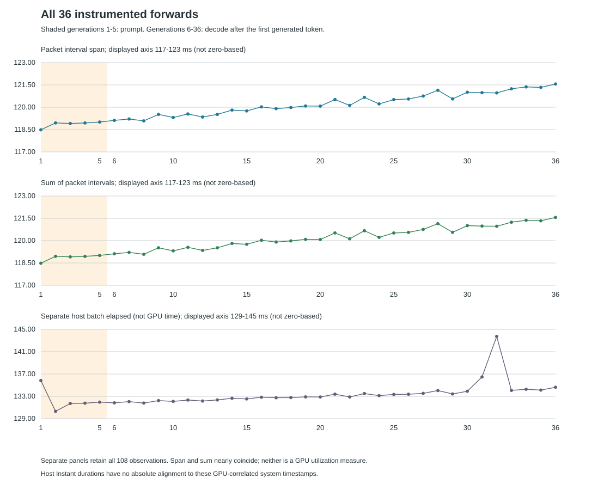
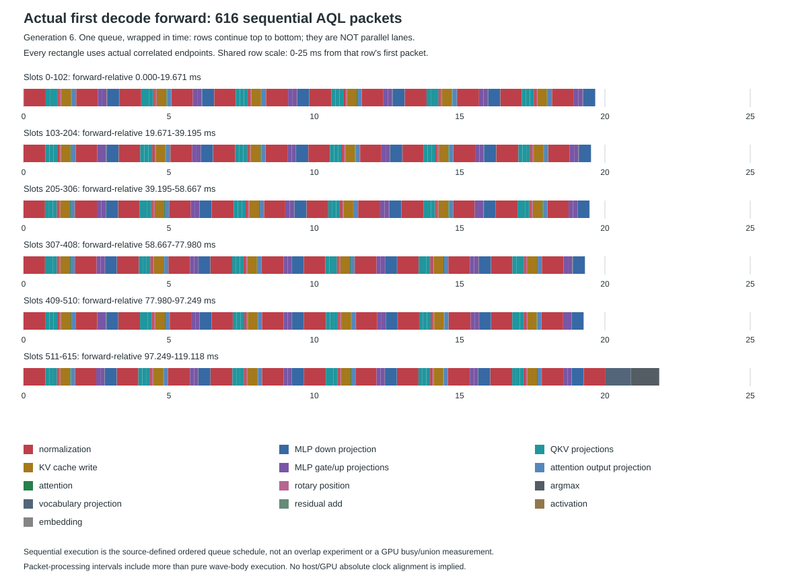

# Target8B GPU Packet Profile

This is one accepted, instrumented **single-request, TP1, target-only Qwen3-8B**
run on Asrock's MI350X (`gfx950`). It uses BF16 weights and activations, paired
MFMA projections, wave attention, an FP32-v7 head, and wave-v11 argmax. There is
no quantization or speculation. All 32 generated token IDs and decoded bytes
match the unchanged independent reference.

The capture retains **36 forwards, 616 ordered AQL packets per forward, and
22,176 validated signal snapshots**. It is not a persistent GPU megakernel.
**700 tokens/s is not achieved or established by this profile.** No throughput
rate, stable speedup, GPU overlap, GPU utilization, or pure kernel-body duration
is inferred from these measurements.

## What Was Measured

Opt-in native queue profiling records AMD dispatch **packet-processing** start
and end timestamps. The worker retains each signal slot and generation, observes
successful completion with an acquire, then snapshots its timestamp fields.
Driver GPU/system clock pairs bracket publication and completion. Checked integer
interpolation maps each enclosed interval into the common system-clock domain;
the captured system frequency is 1,000,000,000 Hz. Clock accuracy is not qualified.

These intervals are not pure wave-body execution or GPU busy/union time. A
packet's interval can include processing beyond instruction execution. The
**packet interval span** is the earliest correlated packet start to the latest
end in a forward. The **packet interval sum** adds all 616 individually floored
durations. Separate endpoint and duration flooring can differ by one nanosecond;
span and sum must not be substituted for one another or treated as an overlap test.

Instrumentation adds clock reads, acquired snapshots, file writes, and checks.
Clock/snapshot work is inside dispatch elapsed; file writes and post-write
currentness checks are outside dispatch elapsed but inside command latency.
The separately retained host batch elapsed uses `Instant`, not this timestamp
domain. It has no absolute alignment to the GPU-correlated endpoints.
Recording overhead was not measured or subtracted. Do not compare this run's
durations with uninstrumented cohorts or multiply earlier observed rate ratios.

## Absolute Categories

All values below are mean **summed packet intervals per forward**, not percentages
of GPU busy time. Each phase is normalized by its actual number of forwards:
five prompt-processing forwards (generations 1-5), then 31 decode forwards
(generations 6-36) after the first generated token. No packet or forward was excluded.



| Family | Packets/forward | All mean (ms) | Prompt mean (ms) | Decode mean (ms) |
| --- | ---: | ---: | ---: | ---: |
| Normalization | 145 | 57.2613 | 57.2682 | 57.2601 |
| MLP down projection | 36 | 14.7343 | 14.7313 | 14.7348 |
| QKV projections | 108 | 14.5455 | 14.5633 | 14.5426 |
| KV cache write | 36 | 11.9466 | 11.9467 | 11.9466 |
| MLP gate/up projections | 72 | 10.5141 | 10.5294 | 10.5116 |
| Attention output projection | 36 | 5.1016 | 5.1029 | 5.1014 |
| Attention | 36 | 1.7894 | 0.5379 | 1.9913 |
| Rotary position | 36 | 1.4085 | 1.4093 | 1.4084 |
| Argmax | 1 | 0.9630 | 0.9653 | 0.9626 |
| Vocabulary projection | 1 | 0.8692 | 0.8704 | 0.8691 |
| Residual add | 72 | 0.5360 | 0.5384 | 0.5356 |
| Activation | 36 | 0.3800 | 0.3849 | 0.3792 |
| Embedding | 1 | 0.0088 | 0.0105 | 0.0085 |

Normalization is the largest summed interval category in this capture. Its
shared `qwen3_rmsnorm_v1` export covers distinct shapes and modes:

| Normalization operation | Packets/forward | All mean sum (ms) | Prompt (ms) | Decode (ms) |
| --- | ---: | ---: | ---: | ---: |
| Input hidden state, width 4096 | 36 | 26.7686 | 26.7615 | 26.7697 |
| Post-attention hidden state, width 4096 | 36 | 26.7558 | 26.7604 | 26.7550 |
| Final hidden state, width 4096 | 1 | 0.7458 | 0.7474 | 0.7456 |
| Q norm, width 128 | 36 | 1.5037 | 1.5069 | 1.5032 |
| K norm, width 128 | 36 | 1.4874 | 1.4920 | 1.4867 |

The **73 full-hidden normalization packets sum to 54.2701 ms per forward**,
averaging 0.7434 ms per packet. The 72 Q/K normalization packets sum to
2.9911 ms, averaging 0.0415 ms each. These costs must not be conflated merely
because they share a root. The complete
[operation table](assets/asrock-target8b-gpu-profile-v1/operation-table.md)
and [operation CSV](assets/asrock-target8b-gpu-profile-v1/operations.csv)
retain all 21 operation classes and both phase breakdowns.

The captured baseline [normalization source](../device/qwen3-all-kernels-v1/src/rmsnorm.rs)
uses serial width-wise accumulation within each lane. Its output narrows the
normalized value to BF16, widens for weight multiplication, then narrows again.
A replacement reduction needs explicit numerical qualification and must account
for both rounding points and changed reduction association. The captured
[KV append source](../device/qwen3-tp-batch-kernels-v2/src/rope_kv.rs)
uses a grid-leader component-copy loop. These source observations motivate
separate optimization candidates; this profile does not establish their gains.
Attention's 1.7894 ms all-forward mean is not the dominant interval category here.

## Every Forward

| Phase | Forwards | Mean packet span (ms) | Mean packet sum (ms) | Separate host batch mean (ms) |
| --- | ---: | ---: | ---: | ---: |
| Prompt | 5 | 118.8589 | 118.8586 | 132.3228 |
| Decode | 31 | 120.2521 | 120.2518 | 133.4879 |
| All | 36 | 120.0586 | 120.0583 | 133.3261 |



The panels have explicitly labeled, non-zero-based axes to show the observations.
All-forward packet spans range from 118.4840 to 121.5636 ms. Span and sum are
nearly coincident, but that is not an independent overlap or utilization result.
The [36-forward CSV](assets/asrock-target8b-gpu-profile-v1/forwards.csv) preserves
integer nanoseconds and each frame's payload hash. These are instrumented batch
durations, not the 31 end-to-end host decode intervals used in the separate
[full-forward throughput observations](GFX950_TARGET8B_FULL_FORWARD_V2.md).

## Actual Sequential Timeline

The timeline selects **generation 6, the first decode forward**, by a fixed
rule, not by fastest duration. It shows all 616 actual packet intervals, colored
by operation family. Its span is 119.117613 ms; its interval sum is 119.117387 ms.
The one sequential queue is wrapped across six consecutive time rows for
legibility. Rows continue top to bottom; **they are not concurrent GPU lanes**.
No overlap or overlap-induced gain is claimed.



Slots are source-derived and checked against the recorded stages: embedding at
0; 36 layers of 17 ordered stages at 1-612; final norm, vocabulary head, and
argmax at 613-615. The actual
[19-root load-order roster](assets/asrock-target8b-gpu-profile-v1/kernel-roster.json)
includes admitted but unused roots; it is not a claim of 19 distinct dispatched
operation classes. No invented spans, concurrency lanes, or interpolated packets
are used in this graph.

## Reproduction And Provenance

The [sanitized packet CSV](assets/asrock-target8b-gpu-profile-v1/packets.csv)
retains all 22,176 rows: stage identity, root, ABI/geometry, integer correlated
endpoints relative to each forward's own zero, frequency, and duration. Absolute
GPU/system timestamps, device/process IDs, private paths, and model data are not
published. This is sufficient to reproduce these sums, tables, and graphs, not
a substitute for the private raw-signal/acquire audit.

The original accepted raw capture, hashes, and plots remain unchanged. The
frozen validator and a separate rational-arithmetic implementation replayed all
signal intervals. The clean close footer, exact 616-stage schedule, numerical
reference, source/image identities, and all 13 acceptance statuses passed.
An independent publication-time replay reproduced the prior analysis files
byte-for-byte. This is one instrumented, unwarmed, nonisolated request, with no
repeat-run error bars or calibrated timestamp-error bounds.

Run from the repository root; the output directory must not already exist:

```sh
python3 tools/target_gpu_profile_v1.py render \
  --input docs/assets/asrock-target8b-gpu-profile-v1 \
  --output /tmp/target8b-gpu-profile-reproduced
python3 -m unittest discover -s tools -p test_target_gpu_profile_v1.py -v
```

The generator is standard-library-only and launches no GPU work. Tests cover
missing/reordered rows, phases, ABI, geometry, bounds, clock fields, integer
flooring, normalized counts, privacy, and byte-identical regeneration. SVG checks
verify all 108 forward-series points and all 616 timeline rectangles. No raster
renderer was available on the analysis host, so these are structural/data checks,
not a claimed browser screenshot or visual-render verification.

| Frozen input | SHA-256 |
| --- | --- |
| Controller | `5b661196dcf4cc63aa2965ae2aea5598c51ea2130ec92412f9f9f31f9bee8ba4` |
| Controller source manifest | `290c56560e7495e784fbba7dfc44c102dd9dcf86f9f832c89260bdb05508ea3d` |
| Worker | `24fcf50e0deb641715691b1d381b34c9f423e036834104ac46b0d754c41be5dc` |
| Worker source manifest | `a9101743147f73beaab2ae8df3f5951fa2885f19dd23282450c541914a01d9fe` |
| Main paired-kernel source manifest | `b27b9cffc159ee82667d039056aa6a414569cc1309e25a5dca442279aba59fb0` |
| Main paired image | `2e677384a5e86c6e1ae95f10333f2d0d330922ed4d1348acdb1b09f5655281e2` |
| FP32-v7 head image | `b21caccae5ec030640242034940822cb1a3f1e8531b7b6ded7371492da3747ae` |
| Wave-v11 argmax image | `86c3ee4cead26f6432ef590434b3335e1ee2a95c9c900cf6315dca4ef0a542b0` |
| Frozen timestamp checker | `ef617b471520477914db653341178e4fe89645042bf5cf8cc3b9e492289362ac` |
| Raw capture manifest | `6c9e89737c956dbedc61de96d830f23c6c970b7a0663f04043cc16e35833d6a8` |
| Independent accepted analysis | `bb73534910b1a87ee9b2c64bd28cf6c5ca8f55991455ace85bf2d581be59f61e` |

[Public provenance](assets/asrock-target8b-gpu-profile-v1/provenance.json) retains
the remaining frozen harness, plan, source, reference, workload, roster, raw-file,
and sanitized-data hashes. [Asset hashes](assets/asrock-target8b-gpu-profile-v1/SHA256SUMS)
bind the complete published data and generated figures. No runtime or kernel
changes are part of this report.
