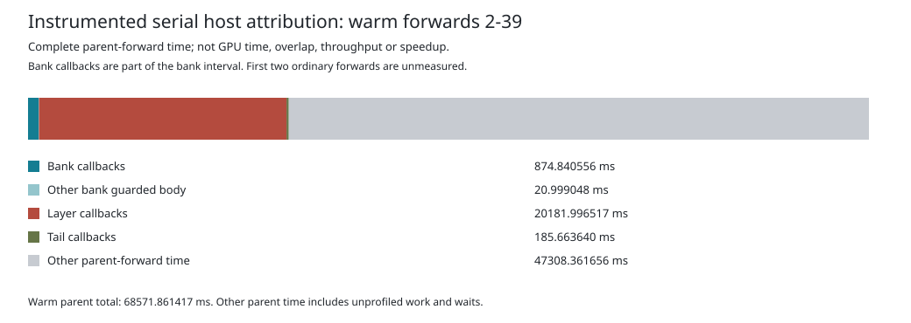

# Instrumented Host Attribution

This report was generated on `mi350` from the original successful
[Readiness40 GPU diagnostic](../native-gpu-v1/README.md). It measures host
elapsed time for forty Qwen3-8B BF16 prompt forwards across two gfx950 GPUs,
with zero generated tokens. Callback instrumentation covers only positions
2-39. This is one instrumented run, not a matched ablation, GPU profile or
decode-throughput measurement.



## What The Measurement Shows

| Warm-forward component | Seconds |
| --- | ---: |
| Bank callbacks | 0.874840556 |
| Other bank guarded-body time | 0.020999048 |
| Layer callbacks, all 36 layers | 20.181996517 |
| Tail callbacks | 0.185663640 |
| Other parent-forward time | 47.308361656 |
| Complete warm parent forwards | 68.571861417 |

The measured callbacks total **21.242500713 seconds**. Including the remaining
bank guarded-body time gives a disjoint attribution of 21.263499761 seconds,
or 31.009075% of warm parent-forward time. The remaining 68.990925% includes
unprofiled work and waiting; it is not a measurement of GPU execution.

The largest measured component is the layer callbacks. Within that component,
before checks account for 8.837488056 seconds, discovery for 4.808508418,
root-generation checks for 3.655685030 and after checks for 2.880315013.
These are subtotals, not extra costs to add to the table. They identify where
to investigate repeated host work, not checks that are safe to remove. Any
optimization must preserve the currentness contract and be qualified in a
separate matched experiment before a speedup is claimed.

## Accounting Boundaries

Let `B` be the bank guarded-body interval and `Cbank`, `Clayers` and `Ctail`
the three callback subtotals. Bank callbacks are already inside `B`. The
plot partitions each complete warm parent forward as:

```text
Cbank + (B - Cbank) + Clayers + Ctail + other parent-forward time
```

The worker can begin before the parent finishes flushing its request. For
that reason, residual time is computed against the complete parent forward,
never just its flush-to-frame-read wait. All thirty-eight per-forward
residuals and bank remainders are nonnegative. Positions 0 and 1 have no
callback measurements; blank CSV cells mean unmeasured, not zero.

The separate 124 disjoint parent spans total 443.663008501 seconds. Their
forward groups are subsets of that total, not additional costs. This span
sum is also distinct from the outer supervised parent-phase wall interval.
Instrumentation and scheduling effects are included. The layer measurements
aggregate 36 layers; they do not identify individual GPU kernels or ranks.

## Inspect And Reproduce

The [complete table](table.md), [callback CSV](callbacks.csv),
[per-forward CSV](forwards.csv), [parent spans](parent-spans.csv) and
[integer summary](summary.json) retain the exact nanosecond measurements.
[Provenance](provenance.json) binds the original archive, verifier and report
source. The [export manifest](manifest.json) authenticates all seven generated
outputs and the separate [thirteen-test CPU qualification](../report-cpu-v1/README.md).
Actual archive verification and report generation also completed successfully
on MI350 without rerunning the native case.

Independent data-only review rehashed the report's eight original members
and all 167 native originals, then recomputed all forty forward rows, twelve
callback categories, parent groups, percentages and SVG geometry. Every
generated value reconciled. No project helpers were executed locally.

Run from the repository root on Linux with Python 3. The report authenticates
all 167 original archive members, invokes the qualified evidence validator,
and writes only to a fresh output directory. No model files or GPU are needed.

```sh
root=$(pwd -P)
case_root="$root/qualification/guarded-mlp-currentness-duration-v1"
scratch=$(mktemp -d)
python3 -I -B "$case_root/report-cpu-v1/duration_report.py" \
  "$case_root/native-gpu-v1/retention_tool.py" \
  "$case_root/native-gpu-v1.tar.gz" \
  fe351dbef62f5e1ba90fe91eee99877c9c53006394054cf88fec5654fa2cf71b \
  "$scratch/report"
```

The original native archive is 4,555,390 bytes with the SHA-256 shown above.
Reproduction uses that archive, not the commentary-augmented published
directory. Six measurement outputs are deterministic; `provenance.json`
also records the local archive path and therefore changes with its location.
The command enforces a 180-second deadline and 768 MiB address-space bound.
This README is subsequent commentary, not one of the seven generated outputs.

Historical Ferric parity is not independent framework acceptance. The known
position-5 discrepancy remains open. Full2303 has not run; the independent
2,048-prompt/256-generated-token gate and the 700 tokens/s target remain unmet.
