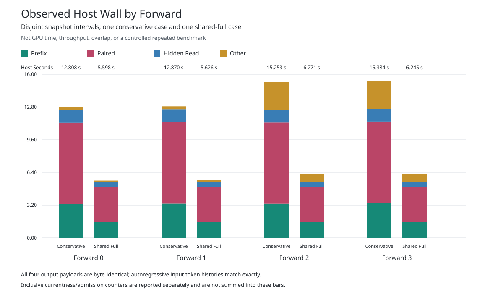

# Shared-Full Currentness: Observed Host Wall

Both MI350 cases execute the same four autoregressive forwards through all
36 layers on two ranks. All four complete 606,976-byte observation payloads
are byte-identical, and genuine token histories match. One observation per
mode is not a controlled repeated benchmark, a GPU speedup or tokens/s.

The [exact table](comparison.md) records conservative/shared host-wall ratios
of 2.288, 2.288, 2.432 and 2.463. Brackets fall from 12.808-15.384 seconds
to 5.598-6.271 seconds. The paired category falls from 7.924-8.004 seconds
to 3.412-3.444 seconds. These are snapshot-to-snapshot host intervals,
including waits and process gaps, not device timings.

## What Changed

The unchanged runtime's explicit
[group fence](https://github.com/harsh-nod/fe2o3/blob/e9ccc629cf1d445bda4d792276a1defb2e386d88/crates/fe2o3-kfd/src/engineering_gfx950_peer.rs#L284)
shares one freshly discovered topology across ranks inside a single fence.
The conservative path checks full currentness, then checks idle, whose
implementation repeats full currentness. The shared path retains each rank's
queue-idle validation after the full group check.

The [fresh observation](https://github.com/harsh-nod/fe2o3/blob/e9ccc629cf1d445bda4d792276a1defb2e386d88/crates/fe2o3-kfd/src/device_gfx950_group_currentness.rs#L17)
still brackets topology discovery with every participant's mutable checks,
compares each retained topology, rechecks its generation, and poisons all
participants on failure. No observation is reused across fences. Kernel
admission caching, operational currentness and raw timestamp queues remain
off. The conservative default, GPU images, queue retirement, ownership and
healthy-close requirements are unchanged.

## Counter Attribution

Each paired layer has 25 group fences: four allocation-census fences, six
coordinator fences, six arena creation/mapping fences, six submit/completion
fences and three retired-proof fences. Six individual full checks per rank
remain, covering four admissions and two allocation-resource checks.

Across 36 layers, conservative `36 * (25 * 2 + 6) = 2016` individual checks
per rank become `36 * 6 = 216` individual checks per rank plus
`36 * 25 = 900` group checks. Every actual forward matches those counts.

| Category, Per Forward | Conservative Full Checks Per Rank | Shared Full Checks Per Rank | Shared Group Checks |
| --- | ---: | ---: | ---: |
| Prefix | 900 | 180 | 360 |
| Paired MLP/Residual | 2016 | 216 | 900 |
| Hidden Read | 360 | 72 | 144 |

Two-bank reuse adds 361 group fences at forwards two and three. These
previously contributed 722 extra individual checks per rank; reset and
readback operations are still performed. The shared forward group totals
are 1438, 1438, 1799 and 1799, while individual forward totals stay at
496/476 for rank zero/one. Publication checks are separate, already share
topology, and can vary with polling. Their counts are not credited as an
effect of this policy change.

The [conservative table](baseline-table.md) and
[shared table](candidate-table.md) keep inclusive rank/shared counters
separate from disjoint wall categories. Adding nested timer scopes would
double-count work. The measured count change corroborates the mechanism;
the two observations alone do not isolate a causal timing gain.

## Validation And Reproduction

The [actual MI350 analysis](complete.json) passed all 16 tests, authenticated
both original terminals, compared all payload bytes and token histories,
and rehashed all 27 selected inputs. No child or GPU work was launched by
the analysis. The terminal is 9,268 bytes, SHA-256
`88418d2e907e353a948e47d2c94bd11742766afe2ab666af961140ba8e565b80`.
The separate [synthetic gate](../comparison-checker-v1/complete.json) also
passed all 16 tests before the native experiment.

The [JSON](comparison.json) retains integer nanoseconds and reduced exact
fractions; the SVG contains each stack's integer value. Display rounding
uses integer round-to-nearest, ties-to-even. The chart was rendered and
visually checked. Original report bytes and actual policy bits are preserved;
only verified copies are adapted to reuse the unchanged accounting helper.

For offline reanalysis, invoke `source/run.py` with the absolute paths of
the conservative `gpu-attempt-v1`, shared `gpu-attempt-v1`, and a fresh output
directory whose parent exists. Use `python3 -I -B`. This reruns the 16 tests
and data accounting, not the original GPU experiment. The selected source
and evidence files are retained; external native dependencies and model
weights are not bundled.

Full-model numerical acceptance, sustained single-request Qwen3-8B BF16
2,048/256 decode, GPU overlap, comparison with vLLM and 700 tokens/s remain
separate open gates.
