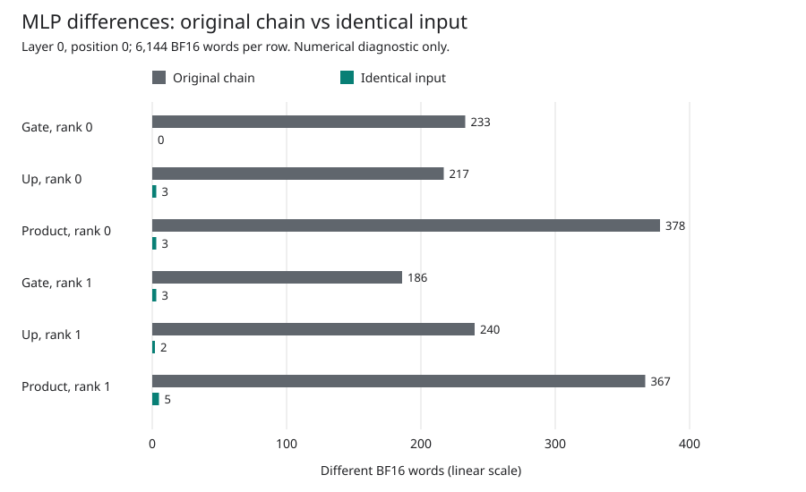

# Matched-Input MLP Qualification

The diagnostic now passes on **MI350 gfx950**, including all **20 CPU regression
tests** and four actual framework MLP calls. The [CPU receipt](cpu-v1/complete.json),
[GPU owner receipt](gpu-v1/complete.json) and
[framework receipt](gpu-v1/output/complete.json) retain the tests, execution,
source/input postchecks and clean container retirement. This is an isolated
layer-zero module comparison, not full-model numerical acceptance or performance.

The separate [actual-data admission](data-v1/complete.json) also passes on
MI350: all 31 original bodies, eight native MLP slices and ten historical
control stages join their saved receipts, with clean read-set postchecks. It
imports no Torch/Transformers/NumPy and executes neither model nor GPU work.

## Why This Comparison

The current guarded capture and the historical framework capture differ at
two of the 4,096 BF16 words entering layer zero's MLP. Comparing their downstream
outputs directly mixes input propagation with differences in operator arithmetic.
The new harness calls the actual framework MLP four times: original input,
native input, original input, native input. It observes ten stages per call.

Both original-input calls must reproduce all ten saved framework stages exactly,
and both native-input calls must repeat exactly. Otherwise it preserves the
captured outputs but withholds the matched-input comparison. Gate/up comparisons
then have identical inputs; the product comparison can still contain propagated
gate/up differences. Native FP32 Down partials are not compared with a complete
framework BF16 Down output. This is an explicitly substituted module input, not
a genuine full-model history or an end-to-end model correctness test.

The [source specification](source/README.md) and
[source manifest](source/source-manifest.json) are retained unchanged from review.
The 31 original input bodies are authenticated by [logical pins and physical
aliases](source/inputs.json); original receipts are not rewritten.

## Actual GPU Result

Both original-input calls reproduce all ten historical framework stages
byte-for-byte, despite the recorded environment differences. Both native-input
calls also repeat exactly across all ten stages. The actual device reports
`gfx950:sramecc+:xnack-`; all 40 captured stage files are retained in `gpu-v1/output/`.

The native and historical MLP inputs differ at only **2/4,096 BF16 words**.
Holding the input fixed removes most downstream differences: **36,848/36,864**
native gate/up/product words match the framework, leaving 16 differences.

| Stage | TP Rank | Different Words, Original Chain | Different Words, Identical Input | Max BF16 Steps, Identical Input | Relative L2, Identical Input |
| --- | ---: | ---: | ---: | ---: | ---: |
| Gate | 0 | 233 | 0 | 0 | 0 |
| Up | 0 | 217 | 3 | 1 | 5.361791e-8 |
| Product | 0 | 378 | 3 | 1 | 1.433838e-8 |
| Gate | 1 | 186 | 3 | 1 | 2.564962e-5 |
| Up | 1 | 240 | 2 | 1 | 5.390805e-5 |
| Product | 1 | 367 | 5 | 2 | 1.132522e-5 |

Each row contains 6,144 BF16 words. Relative L2 is a ratio, not a percentage.
The [raw diagnostic](gpu-v1/output/diagnostic.json) also retains absolute errors,
RMSE and the separate framework input-effect comparison.



This is a **numerical isolation experiment, not an optimization ablation**: no
native kernel was changed or rerun. Gate/up use identical input vectors; product
differences can include propagated gate/up error and do not isolate standalone
SiLU. The eight gate/up differences are one BF16 step each; the eight product
differences are at most two. Native FP32 Down partials are deliberately excluded
from comparison with the full framework BF16 Down projection. Exact agreement
with one framework is not itself proof of correctly rounded arithmetic.

The reproducible [chart renderer](comparison-v1/render.py) consumes only the raw
diagnostic, after checking its pinned hash. It does not run a model or measure
latency. From this directory:

```sh
python3 -B comparison-v1/render.py
```

## Environment

The old reference ran on ASRock. MI350 uses the already cached, immutable ROCm
container image and a private package overlay. The CPU import probe verifies
that all four Python implementation files, including Qwen3 and Torch activation
and functional code, match the historical reference byte-for-byte. This does
not establish equality of compiled math libraries or numerical outputs. The
[actual CPU probe](environment/guarded-mlp-matched-framework-env-v228-v2/probe.json),
both provisioning attempts and their package manifests are retained.

| Component | Historical Reference | Current MI350 Environment |
| --- | --- | --- |
| Python | 3.10.12 | 3.12.13 |
| PyTorch | 2.12.1+rocm7.2 | 2.12.0+git6bbd260 |
| Transformers | 4.51.0 | 4.51.0 |
| NumPy | 1.26.4 | 2.3.5 |
| HIP | 7.2.53211 | 7.2.53211 |

The first private overlay installed successfully but failed CPU imports: the
container needed explicit user/cache environment variables, and its installed
SciPy required NumPy 2. The second overlay leaves the image's NumPy unchanged
and passes the CPU import probe. Neither setup attempt executed a GPU kernel.
The shared installation and model weights were not modified.

## Tests And Execution

The 20 tests cover exact rank-slice byte units, stage identities, control and
repeat failures, activation/product semantics, hook cleanup, source integrity,
container ownership, read-only mounts, and separate cancellation/cleanup budgets.
They also accept both supported unittest report formats while requiring every
expected test to pass. The [CPU runner](preparation/check_cpu.py) retains the raw
test log and process cleanup result.

For the portable CPU tests, from `source/` run:

```sh
python3 -B -m unittest -v test_mlp
```

The GPU launcher is a host-bound engineering experiment, not a public inference
entrypoint. It requires authenticated checkpoint files, original captured inputs,
an exact private overlay, a fresh launch plan, idle GPUs, and a bounded owned
container. It must not be pointed at unrelated shared-host workloads.

All issue #42 milestones remain open. The next community performance demo still
requires model numerical acceptance, bounded full-request execution, and a
controlled single-request BF16 2,048/256 benchmark with actual GPU timelines.
