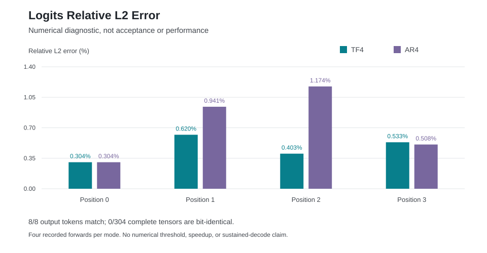

# Guarded Qwen3 Numerical Diagnostics

The [actual MI350 comparison](complete.json) completes successfully for both
four-step modes. All eight selected output tokens match the independent
framework. All 304 tensor slices have comparable input histories; **none of
the complete slices is bitwise identical**. This is a numerical diagnostic,
not full-model acceptance or a throughput result.

Each position includes 36 layer outputs, final normalization and 151,936
logits, all BF16. Relative L2 is `||candidate - reference||2 / ||reference||2`.
No tolerance or acceptance threshold is introduced by this comparison.

The [CSV](plots/logits.csv) retains full recorded values and tensor hashes;
the [rendering receipt](plots/complete.json) binds the chart to this diagnostic.

| Mode | Position | Reference / Candidate Token | Logit Relative L2 | Maximum Absolute Error |
| --- | ---: | --- | ---: | ---: |
| Teacher-forced | 0 | 67 / 67 | 0.0030448043 | 0.0625 |
| Teacher-forced | 1 | 198 / 198 | 0.0061982444 | 0.1875 |
| Teacher-forced | 2 | 25 / 25 | 0.0040257150 | 0.15625 |
| Teacher-forced | 3 | 16 / 16 | 0.0053348135 | 0.171875 |
| Autoregressive | 0 | 67 / 67 | 0.0030448043 | 0.0625 |
| Autoregressive | 1 | 25 / 25 | 0.0094134774 | 0.20703125 |
| Autoregressive | 2 | 576 / 576 | 0.0117436782 | 0.1875 |
| Autoregressive | 3 | 2701 / 2701 | 0.0050785906 | 0.125 |

## Method

The adapter consumes the unchanged guarded observation validator and the
previously established numerical comparison functions. It rehashes the exact
candidate controls, payloads and execution records. TF4's failed original
controller and its separately passing data revalidation remain distinct;
AR4 must have an actual passing outer controller.

The existing independent PyTorch/Transformers references each contain two
fresh-cache passes with identical payloads and KV hashes. Their pinned model,
bundle and input histories match the candidate. They are not constructed from
candidate intermediate tensors. Reusing these immutable references requires
no new framework GPU run. Tensor comparisons stop permanently after any input
history divergence; no such divergence occurs in these eight positions.

All five adapter regressions pass. The diagnostic rehashes 250 inputs and
finishes with clean postchecks. Its 3.103334-second duration is CPU analysis,
not GPU model execution or decode throughput. Report SHA-256:
`55b550cf19e3deae73384db0895407b7d16cd9c75d6e677aa3159eed922da482`.
The seven exact analysis sources are retained beside the report. The original
candidate captures are linked from the [runtime checkpoint](../README.md).
Reference payload identities and all per-layer metrics are in the report;
the previously retained framework payload archives are not duplicated here.

The 2,048-token prompt / 256-generated-token workload, an independently
justified model numerical acceptance policy, production admission, controlled
performance comparisons, overlap traces and 700 tokens/s remain open.
