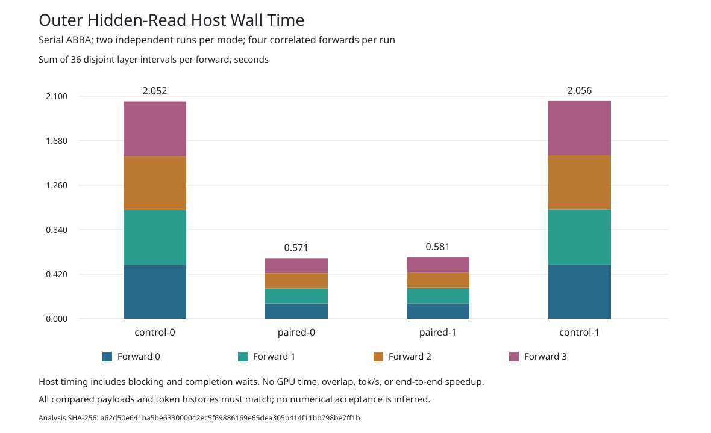

# Paired Hidden-State Reads

The narrow two-rank runtime read API, opt-in Ferric worker caller, and parent
selector have passed CPU qualification on MI350. The API is integrated in
fe2o3 commit `ee63881af1`; the tested worker and parent postimages are integrated
here. The first native comparison failed at worker CLI dispatch after a passing
control case. After the separately tested correction, a fresh four-run native
comparison passed: the outer hidden-read host interval was 71.9% shorter.
This is a read-phase diagnostic, not an end-to-end decode speedup.

## Change

The guarded model currently retains both ranks' 8,192-byte hidden outputs at
each of 36 layers. Two ordinary reads repeat currentness checks. The new
`Group::read_pair_v1` validates both rank-specific public-VRAM tokens and ranges,
makes a fresh full-group check, copies both outputs with actual idle-queue
checks, then makes another fresh full-group check before returning either copy.
Failure or unwind quarantines the Group. Typed state and private dependency
arenas cannot use this API. Ordinary reads, global currentness policy, limits,
dispatches, and buffer-reuse behavior are unchanged.

This is a method-local check cadence, not a cached currentness authorization or
an atomic cross-rank GPU snapshot. Both producers must already have completed
under the existing checked runtime contract.

## Actual CPU Results

[The MI350 receipt](runtime-cpu-v2/evidence/complete.json) records 22 naturally
completed phases, reaped children, absent process groups, and clean source,
tool, dependency, and cache postchecks.

| Check | Result |
| --- | --- |
| Full KFD ordinary test selection | 1,108 passed; 8 unchanged ignored |
| New paired-read tests, included above | 7 passed |
| Unchanged Ferric worker tests | 615 passed; 4 unchanged ignored |
| Existing selected facade doctests | 10 passed |
| Rustdoc parser regression cases | 8 passed |
| Runtime and worker test/executable products | 10 built and pinned |

The run used CPUs 8/9, two Cargo jobs, private offline caches, hidden GPU
visibility, and the existing storage/process bounds. Its 135.76 seconds is
CPU qualification wall time, not model latency or throughput. Ignored native
tests were not executed. Only the selected facade doctests were run.

The [retention map](runtime-cpu-v2/retention.json) authenticates 145 files:
all 117 raw files, receipts/source maps, the three tested runtime postimages,
helpers, lineage, and five workspace manifests. The unchanged compiled source
bodies match the canonical repositories. The qualified reduced Cargo workspace
and lock are retained explicitly; their saved original manifest and input lock
match canonical fe2o3. They are not substituted into the canonical workspace.

The terminal is 2,198,619 bytes, SHA-256
`61f255e100b486418723dc51d36dc400a66945c9412c04f8e8024eb93065014d`.

## Worker Caller

The [worker receipt](worker-cpu-v2/evidence/complete.json) records nine naturally
completed phases, 621 passing tests, four unchanged ignored native tests, and
625 inventoried names. Six new tests cover the explicit route, report schema,
paired hidden-state validation, ordinary read order, and healthy Close gate.
All source, cache, dependency and owned-process postchecks passed. Four Cargo
products were built and pinned. The runtime suite was not rerun in this worker
qualification; it uses the exact runtime sources qualified above.

The opt-in `--engineering-native-guarded-mlp-host-paired-read-v1` route uses fresh
AR4 arenas with shared-full currentness and rejects teacher-forced or reusable
arena modes before setup. The ordinary route is unchanged. Both paths require
equal, complete, finite BF16 hidden outputs from the two ranks.

The [retention map](worker-cpu-v2/retention.json) covers 71 original bodies,
including all 50 raw files, the nine tested worker postimages, lineage and
staging receipts. The terminal SHA-256 is
`1078bf7fc8a1359d8144f786dd32e270a5a736ea995e3f52b97d7e905581d863`;
the worker executable is 5,946,240 bytes with SHA-256
`4bbf99460ad3599248fabcbbc889139269a352e5801d434ba76d5f60b17bb8b3`.
Its 72.66-second qualification wall time is not model throughput.

## Parent Selector

The [parent receipt](parent-cpu-v2/evidence/complete.json) records 55 naturally
completed phases, 400 passing selected tests in 47 scopes, and 878 inventoried
library tests. The full parent library suite was not executed. Five executable
products were built and pinned, with clean source, dependency, cache and
owned-process postchecks. The parent retains its prior locked Git dependencies;
it is not represented as compiling against the worker's newer local runtime.

`--observe-guarded-host-paired-read` selects the new worker mode explicitly.
The [retention map](parent-cpu-v2/retention.json) authenticates 414 original
bodies, including all 279 raw files, 116 lineage inputs, eleven compiled overlay
bodies, and the qualification/staging helpers and receipts. The terminal SHA-256
is `143132b2d4e147aec77865cd7a60a076e1f663088ee9fe4d69ede4cfbf0ed76c`.
The selected parent executable is 13,854,240 bytes, SHA-256
`975ec42dfd7cb39cbd2dce1315e01322a1d36e27309d184b0044d0edfa280750`.

## Measurement Gate

The [data-only analyzer](analysis-cpu-v2/analyze_hidden_reads.py) and its
[eight synthetic tests](analysis-cpu-v2/evidence/complete.json) ran on MI350.
It requires complete payload equality, identical model inputs and executables,
four independent sessions, and an authenticated serial control/paired/paired/
control run manifest. The expected per-layer read counters are four versus two
group checks and two versus zero individual currentness checks per rank.
Both modes must still read all 8,192 bytes from each rank.

The planned comparison uses fresh AR4 arenas and the same shared-full policy
in both modes. Its primary measurement is the outer hidden-read wall interval.
The runtime's nested `read_ns` scope changes, so comparing that counter alone
would overstate the benefit. The original five tests cover parsed-case analysis.
Three additional tests exercise complete command-line manifest admission and
reject incorrect pins, missing/reordered/overlapping runs, and corrupted,
missing, or symlinked payloads. All eight passed without GPU execution.

The separate [comparison-harness CPU result](checker-cpu-v2/evidence/complete.json)
records 26 passing synthetic tests: 14 host-report checks, eight serial-runner
checks, and four topology checks. The isolated child completed naturally and
was reaped. The exact eight input bodies and seven raw files are retained.
Only explicit identity/plan bindings may differ from these tested templates
when the GPU runner is prepared.

The [report generator](report-cpu-v1/render.py) passed all
[seven synthetic tests on MI350](report-cpu-v1/evidence/complete.json).
It requires the complete validated analysis and four original run receipts,
and emits a host-interval plot, per-forward/per-layer CSV tables, and a summary.
Its labels distinguish independent runs from correlated forward observations.
The synthetic tests qualify the reporting tool only. The actual chart below
comes from the separately completed fresh comparison, not the failed attempt.
No GPU-overlap claim is made.

## First Native Attempt

The [serial failure receipt](gpu-attempt-v2/serial-failed.json) preserves the
actual control/paired/paired/control attempt. The first control case passed:
all four payloads and token histories matched the ordinary AR4 reference.
The first paired case exited before bootstrap acknowledgement, reporting
`unsupported finite invocation or missing engineering opt-in`. The serial
runner stopped; the remaining two cases were not started. No comparison input,
timing analysis, or performance chart was produced.

The paired selector was parsed, but the legacy-parser fallback omitted its
`is_none()` condition. This sent a valid paired invocation into the legacy CLI
parser before the paired branch could execute. The passing parser unit tests
did not cover actual executable dispatch. The separately qualified correction
below does not relabel this failed attempt as a success.

Both executed cases retained all 11 owned phases. Every owned process was
reaped, process groups were absent, and the post-run idle checks passed without
forced cleanup. The [retention map](gpu-attempt-v2/retention.json) authenticates
all 164 original files, including both case terminals and their raw evidence.
The passing control prefix alone is not a paired-read comparison or independent
full-model numerical acceptance.

## Qualified Dispatch Correction

The [corrected worker receipt](worker-cpu-v3/evidence/complete.json) records
623 passing tests and four unchanged ignored native tests, with 627 inventoried
names and nine clean phases. All previous outcomes are preserved. Two new tests
launch the actual Cargo-built worker: all six guarded modes must reach the
bootstrap-absent refusal, while invalid paired mode, opt-in, and extra arguments
remain refused. EOF stops these probes before any GPU can be opened.

The worker binary was hashed before and after the tests and matched the final
Cargo build product: 5,941,704 bytes, SHA-256
`7687abc11d2c4847584dcfe35d5a8d4ef02256e7d42e6ca15223620a8b417c15`.
The terminal is 1,641,412 bytes, SHA-256
`f69a1d54adba68602a2bc33a1802a71310cd4a63a8f64cdfd234558e47674d98`.
Its 72.77-second CPU qualification is not model latency. The runtime suite was
not rerun. The [retention map](worker-cpu-v3/retention.json) covers all 64 original
bodies, including 50 raw files and the two tested source postimages integrated
here. Executable bodies are not included; their recorded identities are retained.

The [fresh comparison harness receipt](checker-cpu-v3/evidence/complete.json)
records all 26 synthetic tests passing. It admits only the corrected worker and
the unchanged qualified parent. Fresh v3 directories preserve the earlier failed
experiment; measurement and payload semantics are unchanged.

## Native Comparison

The [fresh serial receipt](gpu-comparison-v3/serial-complete.json) records all
four cases passing in control/paired/paired/control order, with identical worker
and parent executables, model inputs, images, and fresh-arena policy. Each case
executed four forwards through all 36 layers and both ranks. All 16 complete
606,976-byte payloads matched by position, and every input/output history was
`9112 -> 67 -> 25 -> 576 -> 2701`. Healthy Close, all 44 supervised phases,
process retirement, source postchecks, and device-idle postchecks passed.

The [retention map](gpu-comparison-v3/retention.json) covers all 347 original
bodies. The failed v2 attempt remains unchanged and separate. This comparison
checks that instrumentation preserves the ordinary AR4 outputs; it does not
replace an independent model reference.



| Mode | Independent runs | Mean hidden-read time per four-forward run |
| --- | ---: | ---: |
| Two ordinary rank reads | 2 | 2,053.659 ms |
| Paired rank read | 2 | 576.163 ms |

The observed reduction is **71.9%**, or a **3.56x ratio for this host interval**.
Each run contains four correlated forward observations, not four independent
samples. The [per-forward table](comparison-v3/summary.md),
[exact timing CSV](comparison-v3/forward-intervals.csv), and
[576-row counter CSV](comparison-v3/layer-counts.csv) retain the observations.
Each hidden-read interval now has two full-group checks instead of four and
zero individual full checks instead of two per rank. Both modes still perform
one complete 8,192-byte read per rank, with no hidden writes or dispatches.

The analyzed outer interval includes host execution and blocking/completion
waits. Internal inclusive timer counters are not added together. Two runs per
mode are a small diagnostic, not a controlled repeated throughput benchmark.
The [analysis](comparison-v3/analysis.json) and [render receipt](comparison-v3/complete.json)
were produced on MI350 after the native run; all ten recorded render inputs
were rehashed again during retention. To replay the data-only analysis:

```sh
python3 qualification/guarded-mlp-peer-read-pair-v1/analysis-cpu-v2/analyze_hidden_reads.py \
  qualification/guarded-mlp-peer-read-pair-v1/gpu-comparison-v3 \
  ed6e6a4741e959b1134d020b3feb60ae240ba2c4d4d58b2b1dd5988c1cfa7425
```

This result does not establish sustained
2,048/256 decoding, GPU overlap, full-model numerical acceptance, or 700 tok/s.
All issue #42 milestones remain open.
