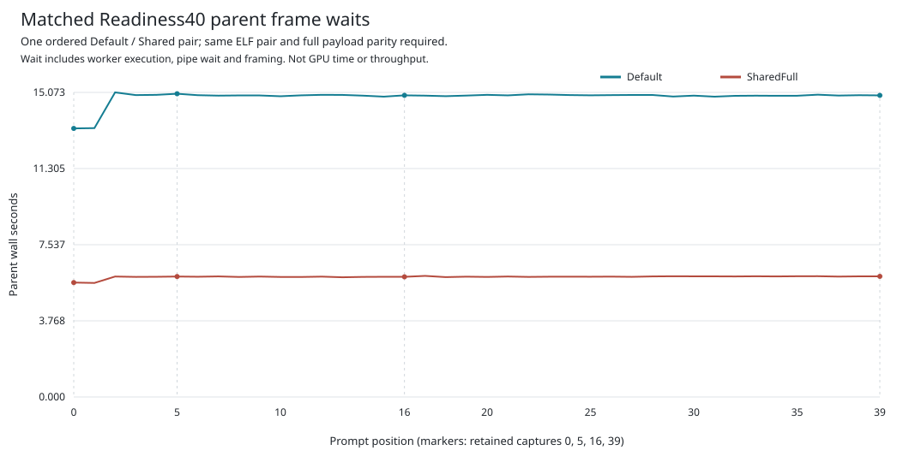

# Matched Readiness40 Parent Wall Report

This report was generated on `mi350` from the retained, same-binary
[Default/SharedFull GPU pair](../matched-timing-gpu-v1/manifest.json).
Both modes completed 40 authentic prompt forwards through all 36 layers on
both ranks, with zero generated tokens. All 40 semantic records and four
complete captured payloads match each other and the historical baseline.

## Observed Result

| Disjoint parent interval | Default seconds | SharedFull seconds | Change |
| --- | ---: | ---: | ---: |
| Source preparation | 91.804484 | 92.323468 | +0.565315% |
| Spawn through setup | 227.087301 | 143.431064 | -36.838800% |
| Prepare/write | 0.001694 | 0.001235 | -27.084615% |
| Wait for frame | 593.931118 | 237.647229 | -59.987409% |
| Validate/retain/commit | 0.022963 | 0.018693 | -18.595047% |
| Close and retirement | 29.865943 | 14.078233 | -52.861917% |
| Postcheck and publication | 0.613294 | 0.697339 | +13.703928% |
| Total | 943.326798 | 488.197262 | -48.247282% |

The opt-in change shares one fresh topology discovery across per-rank full
currentness checks. It does not cache discovery across operations or change
the GPU kernels, math, hidden readbacks or arena policy. The largest observed
reduction is in frame waits, which include worker execution, pipe waiting
and framing. These measurements do not isolate GPU compute time.

The seven categories exhaust each original 124-span parent timeline without
adding nested control timers. Sidecar publication and outer-controller
audits are outside that timeline; the original outer totals are 950.197 and
495.231 seconds. These different timing scopes must not be mixed.

## Reproducibility

[Seven synthetic tests](../matched-timing-report-cpu-v1/evidence/complete.json)
passed on `mi350`, with one naturally retired GPU-hidden child, no errors or
skips, and unchanged source/tool postchecks. Tests cover span reconciliation,
strict integer nanoseconds beyond floating-point precision, decimal rounding,
zero denominators, plot/table consistency and rejection of false authority.

The subsequent data-only render rehashed all 238 original archive members,
revalidated both native outcomes, original policy records and complete
selected payloads, and preserved the original capsule unchanged. An independent
data-only audit agrees on all seven categories and all 40 paired waits.
The SVG was visually inspected after rendering.

- [Exact integer summary](summary.json)
- [Category table](table.md) and [CSV](categories.csv)
- [All 40 positions](positions.csv)
- [Report source](paired_analysis.py) and [provenance](provenance.json)

| Artifact | SHA-256 |
| --- | --- |
| Original GPU-pair archive | `8cb6796e8caf56c5829ab77fc3ec41a9941176c50867501b050516673dd3a84e` |
| Report-test terminal | `3e0e6587f310a4bc8184abf4445963bdf3212d491e7e82544ac3ea54e54d2669` |
| Report-test archive | `a25f52b95d0819042bc55ff7b04fb013da8a4011c0d129dfd4c8d23bf4b0579f` |
| Report source | `fe83740b58d381ede99b2d296f942af78e1df505d650c0726532d2ac31b4ef8f` |

## Limits

This is one chronological Default-then-SharedFull observation. Completed-build
cleanup and a CPU-only exact-dot diagnostic occurred between cases. It is not
an alternating, repeated controlled benchmark or a general speedup claim.
The first SharedFull invocation refused its storage preflight before launching
a native child; the successful retry retained the same source and products.
The report-test invocation likewise initially refused storage before creating
its output directory; only the successful retry executed its seven tests.

This report provides no GPU-overlap measurement, decode tokens/s, TTFT,
independent numerical acceptance, full 2,048/256 workload qualification or
evidence that the 700 tokens/s target has been achieved. The position-5
framework discrepancy remains open. Issue #42 milestones M0-M7 remain open.
