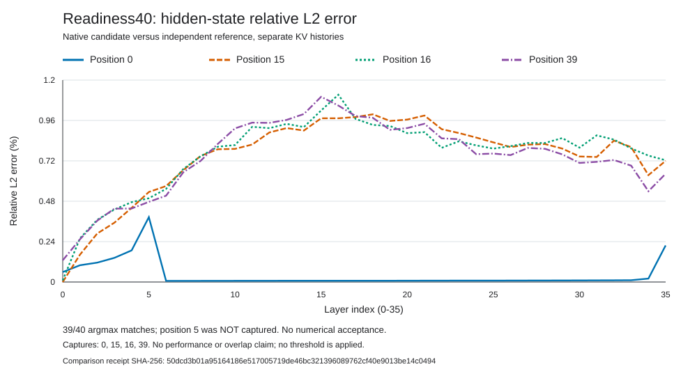

# Readiness40 Numerical Report

This chart presents the [original independent comparison](../comparison-v2/output/complete.json).
It does not recompute metrics or establish a correctness tolerance. The four
curves show hidden-state relative L2 error at each of 36 layers for captured
prompt positions 0, 15, 16 and 39. The vertical axis is a percentage, not a
performance metric or acceptance bound.

- [Summary and selected-logits table](report/summary.md)
- [All 152 tensor comparisons](report/tensor-metrics.csv)
- [All 40 argmax records](report/argmax-diagnostics.csv)
- [Original rendered-output hashes](report/complete.json)

There are 39/40 reported argmax matches and one bit-identical tensor among the
152 comparisons. Position 5 was not captured by these original runs. Its
margin cannot be reconstructed from this report; the
[separate investigation](../../guarded-mlp-readiness40-position5-v1/README.md)
retains new captures without changing the original result.

## Validation

The [MI350 CPU receipt](evidence/complete.json) records ten passing synthetic
renderer tests and a second clean, supervised process rendering the actual
comparison receipt. All 23 original source, raw-test and output files are
retained here. Original input and output hashes were rechecked after transfer.
The actual SVG was inspected in headless Chromium at 1020 by 580 pixels; its
four series, axes, legend and caveats are visible without overlap or clipping.
This visual inspection is separate from the unchanged original CPU receipt.

The comparison input is 94,179 bytes with SHA-256
`50dcd3b01a95164186e517005719de46bc321396089762cf40e9013be14c0494`.
The retained CPU terminal is 16,643 bytes with SHA-256
`83b804ef2396ce8c7bc27b5ab523c996ec613abb2daa3de4289611698ca80856`.
The original 23-file archive is 52,829 bytes with SHA-256
`bd62bcebf677e1e031a8a270c768d6518609102f1d1e6e79cab3c203fee4909c`.

This is a 40-prompt-position diagnostic with zero generated tokens, not the
2,048/256 workload, a throughput measurement or a GPU-overlap visualization.
