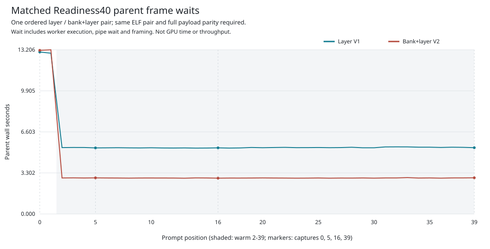
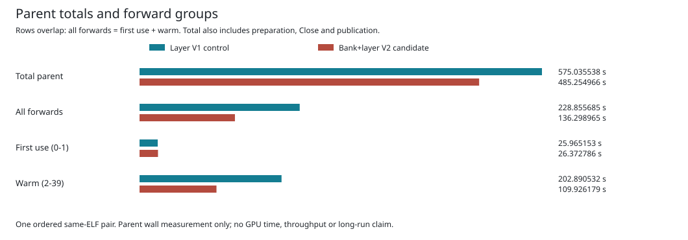

# Bank-Rearm Ablation

This is a bounded Qwen3-8B BF16 TP2 engineering checkpoint on `mi350`, not a
decode-throughput demo. Each case executes the first 40 authentic prompt
positions through all 36 layers and generates zero tokens. The same parent
and worker binaries are used for both cases. All 40 records and four complete
captured payloads match each other and the prior retained baseline.

## What Changed

The control already scopes currentness around each warm layer. The candidate
also uses one closed currentness window across the 36 completed layers of a
bank rearm. It preserves full entry/exit checks, per-entry identity, queue,
signal and generation checks, and failure quarantine. Ordinary first use,
kernel arithmetic and allocation preflights are unchanged.

This reduces repeated full topology discovery; it does not remove the local
checks or make the policy temporally equivalent to repeated full discovery.
A transient non-generation change that reverts inside a window may escape
detection. The policy remains explicit and opt-in, not a production admission.

## Observed Impact

| Parent wall interval | Layer control (s) | Bank+layer candidate (s) | Change |
| --- | ---: | ---: | ---: |
| First use, positions 0-1 | 25.965153 | 26.372786 | +1.569923% |
| Warm, positions 2-39 | 202.890532 | 109.926179 | -45.819956% |
| All 40 forward intervals | 228.855685 | 136.298965 | -40.443269% |
| Complete parent, including setup and shutdown | 575.035538 | 485.254966 | -15.613047% |

The rows overlap: first use plus warm equals all forwards; the complete parent
also includes source preparation, setup, Close and publication. Do not add all
four rows together. The [full category table](table.md), [integer CSV](categories.csv),
[per-position CSV](positions.csv) and [forward-group CSV](forward-groups.csv)
retain the exact measurements and contribution of each disjoint category.





This is one ordered pair, not a repeated controlled benchmark or a confidence
interval. Parent frame waits include worker execution, host checks, pipe waits
and framing. These plots are not GPU kernel durations, overlap traces, TTFT,
tokens/s or a causal attribution of every timing difference. First-use and
setup regressions are retained rather than hidden in the warm result.

The original candidate policy records 38 scoped bank rearms and two ordinary
initial banks, ending at generations `[20, 20]`. Both cases retain 72 ordinary
and 1,368 scoped layer executions. These counts describe the admitted route;
poll-dependent local-check counts must not be treated as fixed kernel work.

## Reproduce The Report

The report was generated on `mi350` with the exact
[nine-test-qualified source](../matched-timing-report-cpu-v1/paired_analysis.py).
[Provenance](provenance.json) binds that source, the original archive, manifest
and retention verifier. The original archive is included, so reproduction does
not depend on a private scratch path or recreating tar/gzip metadata.

From the Ferric repository root, on Linux with Python 3:

```bash
root=$(pwd -P)
case_root="$root/qualification/guarded-mlp-scoped-bank-rearm-v1"
scratch=$(mktemp -d)
archive="$case_root/matched-timing-gpu-v1.tar.gz"
sha=0ff96e3ec41056cd7f137e875b9561825f230b2d4986d7b626d210255ab6815b
python3 -B "$case_root/matched-timing-gpu-v1/retention_tool.py" retain \
  "$archive" "$sha" "$scratch/capsule"
python3 -B "$case_root/matched-timing-report-cpu-v1/paired_analysis.py" \
  "$scratch/capsule" "$archive" "$sha" "$scratch/report"
```

These are data-only commands. They rehash the archive and all original members,
revalidate both policies, parity, chronology, ownership and timing evidence,
and generate eight report files in a fresh directory. They do not execute the
model, reread the remote model or ELF bulk, or rerun GPU qualification. A fresh
capsule avoids treating this additional README as an original archive member.

## Remaining Gates

The position-5 prompt diagnostic still differs from the independent framework;
same-side parity here does not resolve it. The full native 2,048/256 workload,
exact independently generated IDs and decoded bytes, repeated equal-work
performance measurements and GPU timing/overlap evidence remain open. This
experiment does not admit Full2303 execution or establish 700 tokens/s.
