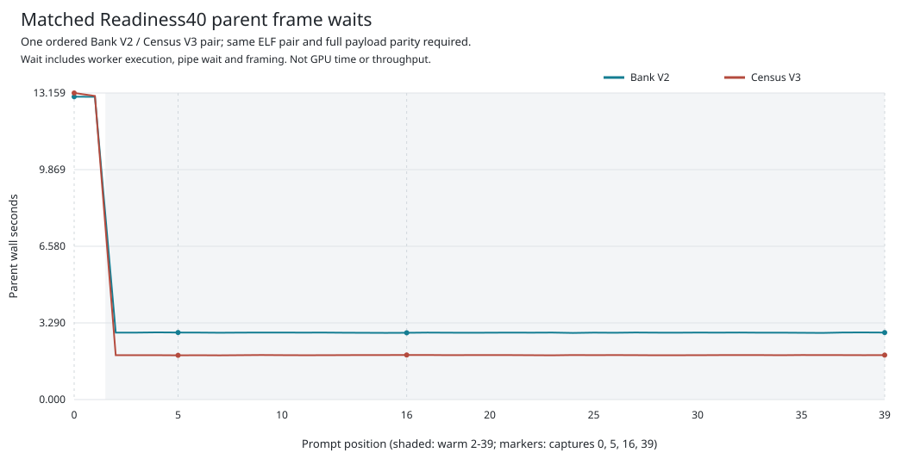
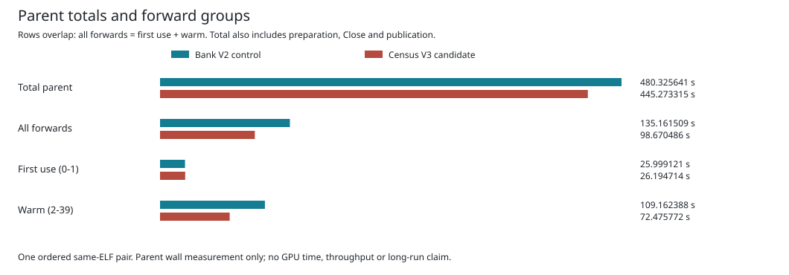

# Scoped Allocation Census Ablation

This Qwen3-8B BF16 TP2 engineering checkpoint on `mi350` executes 40 authentic
prompt positions through all 36 layers, generating zero tokens. Both modes
use the same parent and worker binaries. All 40 records and four complete
observation payloads match each other and the retained historical baseline.

## What Changed

Both modes already scope currentness around warm bank rearm and layer execution.
The candidate additionally moves two zero-add allocation preflights into the
existing closed layer window. Full allocation snapshots are independently
reconstructed and compared; capacity limits, owner identities and all four
ordered rank-local fences remain. Ledger-derived owner counts are reject-only
assertions, not authority to allocate. BF16 arithmetic is unchanged.

This removes repeated full topology discovery from those two preflights.
Full entry/exit checks and local identity/queue/generation checks remain.
The changed timing of discovery is explicit: a transient non-generation change
that reverts inside a window may escape detection. Temporal equivalence to
repeated full discovery and production admission are not claimed.

## Observed Impact

| Parent wall interval | Bank V2 (s) | Census V3 (s) | Change |
| --- | ---: | ---: | ---: |
| First use, positions 0-1 | 25.999121 | 26.194714 | +0.752305% |
| Warm, positions 2-39 | 109.162388 | 72.475772 | -33.607378% |
| All 40 forward intervals | 135.161509 | 98.670486 | -26.998088% |
| Complete parent, including setup and shutdown | 480.325641 | 445.273315 | -7.297617% |

These rows overlap: first use plus warm equals all forwards, which are part of
the complete parent time. Do not add all four rows. The [category table](table.md),
[integer category CSV](categories.csv), [per-position CSV](positions.csv), and
[group CSV](forward-groups.csv) retain all original values and regressions.





This is one ordered same-binary pair, not repetitions or a confidence interval.
Parent frame waits include worker execution, checks, pipe waiting and framing;
they are not GPU kernel durations or an overlap trace. No tokens/s or TTFT
is inferred. Source preparation and setup are effectively unchanged in this
pair and dominate total time, limiting the end-to-end benefit.

The candidate records 1,368 warm layers, 2,736 census preflights, 21,888
rank checkpoints and actual owner counts `[787, 783]`. Census counters are
already a subset of the layer totals, not extra work to add. Both modes retain
two ordinary banks, 38 scoped rearms and final generations `[20, 20]`.
Polling-dependent checkpoint counts are observations, not fixed work estimates.

Both actual host products use optimization level 2, no debuginfo, enabled
debug assertions and enabled overflow checks. `target/debug` does not mean
an unoptimized build. No profile settings differ within this pair.

## Reproduce The Report

The report was generated on `mi350` by the exact
[eleven-test-qualified source](../matched-timing-report-cpu-v1/paired_analysis.py).
[Provenance](provenance.json) binds the original archive, manifest, verifier
and report source. The original archive is published unchanged.

From the Ferric repository root, on Linux with Python 3:

```bash
root=$(pwd -P)
case_root="$root/qualification/guarded-mlp-scoped-capacity-census-v1"
scratch=$(mktemp -d)
archive="$case_root/matched-timing-gpu-v1.tar.gz"
sha=6102253516375fca5b78f7f5f78e3f022046ea53e8383c46b89e46263b5ea78c
python3 -B "$case_root/matched-timing-gpu-v1/retention_tool.py" retain \
  "$archive" "$sha" "$scratch/capsule"
python3 -B "$case_root/matched-timing-report-cpu-v1/paired_analysis.py" \
  "$scratch/capsule" "$archive" "$sha" "$scratch/report"
```

These data-only commands rehash all originals and revalidate both policies,
parity, chronology, process ownership and timelines. They create a fresh capsule
and eight report files without running the model or GPU. A fresh capsule is
required because this published README is not an original archive member.

## Remaining Gates

The existing independent position-5 prompt diagnostic is not resolved by this
same-side comparison. Native Full2303 execution, exact independent 256 generated
IDs/raw decoded bytes, repeated equivalent-work performance measurements and
GPU timing/overlap evidence remain open. The new full-workload bank/census route
is a separate unqualified source proposal. This result does not admit that
launch or establish the 700 tokens/s target; issue #42 M0-M7 remain open.
