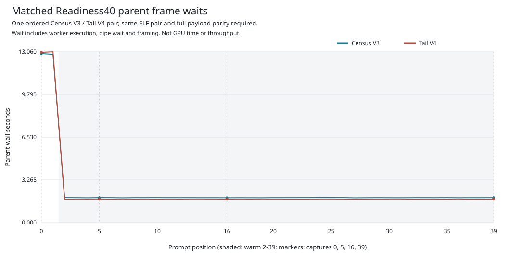
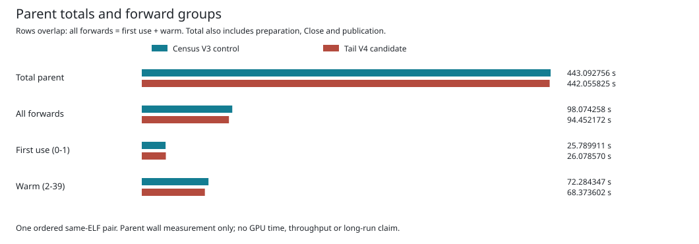

# Scoped Tail Ablation

This MI350 Qwen3-8B BF16 TP2 experiment compares Census V3 with Tail V4 using
the same qualified parent and worker binaries. Both consume 40 authentic prompt
positions through all 36 layers, with zero generated tokens. All 40 semantic
records and four complete captured payloads match each other and the historical
baseline. The [native pair record](../matched-timing-gpu-v2/README.md) retains
both successful attempts and their original evidence.

## Optimization

Both cases already scope warm bank rearm, layer execution and allocation
censuses. Tail additionally places final normalization, vocabulary projection,
argmax and three readbacks within one closed currentness window. Full discovery
still occurs at entry and exit. Local group/rank predicates, generation probes,
queue retirement and once-only post-exit output validation remain. Dispatch
order, arithmetic, buffers, capacity limits and deadlines are unchanged.

The first two forwards retain ordinary tail checks. The following 38 use the
new window. Errors and unwind remain terminal, without fallback. This is an
explicit change in discovery timing: a transient non-generation change that
reverts within the window may go undetected. Temporal equivalence to repeated
full discovery and production admission are not claimed.

## Observed Impact

| Parent wall interval | Census V3 (s) | Tail V4 (s) | Change |
| --- | ---: | ---: | ---: |
| First use, positions 0-1 | 25.789911 | 26.078570 | +1.119270% |
| Warm, positions 2-39 | 72.284347 | 68.373602 | -5.410224% |
| All 40 forward intervals | 98.074258 | 94.452172 | -3.693208% |
| Complete parent, including setup and shutdown | 443.092756 | 442.055825 | -0.234021% |

These rows overlap: first use plus warm equals all forwards, which are part of
the parent total. The [category table](table.md), [category CSV](categories.csv),
[position CSV](positions.csv) and [group CSV](forward-groups.csv) preserve the
original integer durations and the observed regressions.





The warm interval fell by 3.910745 seconds in this pair. The complete parent
fell by only 1.036931 seconds because source preparation, setup and shutdown
dominate and varied between cases. First-use time increased even though those
two forwards use the ordinary path. This is one ordered pair, not repeated
samples, a confidence interval or a guaranteed causal gain. Do not multiply
this result by reductions from separate earlier experiments.

Frame waits include worker execution, host checks, pipe waiting and framing.
They are not GPU kernel time, an overlap trace or sustained decode throughput.
No token rate or Full2303 feasibility is inferred from this 40-position sample.

The observed Tail counters are two ordinary and 38 scoped tails, 114 dispatches,
114 readbacks, 11,858,584 readback bytes, 76 full discoveries, 1,140 local
checkpoints, 1,748 before/after calls and 2,394 generation probes. They are
independent diagnostic counts, not durations to add to the timeline. Census
counts remain a subset of layer counts. Both host products use optimization
level 2 with debug assertions and overflow checks enabled; no profile setting
differs within the pair.

## Reproduce The Report

The eight report files were generated on MI350 using the exact
[13-test-qualified source](../matched-timing-report-cpu-v1/paired_analysis.py).
[Provenance](provenance.json) binds the original archive, manifest, verifier and
report source.

Independent data-only review joined all original integer timeline spans and
comparison records to the CSV, Markdown and SVG values. This checks the retained
pair and report, not repeatability, GPU overlap or full-workload correctness.

From the Ferric repository root, on Linux with Python 3:

```bash
root=$(pwd -P)
case_root="$root/qualification/guarded-mlp-scoped-tail-v1"
scratch=$(mktemp -d)
archive="$case_root/matched-timing-gpu-v2.tar.gz"
sha=2e95fedc277038899bd4be7fb7421d828cbbda74b55ec235abf1f25fe323e294
python3 -B "$case_root/matched-timing-gpu-v2/retention_tool.py" retain \
  "$archive" "$sha" "$scratch/capsule"
python3 -B "$case_root/matched-timing-report-cpu-v1/paired_analysis.py" \
  "$scratch/capsule" "$archive" "$sha" "$scratch/report"
```

These commands rehash the originals and validate policies, parity, chronology,
process retirement and timelines without rerunning a model or GPU. Use a fresh
original-only capsule, not the published capsule with this additional commentary.

The position-five independent-reference discrepancy remains unresolved. Exact
independent 256 generated IDs/raw decoded bytes, native Full2303 execution,
repeated equivalent-work benchmarks, GPU overlap and 700 tokens/s remain open.
This is a bounded engineering demo, not a completed issue #42 milestone.
