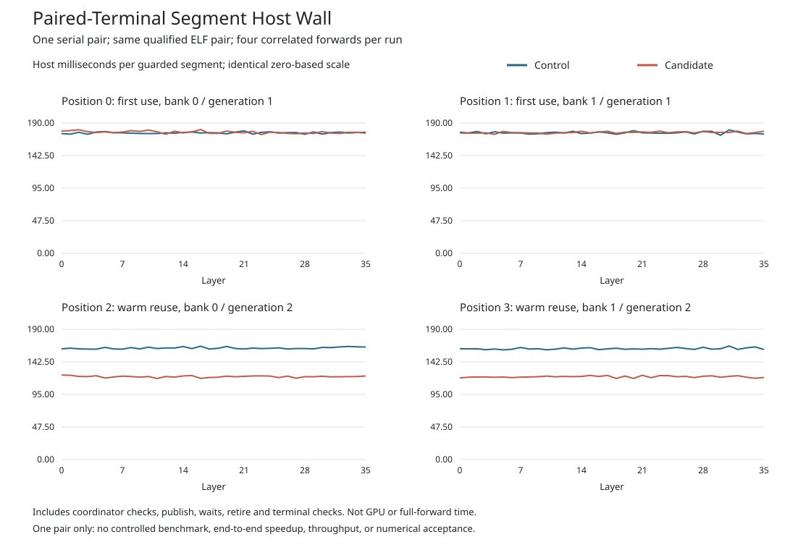

# Paired-Terminal Host Timing

Both matched native AR4 runs passed on SSH host `mi350`. The same parent and
worker binaries, model, GPU images, full-currentness policy and ordinary
hidden reads were used. All four complete payloads and token histories match.
This is one serial control/candidate pair, not a repeated benchmark.

| Scope | Segments per mode | Control sum (ms) | Candidate sum (ms) | Relative change |
| --- | ---: | ---: | ---: | ---: |
| First use, positions 0/1 | 72 | 12,653.516 | 12,702.327 | +0.386% |
| Warm reuse, positions 2/3 | 72 | 11,675.363 | 8,700.097 | -25.483% |

Both modes retain legacy terminal handling on first use. Only the candidate's
warm, genuinely retired arenas use paired-terminal validation. The source
change removes six full group checks per paired segment, or 216 per warm
forward, while preserving queue/fault probes and retirement validation.
That check-count reduction is a source-derived prediction, not a measured
hardware counter. The timing difference is an observation, not proof of
causality from one pair.

The timer includes coordinator preflight, publication, waits, retirement and
terminal validation. It excludes earlier allocation/setup, prefix work, later
hidden readback and other parts of the forward. These are host-wall intervals,
not GPU kernel durations, an overlap trace, full-forward latency or tokens/s.
The four forwards within each run are correlated, not independent samples.

## Reproduction and Evidence

The [seven fixture tests](tests/complete.json) and
[actual renderer](report/complete.json) both passed on MI350. Tests cover exact
integer aggregation, signed changes, first-use/warm grouping, malformed data
and policy refusals, same-ELF/payload/history joins, zero denominators and the
fixed plot layout. The renderer revalidates every original native evidence
body using the pinned data-only verifier before producing the report.

See the [full six-row table](report/summary.md),
[288 original layer observations](report/layers.csv),
[aggregate CSV](report/summary.csv), and [exact integer report](report/comparison.json).
The [native pair](../native-pair-v1/manifest.json) retains both original runs.
The [retention map](retention.json) preserves twelve original test, source and
report bodies without rewriting their receipts. The source README describes
its authored proposal; the receipts here establish its subsequent execution.

All issue #42 milestones, independent full-model numerical acceptance and the
single-request Qwen3-8B BF16 2,048/256, 700 tokens/s target remain open.
