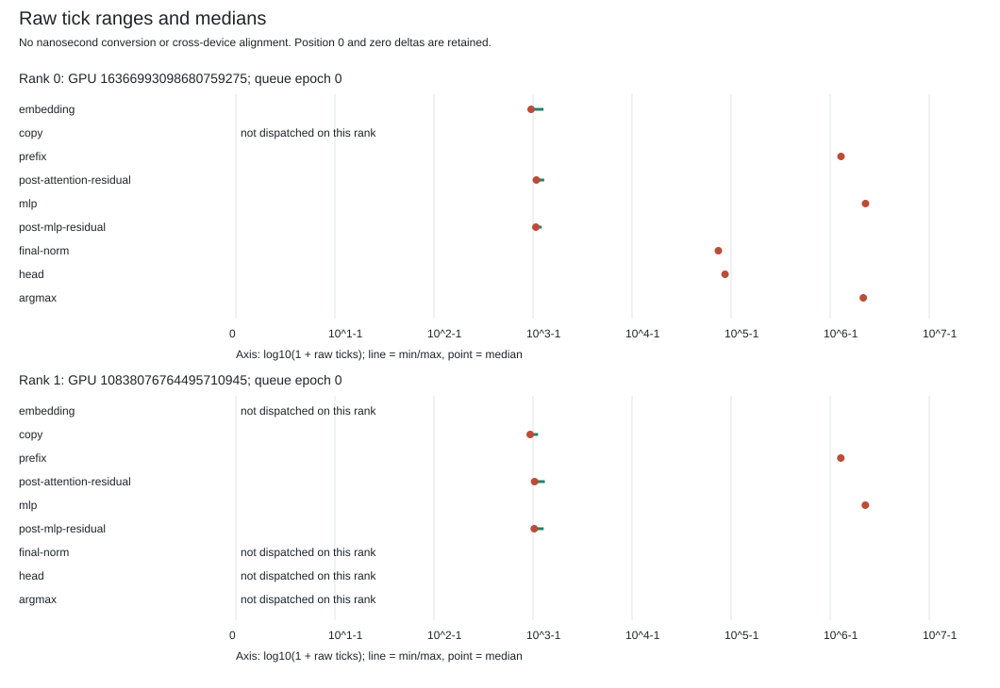
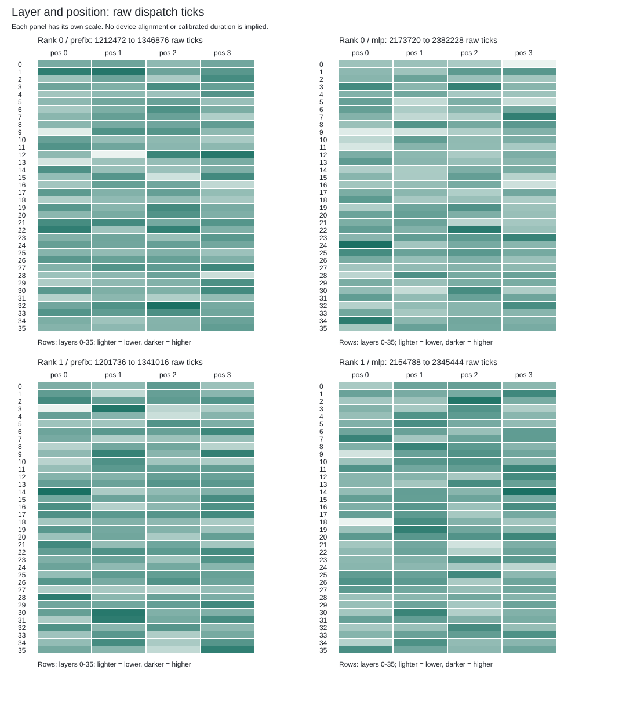

# Native gfx950 Clock Observation

The versioned clock parent and worker ran successfully on `mi350`, with exact
output invariance against the existing four-forward native baseline. This is
raw clock observation, not calibrated GPU timing or full-model acceptance.
The single-request Qwen3-8B BF16 target-only 2,048/256, 700 tokens/s target and
all issue #42 milestones remain open.

## Actual Result

| Check | Result |
| --- | --- |
| Native attempts / retries | 1 / 0 |
| Completed teacher-forced forwards | 4 |
| Native clock samples | 16: pre/post, both ranks, every forward |
| Recorded dispatch rows | 1,172; rank totals 592 and 580 |
| Full output buffers compared | 4, each 606,976 bytes; byte-identical |
| Tensor comparisons | 152, all exact |
| Output tokens | 67, 198, 25, 16; unchanged |
| Before/after process and topology audits | 3 + 3 passed |
| Owned process leaves | 7 natural exits, reaped without forced cleanup |
| Native Close and worker reap | Passed |

The actual completion SHA-256 is
`e34189597dc7db7a7c325040f5381932e84390c1a2cf32055830858cb9278ddb`.
The 573,311-byte V2 sidecar SHA-256 is
`c08524c3bb0aa18a74bac73f12eb224444c6bd4dffa2448c2703837a62c8819d`.
See the [capture](capture/complete.json), [sidecar](capture/native-device-clock-v2.json),
and [publication ledger](result.json).

Both selected GPUs remain on `smci350-rck-g03-b19-03`, boot
`2dbbbc5a-d8b7-46ac-bd1f-236e5847e24a`, with ordered unique IDs
`16366993098680759275` and `10838076764495710945`. The observed KFD GPU IDs are
39903 and 22482. Each sample reports a 1,000,000,000 Hz **system-counter**
frequency; this is not a GPU tick frequency.

## Tables And Plots

The [raw report](plots/raw-ticks.md) includes stage distributions, all sixteen
samples, eight same-device counter differences and separate host intervals.
Each device has its own tick scale; these are not aligned overlap timelines.

MLP and prefix dispatches dominate the rank-local raw tick sums. These samples
identify where to investigate, but do not demonstrate a speedup. The clocks
are sampled sequentially, not simultaneously; their host brackets include
currentness checks. Signed counter differences receive no frequency conversion,
wrap repair or cross-device alignment.

## Reproduction Scope

The [worker](../gfx950-clock-recorder-v1/README.md) and
[parent](../gfx950-clock-parent-v1/README.md) are the exact separately qualified
669-test worker and 275-test parent builds. Fresh runtime audits resolve their system
libraries and bind the current host. The model, weights, kernel images,
launch geometry, four inputs and six prefix prerequisites are unchanged.
The nested model request is unchanged except for worker, session and output
directory. The separately qualified parent and worker add the explicit
raw-clock diagnostic route.

The frozen controller passed 61 synthetic tests on MI350 before this run.
Separate audit-selector, data-preparation and reporting suites passed 7, 5
and 5 tests respectively. These are distinct suites, not additional native
or numerical cases. The actual report was generated on MI350 from the retained
capture, under CPU-only resource limits.

Local publication rehashes retained evidence and compares full payloads,
tensor slices and all 1,172 binary Control intervals. Binary captures, model
weights and executables are retained outside Git. It does not rerun independent
mathematical references, rehash every transitive runtime input or turn this
diagnostic into production admission. The whole-case wall time includes model
preparation and host checks and must not be reported as decode throughput.

## Next Gates

Establish the dispatch/counter clock-domain relationship and bounded clock
calibration before reporting GPU durations or overlap. The
[paired-row MLP candidate](../paired-row-mlp-lowering-v1/README.md) subsequently
passed checked HSACO lowering and resource inspection. It still needs GPU
output comparison before an equal-workload timing ablation.
Full-model numerical acceptance and the sustained 2,048/256 benchmark remain
separate requirements.
