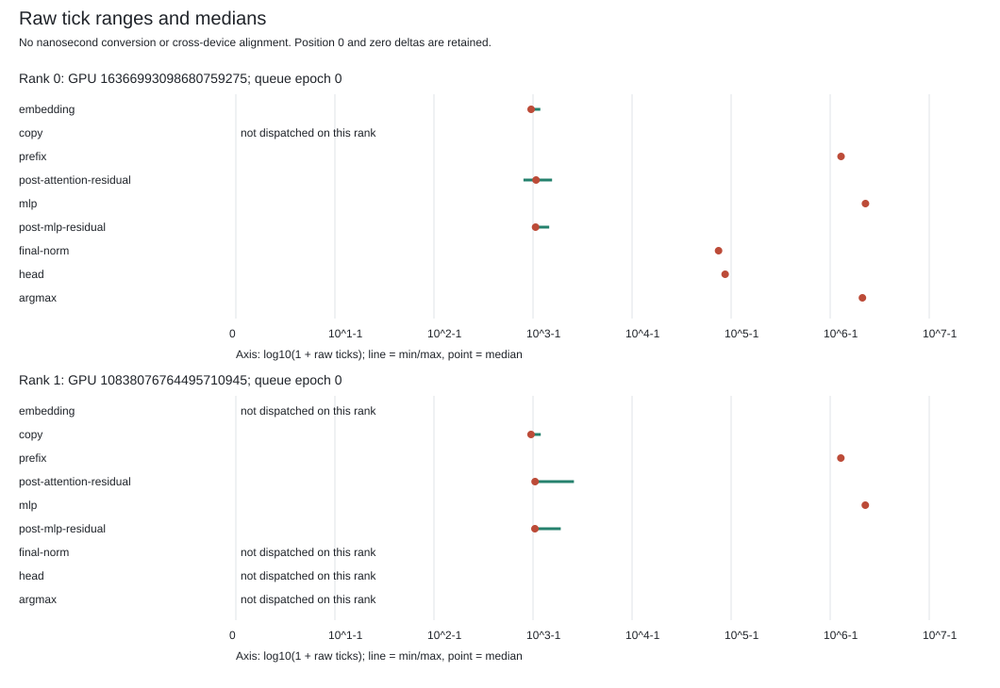
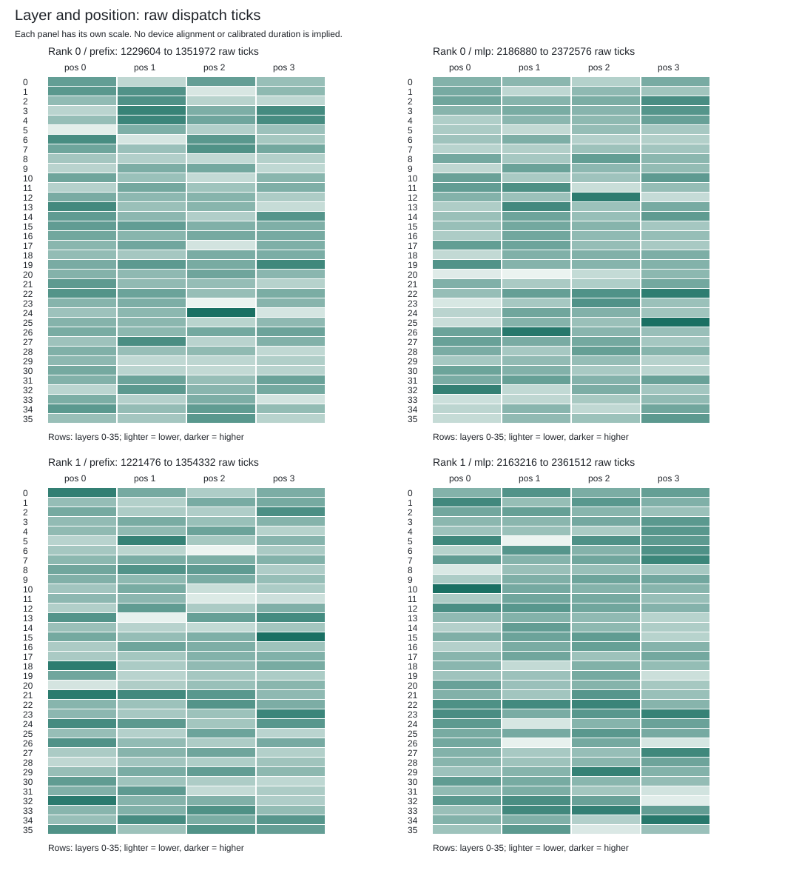

# MI350 Raw Device-Tick Capture

The timestamp-enabled Ferric parent and worker ran successfully on `mi350`
(`smci350-rck-g03-b19-03`). This is Qwen3-8B BF16, TP2, four teacher-forced
forwards through all 36 layers at positions 0-3. It is not the 2,048-token
prefill / 256-token target-only decode benchmark.

| Check | Measured result |
| --- | --- |
| GPU attempts / retries | 1 / 0 |
| Raw completion rows | 1,172; 293 per forward |
| Per-rank dispatch counts | 592 / 580 |
| Full captured payloads | Four, 606,976 bytes each, byte-identical to the native baseline |
| Named tensor comparisons | 152 / 152 byte-identical |
| Output tokens | `67, 198, 25, 16`, unchanged from the teacher-forced baseline |
| Lifecycle | Consuming Close, native child exit/reap, parent natural zero exit |
| Device/process audits | Three before and three after, all passed |
| Owned leaf processes | Seven natural zero exits, no forced cleanup |
| Successor controller tests | 47 passed on MI350, no errors, failures or skips |

The [GPU receipt](capture/complete.json), [checked observation](capture/observation.json),
[raw sidecar](capture/native-device-v1.json) and [public result](result.json)
bind the actual request, binaries, code objects, queue identities, native
Control/capture pairs, and process lifecycle. All 1,172 host intervals also
match their corresponding binary Control slots.

## Measured Plots

[Full tables and plots](plots/raw-ticks.md) retain every position, including
position 0. Medians are computed exactly, not through floating-point timestamp
subtraction. Each device has its own panel; the figures do not put different
devices on a shared timestamp axis.





The sidecar has no zero or reversed intervals. Raw deltas range from 800 to
2,372,576 ticks. The tables also show separately measured inclusive host
intervals in nanoseconds. These units must not be combined or subtracted.
The figures summarize an authenticated capture; the report generator is not
an independent replay of GPU arithmetic or the device-audit implementation.

## What Changed

The native implementation was separately qualified in the
[257-test parent cohort](../native-device-parent-v1/README.md) and
[609-test worker cohort](../native-device-routing-v1/README.md).
[Runtime dependency audits](../native-device-runtime-v1/README.md) checked the
transported pair before this run. No kernel image or model arithmetic changed
for the instrumentation comparison.

The first controller's real admission failed before any native launch after
historical replay restored imports needed by a later legacy validator.
The [successor intake](source/intake.py) explicitly loads all five dependencies
from the authenticated legacy package, then restores the caller's bindings.
It does not change `sys.path`, bypass validation, or modify the frozen baseline.
Three new regressions cover import identities, every dependency/intake failure,
and manifest disagreement. The original 44 tests plus these three passed in
the [actual 47-test run](pure/complete.json).

## Reproduction And Limits

The [report generator](report.py) uses only Python's standard library. It ran
on MI350 with CPU affinity 8/9, niceness 10, empty GPU visibility, a 150-second
wall limit and bounded CPU, memory and output sizes. To regenerate its four
outputs into a new directory from this checkpoint:

```sh
python3 -I -B report.py capture/complete.json \
  f11abfb09c0713f17f26fede32a98d525c85480c0bf88b0c1b8342a0b0de3e5a \
  capture/native-device-v1.json regenerated
```

The complete 58-file raw capture is retained in session evidence. Git includes
the textual receipts, owner/audit records, requests and raw timestamp sidecar;
it excludes the binary Control and tensor payloads. Their hashes remain in
the receipts. Publication rechecked the retained hashes, all four complete
payloads against the baseline, token trajectories, and all host interval slots.
The baseline comparison is instrumentation invariance, not new independent
full-model numerical acceptance.

Raw ticks are **not nanoseconds**. Clock correlation and qualified conversion
are still required before reporting GPU durations or cross-device overlap.
Singleton timestamp observations add a publication fence, so the host times
are not a like-for-like optimization comparison with the ordinary path.
This checkpoint makes no speedup, SoTA, 700 tokens/s, sustained-throughput or
production claim. Issue #42 M0-M7 remain open.
