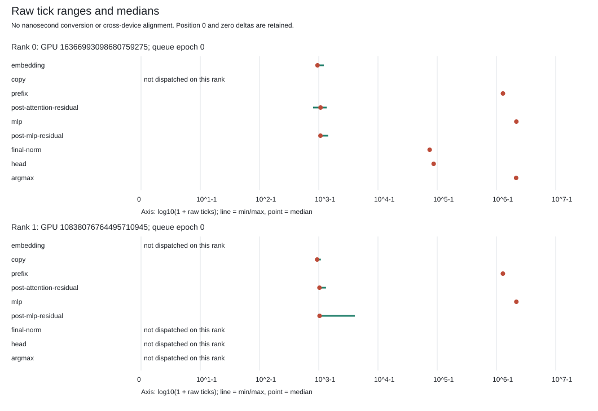

# Paired-Row MLP: Native gfx950 Validation

The [paired-row MLP candidate](../paired-row-mlp-lowering-v1/README.md) ran on
`mi350` and matched the unchanged clock-enabled baseline exactly. This is an
end-to-end four-forward engineering result, not independent full-model
acceptance or the sustained 2,048/256 performance benchmark.

## Exact Experiment

Only the explicit tiled MLP image changed, from the original 32,328-byte image
to the checked 33,112-byte paired-row image. The separate bootstrap MLP image,
V7 prefix, other kernels, parent and worker binaries, weights, devices, input
tokens, launch geometry and currentness policy stayed unchanged. Session and
output paths were fresh. No runtime rebuild or provider change was involved.

| Actual Check | Result |
| --- | ---: |
| Native attempts / retries | 1 / 0 |
| Complete output buffers | 4, each 606,976 bytes |
| Byte-equal tensor comparisons | 152 / 152 |
| Dispatch rows | 1,172 |
| MLP dispatches bound to the candidate image | 288 |
| Native clock samples | 16 |
| Before / after device-process audits | 3 / 3 |
| Natural, reaped process leaves | 7 / 7 |
| Comparison-controller tests | 75 passed |

The input tokens were `9112, 2190, 3772, 220`; output tokens were
`67, 198, 25, 16`, identical to the baseline. All four complete payloads,
including every retained layer output, final norm and logits, were compared.
The consuming Close and process-reaping checks passed without forced cleanup.

The actual completion is 963,187 bytes, SHA-256
`00e1af86b1a61894797dc1eeb3202a113d62bd3d11c8069ba6299d63f8875073`.
The image SHA-256 is
`65a76f917c12476f4814174ee39d515642a643a0352c6609ee514955a6a97449`.

## Descriptive Comparison

The [full tables and four plots](report/comparison.md) compare one baseline
capture with this candidate capture. Each rank contributes 144 MLP dispatches
per capture; these are samples within one run, not 144 independent trials.

| Rank | Baseline MLP Median Ticks | Paired-Row MLP Median Ticks | Signed Difference |
| ---: | ---: | ---: | ---: |
| 0 | 2,272,832 | 2,167,738 | -105,094 |
| 1 | 2,264,908 | 2,167,980 | -96,928 |

These are uncalibrated counter values, not measured GPU nanoseconds or a
qualified speedup. Each plot uses its own labeled scale. Neither device clock
alignment nor concurrent kernel overlap is established.

The [report supplement](report-manifest.json) pins the six generated outputs,
[renderer and tests](report-source/README.md), [12-test receipt](report-tests/complete.json)
and unchanged plotting helper. The source README preserves the author's
pre-execution account; the linked receipt records the subsequent actual test
run on `mi350`. Rendering consumed the pinned actual native observations; it
did not run another GPU experiment or an independent numerical reference.

## Evidence And Limits

The [publication ledger](result.json) covers the [actual completion](capture/complete.json),
[request](inputs/request.json), [image review](inputs/down2-review.json),
[decode review](inputs/decode-review.json), [raw clock sidecar](capture/native-device-clock-v2.json),
[Control interval summary](control-summary.json), [tested source](source/manifest.json),
and [75-test receipt](pure/complete.json). Raw binary captures remain retained
outside Git; the publisher rechecked all four full buffers and 152 tensor
slice hashes against the actual baseline before creating this checkpoint.

This validates output invariance for this exact image and workload. It does
not establish agreement with the independent framework reference: the
baseline's unresolved numerical differences remain unresolved. The compiler's
eight conditional runtime requirements are not converted into general
production authority by this engineering run.

Raw ticks are not calibrated GPU nanoseconds. Inclusive host intervals include
currentness checks and dispatch work. The 276.924-second whole-case elapsed
time also includes model preparation and audits; it is not decode throughput.
No kernel speedup, overlap, SoTA comparison or 700 tokens/s result is claimed.

Next gates are independent layer-zero arithmetic diagnosis, clock-domain
validation and repeated equal-workload timing, followed by longer-context
numerical validation and sustained single-request Qwen3-8B BF16 target-only
2,048/256 decoding. All issue #42 milestones remain open.

Follow-up: the [independent layer-zero capture](../layer0-framework-capture-v1/README.md)
now retains 33 repeated framework intermediates and confirms the original
reference output exactly. Its table quantifies the remaining difference in
this candidate's layer-zero output; it does not yet locate the first differing
native operation or establish numerical acceptance.
