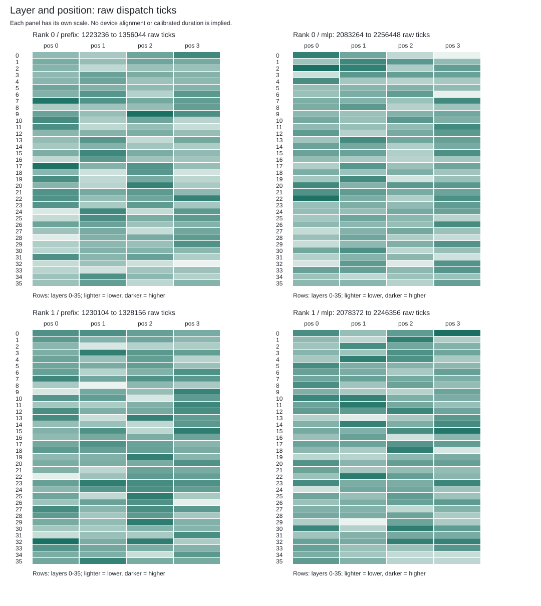

# Down2 Raw-Clock Comparison

One genuine baseline and one Down2 four-forward teacher-forced observation.
These are descriptive samples, not a speedup, throughput result, calibrated GPU duration or overlap claim.
Raw ticks have no established cross-run/device frequency or aligned origin. Signed differences are arithmetic only.

## Per-Device Raw Ticks

| Rank | Stage | Count each | Baseline median | Down2 median | Signed difference | Baseline zeros | Down2 zeros |
| ---: | --- | ---: | ---: | ---: | ---: | ---: | ---: |
| 0 | embedding | 4 | 956 | 952 | -4 | 0 | 0 |
| 0 | prefix | 144 | 1285928 | 1287086 | 1158 | 0 | 0 |
| 0 | post-attention-residual | 144 | 1080 | 1072 | -8 | 0 | 0 |
| 0 | mlp | 144 | 2272832 | 2167738 | -105094 | 0 | 0 |
| 0 | post-mlp-residual | 144 | 1068 | 1068 | 0 | 0 | 0 |
| 0 | final-norm | 4 | 74352 | 74528 | 176 | 0 | 0 |
| 0 | head | 4 | 86800 | 87062 | 262 | 0 | 0 |
| 0 | argmax | 4 | 2159574 | 2147120 | -12454 | 0 | 0 |
| 1 | copy | 4 | 936 | 938 | 2 | 0 | 0 |
| 1 | prefix | 144 | 1281008 | 1284294 | 3286 | 0 | 0 |
| 1 | post-attention-residual | 144 | 1036 | 1028 | -8 | 0 | 0 |
| 1 | mlp | 144 | 2264908 | 2167980 | -96928 | 0 | 0 |
| 1 | post-mlp-residual | 144 | 1028 | 1032 | 4 | 0 | 0 |

## Inclusive Host Intervals

Host intervals are recorded nanoseconds, not GPU durations. They include currentness checks and host dispatch work.

| Rank | Stage | Baseline median ns | Down2 median ns | Signed difference ns |
| ---: | --- | ---: | ---: | ---: | ---: |
| 0 | embedding | 8564455.5 | 8613330 | 48874.5 |
| 0 | prefix | 16280405 | 16315700 | 35295 |
| 0 | post-attention-residual | 6757019 | 6780069.5 | 23050.5 |
| 0 | mlp | 26204851 | 25133750.5 | -1071100.5 |
| 0 | post-mlp-residual | 6754664.5 | 6779454 | 24789.5 |
| 0 | final-norm | 8516710.5 | 8560325.5 | 43615 |
| 0 | head | 8486535 | 8556705.5 | 70170.5 |
| 0 | argmax | 24988255.5 | 24957295.5 | -30960 |
| 1 | copy | 8544300.5 | 8548770 | 4469.5 |
| 1 | prefix | 16235485 | 16301550 | 66065 |
| 1 | post-attention-residual | 5038618 | 5057018 | 18400 |
| 1 | mlp | 26045676 | 25132071 | -913605 |
| 1 | post-mlp-residual | 5038308 | 5055623 | 17315 |

## Separate Plots

Each plot/panel has its own labeled scale; no aligned device timeline is inferred.

The accepted observer checked four whole payloads and 152 tensor rows for bitwise invariance.
This renderer reads that pinned result and rechecks raw identities; it does not rerun independent numerical validation.
No sustained 2,048/256 decode or 700 tokens/s result is implied.
