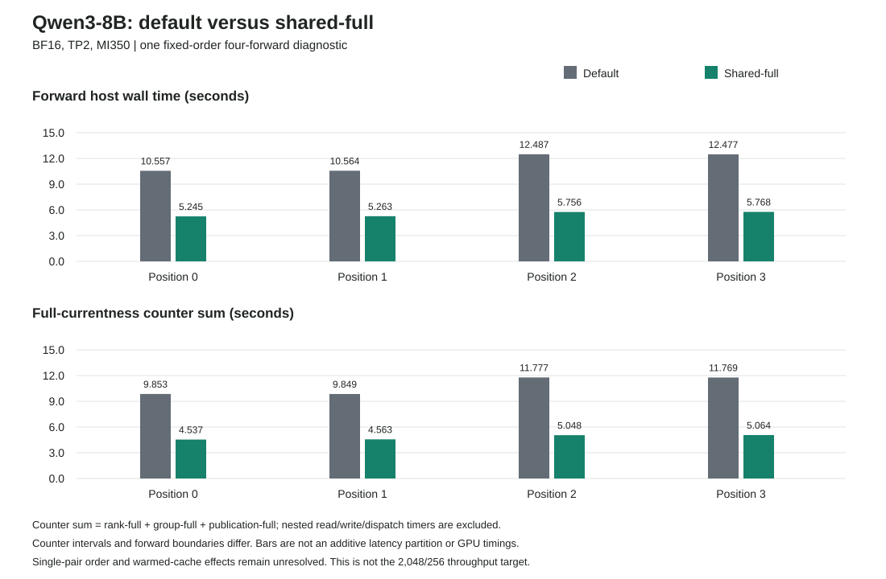

# Default Versus Shared-Full On MI350

Both Qwen3-8B BF16 TP2 engineering routes completed four own-output forwards
through `ssh mi350` on 2026-10-05 UTC. Each ran once without retry and passed
structural, Close/EOF, process-reaping and surrounding-audit checks. All four
606,976-byte output payloads are byte-identical between routes, covering all
152 captured tensor slices. Both generated `9112 -> 67 -> 25 -> 576 -> 2701`.
Each arm validated 576 terminal states and seven naturally completed process
leaves; all six process/topology audits per arm passed.

**Observed four-forward host-time ratio: 2.092**, from 46.084965 seconds for
default to 22.031645 seconds for shared-full. This is one fixed-order pair,
default first and shared second, not a statistically established speedup.
Warm-cache/order effects remain unresolved. This is not GPU timing, independent
model numerical acceptance, or the sustained 2,048/256 benchmark.

## What Changed

The [qualified shared route](../projection-ar4-shared-host-v1/README.md) explicitly
selects `configure_performance_v2(false, false, true)` before enabling observation.
It shares one fresh topology discovery within a group fence instead of repeatedly
rediscovering the same topology for both ranks. It retains mutable per-rank device
checks, generation checks and queue validation. It does not reuse a topology
snapshot across operations. Kernel-admission caching, operational currentness and
raw timestamps remain off. This changes group-fence scheduling; the ordinary
default route and its policy remain unchanged.

The two parents come from the same CPU883 qualification and use the same worker,
kernel images, weights, actual input history, precision and deadlines. The
[runtime audits and assembled inputs](../projection-ar4-shared-host-runtime-v1/README.md)
bind those identities. No compiler, GPU kernel, BF16 arithmetic, tiling, software
pipeline or shared-memory buffering changed in this experiment. The already-shared
publication check is present in both arms and is not credited as a new optimization.

## Measured Comparison

Forward wall time brackets the worker's forward operation, including host checks,
dispatch, waiting, readback and capture. Ratios below are default/shared for that
position, not GPU-kernel speedups or independent repeated trials.

| Position | Default Forward (s) | Shared Forward (s) | Observed Ratio | Default Full-Check Sum (s) | Shared Full-Check Sum (s) |
| ---: | ---: | ---: | ---: | ---: | ---: |
| 0 | 10.556575 | 5.245102 | 2.013 | 9.853116 | 4.536995 |
| 1 | 10.564497 | 5.263024 | 2.007 | 9.849011 | 4.562654 |
| 2 | 12.486571 | 5.755813 | 2.169 | 11.777102 | 5.048430 |
| 3 | 12.477322 | 5.767707 | 2.163 | 11.769090 | 5.063610 |

The full-check sum is `rank_full_ns[0] + rank_full_ns[1] + group_full_ns +
publication_full_ns`, measured over each corresponding snapshot interval.
These are separate sequential full-check call scopes on the worker thread.
Nested read/write/dispatch scopes are excluded from the sum. Do not add this sum
to forward wall time or subtract it to infer device duration. Snapshot intervals
include surrounding work and do not exactly match forward boundaries; serialization
after a forward appears in the following interval. The two graph panels are
therefore not an additive latency partition.

| Position | Default Rank Checks | Shared Rank Checks | Shared Group Checks | Publication Checks, Each Arm |
| ---: | ---: | ---: | ---: | ---: |
| 0 | 5,524 | 1,332 | 1,048 | 288 |
| 1 | 5,524 | 1,332 | 1,048 | 288 |
| 2 | 6,676 | 1,332 | 1,336 | 288 |
| 3 | 6,676 | 1,332 | 1,336 | 288 |

Default group-check counters are zero. A shared group check covers both ranks;
one group check and one rank check are not equivalent units of work. Shared
rank checks account for 2.247-2.266 seconds per interval, shared group checks
1.795-2.300 seconds, and publication checks approximately 0.495-0.498 seconds.
The residual cost motivates reducing host-coordinated dispatch rounds, not
silently removing the remaining fresh checks.

| Other Host Scope | Default (s) | Shared (s) | Boundary |
| --- | ---: | ---: | --- |
| Shared-policy configuration | Not performed | 0.022004 | Before observer enable; outside snapshots |
| Observed setup | 167.073904 | 89.953356 | Fresh observer through sealed setup |
| Close | 26.449168 | 12.514136 | After last counter snapshot |
| Owned parent | 382.890688 | 267.665199 | Setup, transfers, forwards, control and shutdown |
| Arm supervisor | 391.347019 | 276.130453 | Parent and surrounding audits |

These scopes are not a partition of elapsed time. Serialization is separately
recorded per forward in the [full report](analysis/report.md). The paired
supervisor completed in 670.962235 seconds, including both arms and pair checks.

## Reproducibility And Limits

- [Pair completion](pair-complete.json): `095070cb312dd286ec76b0b72c11c82c96c073f2dc6fc84996efc30d8ba48994`.
- [Default completion](capture/default/complete.json): `da039b8dfeea0e11e66440c2c628db1d92da507ec901ef791b46ea6f5ab55bf5`.
- [Shared completion](capture/shared/complete.json): `4163ba9800fe9176abfacf819d73f0b571b2ac09bcb0ce3d01caefcdf4380bcd`.
- [Analysis JSON](analysis/analysis.json) and [CSV](analysis/intervals.csv) preserve integer nanoseconds and counter totals.
- [Primary observation](run-observation.json) records the executed command and terminal outcomes.
- [Publication inventory](result.json) maps copied bodies to their original paths and SHA-256 hashes.

The retained export contains 128 original bodies plus its manifest. All 128 were
rehashed locally. The 100 nonbinary arm records, pair receipt, plan, manifest,
analysis and source tools are published here. Eighteen binary capture/control
files remain outside Git; their identities are retained in the receipts and
inventory. The eight input records are already published in the runtime
preparation checkpoint. No model weights or executable bodies are published.
The analyzer reread all eight actual tensor payloads to verify equality; equality
was not inferred from two empty buffers or only from reported hashes.

The [analyzer](source/analyze.py) and [plotter](source/plot.py) consume pinned data,
not executable receipts. The SVG was rendered in headless Chrome and visually
checked. Local publication does not rerun the native lifecycle or admission
validators and does not confer production authority.

Four forwards from position zero do not consume the 2,048-token prompt. Native
repeatability does not resolve the earlier independent-framework tensor
differences. Repeated order-balanced timing, full-model numerical acceptance,
sustained BF16 target-only 2,048/256 decoding, 700 tokens/s and all issue #42
M0-M7 acceptance milestones remain open.
