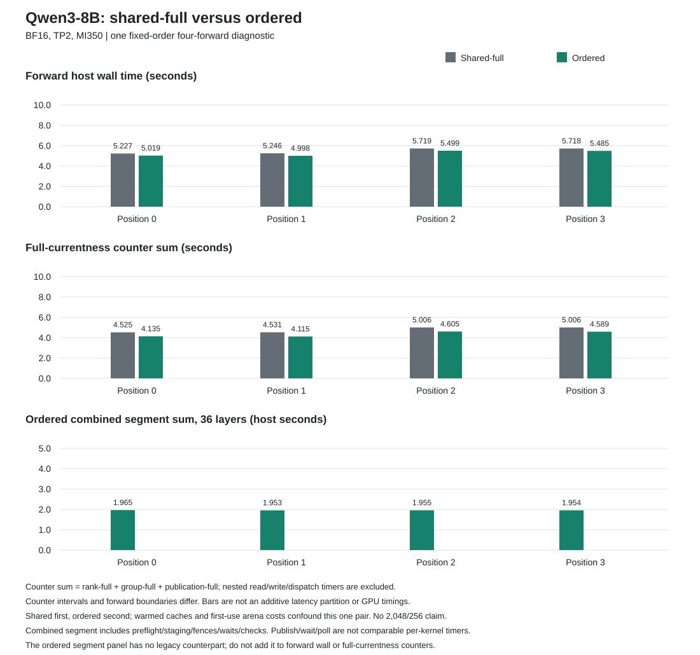

# Shared-Full Versus Ordered Segments On MI350

Both Qwen3-8B BF16 TP2 engineering routes completed four own-output forwards
through `ssh mi350` on 2026-10-05 UTC. Each ran once without retry and passed
structural and lifecycle checks. All four 606,976-byte payloads are
byte-identical across routes, covering 152 captured tensor slices per arm.
Both followed `9112 -> 67 -> 25 -> 576 -> 2701`.

**Observed four-forward host-time ratio: 1.043**, from 21.908947 seconds for
shared-full to 21.000850 seconds for ordered segments. That is 0.908096 seconds,
or 4.145%, less observed host wall time. This is one fixed-order diagnostic:
shared ran first, ordered second. Cache warming, execution order and first-use
ordered arena allocation are unresolved confounders, not repeated trials.

This is not GPU timing, independent model numerical acceptance, or the
2,048-token prompt / 256-token sustained benchmark. AR4 starts with token
9112 at position zero and follows its own outputs; the prompt provenance
object does not mean all 2,048 prompt tokens were processed in this run.
All issue #42 milestones and the 700 tokens/s target remain open.

## What Changed

The [CPU-qualified ordered path](../projection-ordered-segment-cpu-v1/README.md)
combines projection-residual and MLP dispatches into one ordered segment.
Both ranks publish their command pairs before either rank waits. The final
residual remains a separate host-coordinated round after both MLP completions.
This reduces per-layer coordinated rounds from four to three; it is not a
whole-forward device schedule.

Each rank gets separate 16 KiB Down-output scratch, allocated once. Reusing the
old O-projection partial buffer for Down would allow one rank's MLP to overwrite
data before its peer finished the first residual. Distinct scratch removes
that alias race without changing kernel images or arithmetic.

Both comparison arms select `configure_performance_v2(false, false, true)`
before observation: full currentness with shared group discovery, no kernel
admission cache and no operational-currentness mode. The ordered route does
change intermediate host fence timing and publication boundaries. Full
admission, lifecycle checks, aggregate deadline and poison-on-failure remain;
the entire monitoring policy must not be described as unchanged.

The [fresh runtime audits and inputs](../projection-ordered-segment-runtime-v1/README.md)
bind the same CPU qualification, worker, model, BF16 weights, device identities,
actual input history and kernel images. No MFMA instruction, tiling, arithmetic,
kernel software pipeline or shared-memory buffering changed in this experiment.

## Measured Comparison

Forward wall brackets the worker forward, including checks, dispatch, waiting,
readback and capture. The combined ordered-segment sum is across all 36 layers;
there is no equivalent combined field in the shared route.

| Position | Shared Forward (s) | Ordered Forward (s) | Shared / Ordered | Ordered Segment Sum (s) |
| ---: | ---: | ---: | ---: | ---: |
| 0 | 5.226694 | 5.018643 | 1.041456 | 1.965093 |
| 1 | 5.245507 | 4.998252 | 1.049468 | 1.952780 |
| 2 | 5.718664 | 5.499115 | 1.039924 | 1.955193 |
| 3 | 5.718081 | 5.484840 | 1.042525 | 1.953680 |

| Position | Shared Full-Check Sum (s) | Ordered Full-Check Sum (s) | Shared Rank / Group / Publication Checks | Ordered Rank / Group / Publication Checks |
| ---: | ---: | ---: | --- | --- |
| 0 | 4.525107 | 4.134941 | 1,332 / 1,048 / 288 | 1,266 / 940 / 216 |
| 1 | 4.530891 | 4.114608 | 1,332 / 1,048 / 288 | 1,260 / 940 / 216 |
| 2 | 5.006353 | 4.605472 | 1,332 / 1,336 / 288 | 1,260 / 1,228 / 216 |
| 3 | 5.006244 | 4.589466 | 1,332 / 1,336 / 288 | 1,260 / 1,228 / 216 |

The check sum is `rank_full_ns[0] + rank_full_ns[1] + group_full_ns +
publication_full_ns`, excluding nested read/write/dispatch counters. These
intervals include surrounding work and are not exactly forward boundaries.
Do not add the sum to forward time or subtract it to infer GPU duration.
A group check covers both ranks, so group and rank counts are not equivalent
units. Extra first-use allocation checks are visible in ordered position zero.

Ordered segment timings include preflight, staging, cold arena initialization,
fences, waits and terminal checks. Ordered publication excludes staging that
the legacy publisher included; rank waits overlap and cover paired completion
and retirement. Publish/wait/poll deltas are not per-kernel speedups. The
three graph panels are not an additive latency breakdown.

| Other Host Scope | Shared (s) | Ordered (s) | Boundary |
| --- | ---: | ---: | --- |
| Policy configuration | 0.021881 | 0.021688 | Before observer enable |
| Observed setup | 89.717173 | 90.020703 | Fresh observer to sealed setup |
| Close | 12.403946 | 12.407151 | After final counter snapshot |

Serialization remains separate in the [full report](analysis/report.md).
The report and [CSV](analysis/intervals.csv) preserve the integer-nanosecond
inputs, and the report includes all 144 checked ordered-segment timing rows.

## Evidence And Reporting Tests

- [Pair completion](pair-complete.json): `10a3ae201520bec496705caa7db3a43275ad3dede028fba74d45cc4898fe6aa0`.
- [Shared completion](capture/shared/complete.json): `30e4ded9561a055d25391cc42e214b8eafdc1790544fb3b4ade60703cc56ca85`.
- [Ordered completion](capture/ordered/complete.json): `461101d519d66c7fd7932be4d3b616efe0475feed26908badc310ba9d1249bf0`.
- [Analysis](analysis/analysis.json): `f247b8068196606cba0ae9da882cbfafbb913b109385e8a71c635cc129bd0e54`.
- [Primary observation](run-observation.json) records executed tools, outcomes and reporting corrections; it is not a remote owned-process receipt.
- [Publication inventory](result.json) records all copied and retained identities.

The export has 128 original bodies plus its manifest. Every original body was
rehashed locally; all eight actual payloads were read and directly compared.
Eighteen binary capture/control bodies remain outside Git with retained hashes.
The 122 copied records include the actual inputs, native text records, reports,
source tools and eight-test trajectory regression source. Model weights and
executables are not published.

The first local analyzer incorrectly indexed the prompt provenance object as
a token array and failed before writing output. V2 validates the fixed AR4 seed,
positions, generations and captured own-output recurrence; all eight focused
tests and the actual-data analysis passed. The first local publisher then
refused helper source pins after copies lost a trailing blank line; V3 binds
the actually executed plot source and original exporter. Both failures are
recorded, not relabeled as passes. Neither changed or retried native GPU work.

## Next Runtime Work

Full-currentness work still accounts for 4.11-4.61 seconds of the ordered
snapshot intervals. The next larger opportunity is device-side synchronization,
not a claim that another small host change will reach the throughput target.

A proposed per-layer device schedule is Prefix, both-rank Prefix barrier,
projection residual, MLP, both-rank MLP barrier, final residual. Before using
it for a model, the runtime needs peer-visible completion storage, typed
two-rank barrier dependencies, mixed-packet publication and queue-epoch/lifetime
checks. Existing completion signals are owner-only, and current barrier
construction has no dependencies.

Qualification should progress from a two-GPU producer/barrier/consumer sentinel
to reused-buffer iterations, one real layer, two layers, then 36 layers.
Completion alone does not prove task-state success; moving host validation later
changes failure behavior. Per-layer captures also need preserved snapshots of
reused buffers. Missing dependencies, partial publication, deadlines, poisoned
groups and uncertain mapping teardown must all be tested before a full schedule
can replace the current boundaries. This roadmap is not implemented or qualified
by the present checkpoint.
