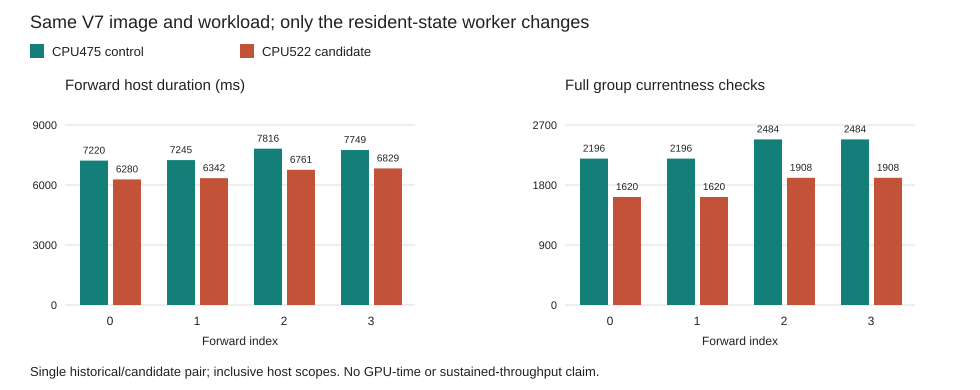

# Resident-State Fence GPU Comparison

On 2026-10-04 the new CPU522 worker completed four teacher-forced Qwen3-8B
forwards through all 36 layers on `mi350`, using the unchanged CPU633 parent,
V7 prefix image, BF16 weights, TP2 placement and input tokens. All **152 tensor
rows and four output tokens are bitwise equal** to the CPU475 worker's retained
V7 control. All six device audits and seven owned process exits passed, with
clean Close/reaping, one GPU attempt and no retry.

This is a finite engineering run, not the 2,048-token prompt / 256-token decode
benchmark. It does not establish independent full-model numerical acceptance,
production admission or the 700 tokens/s target.

## Optimization and Measured Effect

The coordinator already brackets private resident-state observation with fresh
full group checks. The new worker removes redundant checks inside that private
path, retaining token, owner, mapping and lifetime checks, Acquire loads,
coordinator entry/exit checks and error poisoning. Public single-state observers,
publication checks and rearm ordering are unchanged.

| Forward | Control host ms | Candidate host ms | Full group checks, old/new | Removed | Publications, old/new |
| ---: | ---: | ---: | ---: | ---: | ---: |
| 0 | 7,220.002 | 6,280.256 | 2,196 / 1,620 | 576 | 288 / 288 |
| 1 | 7,244.989 | 6,342.408 | 2,196 / 1,620 | 576 | 288 / 288 |
| 2 | 7,816.436 | 6,760.717 | 2,484 / 1,908 | 576 | 288 / 288 |
| 3 | 7,748.952 | 6,829.020 | 2,484 / 1,908 | 576 | 288 / 288 |

The expected reduction is now **measured**: 2,304 fewer full group checks over
four forwards, with all 1,152 publication checks preserved. Rank-level command,
full/operational currentness, admission, dispatch, read/write and byte counts
are unchanged. Completion polls are not treated as deterministic invariants.
The forward host totals are 30.030379 seconds and 26.212401 seconds.

These are one historical/control run and one candidate run, with inclusive
host scopes, not GPU timings or a qualified speedup. The complete candidate
case took 286.878 seconds including setup, audits and teardown; forward totals
exclude those phases. Nested group, publication and rank timers must not be
added together. Repeated isolated runs and a sustained workload remain needed.
The chart uses `forward_host_ns`; counter intervals use a distinct
`host_elapsed_ns` scope. Candidate setup's counter interval is 90.997 seconds
and `close_host_ns` is 12.537 seconds. Neither is part of the forward chart.

## Evidence and Reader Correction

- [GPU receipt](gpu-complete.json), [structural observation](observation.json)
  and [host counters](host-observation.json)
- [Actual comparison](complete.json), [CPU receipt](comparison-cpu.json),
  [21-test receipt](pure/complete.json) and [test log](pure/tests.log)
- [Comparison source](source/run.py), [bounded CPU runner](run_cpu.py),
  [plan](plan.json), [request](request.json) and [root review](decode-review.json)
- [Parent runtime audit](parent-runtime-audit.json) and
  [worker runtime audit](worker-runtime-audit.json)
- [Summary](result.json) and [machine-generated host table](host-comparison.md)

The first comparison reader passed 19 synthetic tests but stopped in actual
replay because it incorrectly required equal profile hashes across runs. The
profile hash includes session, registration and child identity. V2 retains the
frozen per-run hash validation, explicitly checks each request's own binding,
and compares the actual commands, devices, protocol and IDs across runs. Two
new regressions cover fresh valid hashes and corrupted bindings. V1 source and
partial replay remain retained; the GPU was not rerun for this correction.

All 58 files in the GPU case and the complete CPU comparison/test trees were
retained and rehashed before publication. Raw tensor payloads and binaries are
in the task-owned evidence store, not this Git package. The [deployment tests](../README.md)
and [522-test runtime cohort](../../resident-state-fence-consolidation-v1/README.md)
remain separate source/build prerequisites; test counts are not cumulative
performance or numerical evidence.

The next candidate targets the two read-only 144-state bank scans. It must
preserve fresh group fences, validate every state before any rearm store, keep
all individual rearm checks, and repeat this tensor/counter comparison.
