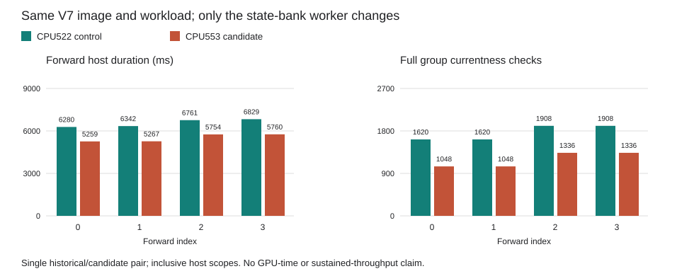

# State-Bank GPU Comparison

Engineering observation on `ssh mi350`, 2026-10-04. The CPU553 worker completed
one four-forward teacher-forced Qwen3-8B BF16 TP2 observation. Comparison with
the retained CPU522 worker passed. Both used the same CPU633 parent, V7 image,
model inputs and shared-full-currentness policy.

This establishes same-image output preservation and an exact reduction in
host check counts. It does not establish independent numerical correctness,
production admission, GPU execution time, sustained 2,048/256 decoding, or the
700 tokens/s target.

## Optimization

Previously, each of two state-bank scans read 144 individual prefix/MLP
states, each with fresh entry and exit group checks: `2 * 144 * 2 = 576`.
The new bounded bank observer keeps one fresh entry and exit check per scan:
`2 * 2 = 4`. The difference is **572 checks per forward**.

The group remains exclusively borrowed while records are validated and read.
Every record must pass typed ownership, extent, mapping and lifetime checks;
failure quarantines the operation instead of returning a partial snapshot.
Both outer ledger fences and all 144 individual rearm operations retain their
checks and ordering. All states are validated before the first rearm store.
Snapshots do not authorize later dispatch or state reuse.

See the [paired Rust implementation and 553-test checkpoint](../../state-bank-batch-v1/README.md).

## Observed Checks and Host Durations

| Forward | Old group checks | New group checks | Removed | Publication checks, each run | Old host ms | New host ms |
| --- | ---: | ---: | ---: | ---: | ---: | ---: |
| 0 | 1,620 | 1,048 | 572 | 288 | 6,280.256 | 5,258.709 |
| 1 | 1,620 | 1,048 | 572 | 288 | 6,342.408 | 5,267.448 |
| 2, reused bank | 1,908 | 1,336 | 572 | 288 | 6,760.717 | 5,754.206 |
| 3, reused bank | 1,908 | 1,336 | 572 | 288 | 6,829.020 | 5,760.197 |
| Total | 7,056 | 4,768 | 2,288 | 1,152 | 26,212.401 | 22,040.561 |

These are inclusive host wall durations from one historical/candidate pair,
not GPU timestamps or a qualified speedup. Another workload was observed on
the shared host during the candidate run. Nested currentness, publication,
dispatch and wait timers overlap; adding them or subtracting them from host
duration does not yield GPU time. Setup and Close are excluded from the
forward rows. The entire observation case took 280.315 seconds.

## Preserved Work and Outputs

Every row below passed on all four forwards. Timing and completion-poll
counts were permitted to vary; work counts were not.

| Per-forward invariant | Rank 0 | Rank 1 |
| --- | ---: | ---: |
| Kernel admissions and dispatches | 148 each | 145 each |
| Full rank currentness checks | 676 | 656 |
| Reads / bytes | 39 / 606,980 | 36 / 294,912 |
| Writes / bytes | 3 / 1,096 | 2 / 1,092 |
| Command and operational-currentness counts | 0 | 0 |

| Output comparison | Result |
| --- | --- |
| Complete captures | All four 606,976-byte payloads exactly equal |
| Tensor slices | All 152 exactly equal |
| Token records | All four exactly equal |
| Lifecycle | Six device audits, seven natural owned exits, Close and clean reaping |
| Attempts / retries | One / zero |

The two workers have different fresh sessions and process identities. Each
profile is authenticated against its own session and registration; cross-run
profile hashes are intentionally not required to match.

## Evidence and Reproduction

- [Summary and exact identities](result.json), [GPU completion](gpu-complete.json), and [request](request.json)
- [Complete comparison](complete.json) and [generated host table](host-comparison.md)
- [Host counters](host-observation.json) and [observed forward records](observation.json)
- [Actual 25-test receipt](pure/complete.json) and [test log](pure/tests.log)
- [CPU comparison runner](run_cpu.py) and [comparison source](source/run.py)
- [Parent audit](parent-runtime-audit.json) and [worker audit](worker-runtime-audit.json)
- [Parent review](parent-runtime-review.json), [worker review](worker-runtime-review.json), and [decode review](decode-review.json)

The GPU receipt SHA256 is
`9917a07aba38ecdf4ca1c9289774c9b9c040bdf5bf850157126c87ca1ab7595c`.
The comparison receipt SHA256 is
`1ac3c18440730526d166ef0a77dded008c2d675a0ffd1d4ddc867695da13a2d2`.
All 58 GPU evidence files, seven comparison files and four test files were
retained and rehashed before publication. Raw model payloads and executable
bodies remain separate from Git; replay needs the pinned retained artifacts
listed in the receipts. The public JSON is not a self-contained model bundle.

## Remaining Work

All issue #42 M0-M7 milestones remain open. Next performance work needs actual
per-stage device timing and a bounded device-owned layer schedule to reduce
the remaining host-mediated dispatch boundaries. Four early-context forwards
cannot establish long-context attention cost. Independent full-model
numerical validation and the requested sustained workload remain required.
